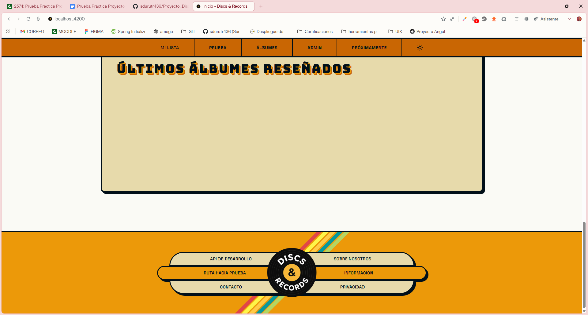

# 1) Desarrollo en entorno cliente:

## 1. Routing y Navegación (RA7 + RA5.d)

Nueva Ruta: Define e implementa una nueva ruta en el sistema de routing de Angular: Implementada la ruta ("/prueba").

Integración: Modifica los componentes estructurales (Header y Footer) para incluir la navegación hacia esta nueva sección:
- Se modifica en lugar del Header (que no incluye el menú de navegación) el main para alojar un nuevo botón (reutilización de unos que ya tenía que no se usaban que estaban comentados de hace meses).
- Se modifica en el footer uno de los botones laterales izquierdos que llevan hacia la ruta.




Lazy Loading: Se valorará positivamente la carga perezosa del módulo/componente.

```bash
  {
    path: 'prueba',
    loadComponent: () => import('./pages/prueba/prueba'),
    title: 'Prueba técnica - Discs & Records',
    data: { preload: false, breadcrumb: 'Prueba' }
  },
```

Se hace con lo de loadComponent: ()

## 2. Arquitectura de Componentes (RA6 + RA4)


# Documentación externa consultada:

## Frontend:

Angular 17: https://v17.angular.io/guide/standalone-components
Angular 21: https://angular.dev/guide/components
Angular 20: https://v20.angular.dev/overview

HECHO POR SERGIO DURÁN UTRERA