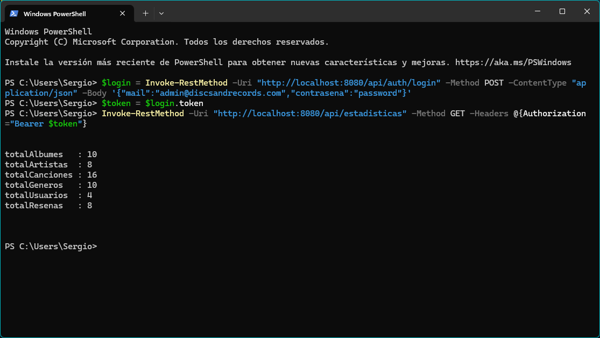

# 3) Desarrollo en entorno servidor

Objetivo: Implementar la logica de negocio y exponer los datos de forma segura mediante servicios web.

## 1. Endpoint nuevo: GET /api/estadisticas

Endpoint que devuelve las estadisticas generales de la plataforma: total de albumes, artistas, canciones, generos, usuarios registrados y reseñas. Su proposito es alimentar un panel de administracion donde el admin puede ver el estado general de la aplicacion y los datos que se han ido hidratando desde la API de Deezer. Para local, los datos están hardcodes con un seeding de .SQL que no existia en la versión actual. He tenido que recuperarlo de un commit antiguo: 950e7a4ae3117f799a66ec1d9e5a41c9e6ab0f84 por si se quiere revisar. Ahí existia un .SQL que tuve que borrar porque hacia conflicto con Digital Ocean y me corrompía la base de datos. Ahora mismo se ha añadido al .gitignore. También se recupera la configuración de los docker-compose.yml para que no haya errores.

La respuesta es un JSON con la siguiente estructura:

```json
{
  "totalAlbumes": 10,
  "totalArtistas": 8,
  "totalCanciones": 16,
  "totalGeneros": 10,
  "totalUsuarios": 4,
  "totalResenas": 8
}
```

### Separacion de capas

La arquitectura respeta estrictamente la separacion Controlador - Servicio - Repositorio:

- **EstadisticasController** (`controllers/EstadisticasController.java`): Recibe la peticion GET, delega en el servicio y devuelve ResponseEntity.
- **EstadisticasService** (`services/EstadisticasService.java`): Capa de logica de negocio. Marcada como @Transactional(readOnly = true). Delega en el repositorio.
- **EstadisticasRepository** (`repositories/EstadisticasRepository.java`): Accede a la base de datos mediante EntityManager con una unica query nativa que obtiene los 6 conteos en una sola consulta SQL.
- **EstadisticasPlataformaDTO** (`dto/EstadisticasPlataformaDTO.java`): Record de Java que transporta los datos entre capas.

### Ficheros implicados

| Capa | Fichero | Responsabilidad |
|------|---------|-----------------|
| Controller | `EstadisticasController.java` | Expone GET /api/estadisticas, aplica @PreAuthorize |
| Service | `EstadisticasService.java` | Logica de negocio, transaccion de solo lectura |
| Repository | `EstadisticasRepository.java` | Query nativa con EntityManager |
| DTO | `EstadisticasPlataformaDTO.java` | Record inmutable con los 6 conteos |

## 2. Seguridad y calidad

### Proteccion del endpoint

El endpoint esta protegido por dos mecanismos complementarios:

1. **SecurityConfig.java**: La ruta `/api/estadisticas` NO aparece en las rutas publicas (permitAll). Al caer bajo `.anyRequest().authenticated()`, requiere autenticacion JWT obligatoriamente. Si se accede, redirige a 404.

2. **@PreAuthorize("hasRole('ADMIN')")**: Anotacion en el metodo del controlador que restringe el acceso exclusivamente a usuarios con rol ROLE_ADMIN. Un usuario autenticado con ROLE_USER o ROLE_MODERATOR recibira un 403 Forbidden.

Flujo de una peticion:

1. El cliente envia el header `Authorization: Bearer <token_jwt>`.
2. JwtAuthenticationFilter extrae y valida el token.
3. Spring Security verifica que el usuario esta autenticado.
4. @PreAuthorize comprueba que el rol sea ADMIN.
5. Si todo es correcto, se ejecuta el metodo del controlador.

### Pruebas con comandos (PowerShell)

**Paso 1: Obtener token JWT de administrador**

```powershell
$login = Invoke-RestMethod -Uri "http://localhost:8080/api/auth/login" -Method POST -ContentType "application/json" -Body '{"mail":"admin@discsandrecords.com","contrasena":"password"}'
$token = $login.token
```

**Paso 2: Llamar al endpoint de estadisticas con el token**

```powershell
Invoke-RestMethod -Uri "http://localhost:8080/api/estadisticas" -Method GET -Headers @{Authorization="Bearer $token"}
```

Respuesta esperada (200 OK):

```
totalAlbumes   : 10
totalArtistas  : 8
totalCanciones : 16
totalGeneros   : 10
totalUsuarios  : 4
totalResenas   : 8
```

**Paso 3: Verificar que un usuario normal NO tiene acceso**

```powershell
$loginUser = Invoke-RestMethod -Uri "http://localhost:8080/api/auth/login" -Method POST -ContentType "application/json" -Body '{"mail":"user@discsandrecords.com","contrasena":"password"}'
$tokenUser = $loginUser.token

Invoke-RestMethod -Uri "http://localhost:8080/api/estadisticas" -Method GET -Headers @{Authorization="Bearer $tokenUser"}
```

Respuesta esperada: error 403 Forbidden.

**Paso 4: Verificar que sin token devuelve 401**

```powershell
Invoke-RestMethod -Uri "http://localhost:8080/api/estadisticas" -Method GET
```

Respuesta esperada: error 401 Unauthorized.

Pruebas realizadas al endpoint:

