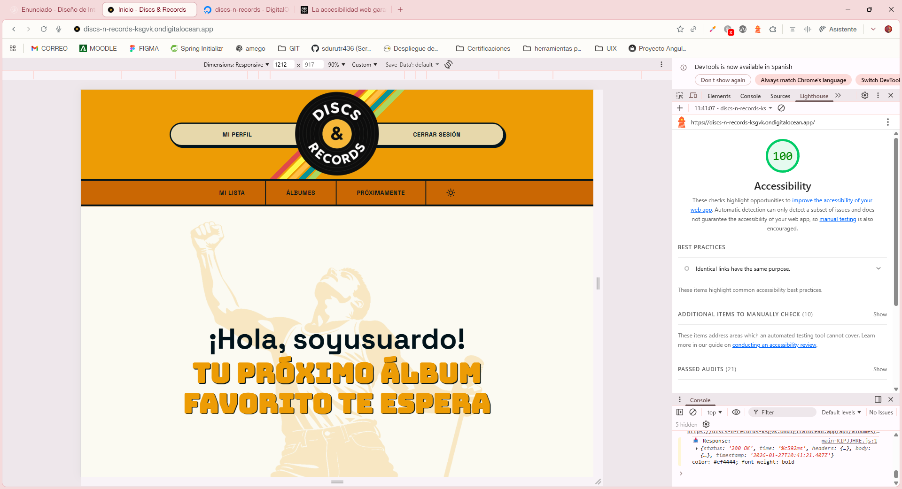
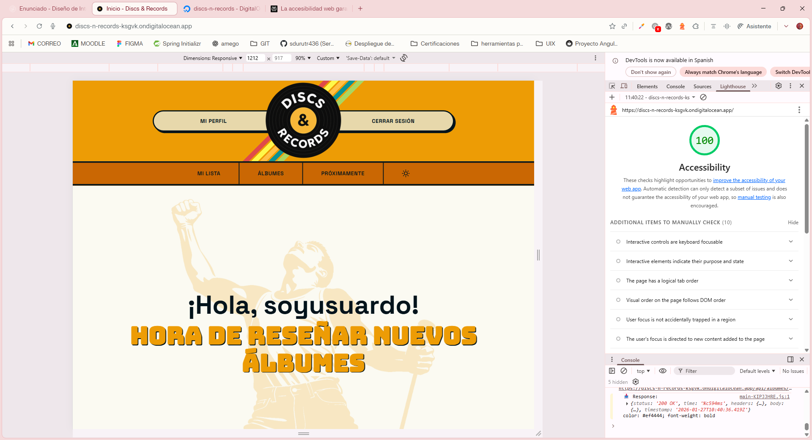
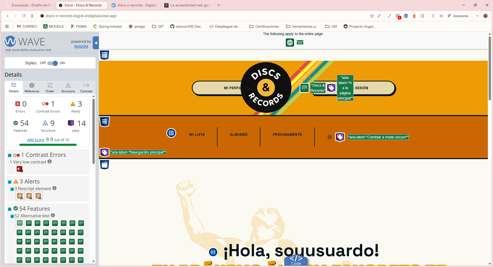
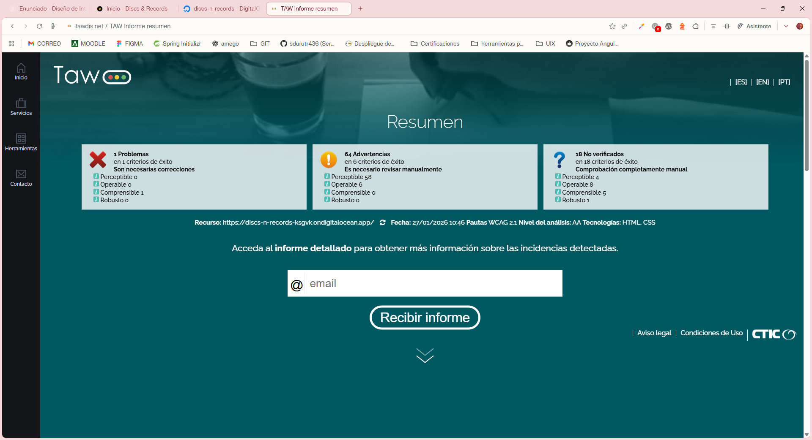

# Análisis de Accesibilidad

## Seccion 1: Fundamentos de accesibilidad:

### ¿Por qué es necesaria la accesibilidad web?

La accesibilidad web garantiza que personas con discapacidades visuales, auditivas, motoras o cognitivas puedan navegar e interactuar sin barreras. Este enfoque mejora la experiencia de usuario para todos, independientemente del contexto o dispositivo. Además, cumplir con estos estándares es ahora una obligación legal en España y Europa, convirtiendo la inclusión digital en un requisito técnico indispensable para cualquier desarrollo profesional.

### Principios WCAG 2.1

1. **Perceptible**: La información y los componentes de la interfaz deben presentarse de manera que los usuarios puedan percibirlos a través de sus sentidos disponibles, evitando que el contenido sea invisible para los usuarios.

> Ejemplo: Todas las imágenes de álbumes incluyen texto alternativo con formato "título por artista", permitiendo a usuarios de lectores de pantalla identificar el contenido sin verlo.

2. **Operable**: Los elementos de la interfaz y la navegación deben ser manejables, garantizando que cualquier usuario pueda interactuar con ellos mediante teclado, ratón o tecnologías de asistencia sin bloqueos.

> Ejemplo: El carrusel de álbumes es completamente navegable con teclado mediante Tab, Enter, Space y flechas de dirección, sin depender del ratón. Los botones tienen áreas de toque de mínimo 44x44px en dispositivos táctiles.

3. **Comprensible**: La información y el funcionamiento de la interfaz deben ser claros y predecibles, asegurando que los usuarios entiendan tanto el contenido como la forma de navegar por él.

> Ejemplo: Los mensajes de error en formularios son específicos ("El correo electrónico no es válido") en lugar de genéricos, y se marcan con role="alert" para anuncio automático por lectores de pantalla.

4. **Robusto**: El contenido debe crearse con estándares web sólidos para que pueda ser interpretado de manera fiable por una amplia variedad de navegadores y tecnologías de asistencia, presentes y futuras.

> Ejemplo: Uso de HTML5 semántico (header, nav, main, footer) con roles ARIA apropiados, garantizando interpretación correcta por tecnologías de asistencia actuales y futuras.

### Niveles de conformidad

#### Nivel A (Básico):
Establece los requisitos mínimos indispensables para que el contenido no bloquee el acceso a los usuarios.

#### Nivel AA (Intermedio):
Elimina las barreras de usabilidad más comunes y es el estándar exigido por la legislación vigente.

#### Nivel AAA (Avanzado):
Representa el máximo grado de accesibilidad con requisitos muy estrictos destinados a contextos especializados.

> Alcanzar el Nivel AA para garantizar tanto el cumplimiento legal como una experiencia de usuario sólida.

---

## Seccion 2: Componentes multimedia implementados

**Tipo de componente:** Carrusel horizontal.

**Descripción del componente:** Carrusel de álbumes musicales con cards tipo polaroid con imagen en la mitad superior para identificación visual, que representan dependiendo del contexto del carrusel, álbumes en tendencia o reseñados recientemente.

**Características de accesibilidad implementadas:**
- Tabulación en orden lógico a través de los títulos y artistas de los álbumes. Posibilidad de entrar haciendo uso del botón Enter.

- Etiquetas ARIA descriptivas, con títulos semánticos proporcionando contexto sobre el tipo de carrusel.

- Estados visibles claros cuando se está haciendo _focus_ en un elemento.

- Estructura semántica, cada card es un article con imagen, titulo y enlace, y las imágenes tienen _alt_ descriptivo; y el contenedor del carrusel también con un h2 descriptivo.

- Diseño responsivo con _touch targets_, scroll nativo en móviles y adaptación del número de elementos según el _viewport_.

---

## Seccion 3: Auditoría automatizada

### Auditoria Lighthouse inicial

#### Capturas iniciales de auditoria Lighthouse:





#### Capturas iniciales de auditoria WAVE:



#### Capturas iniciales de auditoria 



#### Tabla informativa

| Herramienta | Puntuación/Errores | Captura |
|-------------|-------------------|---------|
| Lighthouse Móvil | 100/100 |  |
| Lighthouse Desktop | 100/100 |  |
| WAVE | 0 errores graves, 1 error contraste, 3 alertas |  |
| TAW | 1 problemas |  |

#### Errores más graves:

- Lighthouse: No tiene errores presentables.

- WAVE: Error de contraste encontrado en H1 de información atrayente:


Las alertas que se presentan son de elementos escondidos.

- TAWDIS: 
    - Error de idioma declarado frente al idioma real (pendiente).
    - Controles de formulario sin etiquetar.
    - Contenido generado desde CSS.
    - Posicionamiento absoluto.
    - Imágenes sin descripciones adecuadas.

---

## Seccion 4: Análisis y corrección de errores:

| # | Error | Criterio WCAG | Herramienta | Solución aplicada |
|---|-------|---------------|-------------|-------------------|
| 1 | Control de formulario sin etiquetar | 1.1.1, 1.3.1 (H44, H65) | TAWDIS | Añadido label con patrón sr-only al input de búsqueda |
| 2 | Contenido generado desde CSS | 1.3.1 (F87) | TAWDIS | Verificado - elementos decorativos con aria-hidden="true" correctamente implementados |
| 3 | Posicionamiento absoluto | 1.3.2 (C27) | TAWDIS | Verificado - no afecta el orden de navegación ni la secuencia lógica de lectura |
| 4 | Imágenes sin descripciones adecuadas | 1.1.1 (H45) | TAWDIS | Verificado - 53 imágenes revisadas con alt descriptivos en formato "título por artista" |
| 5 | Error de idioma declarado | 3.5.1 | TAWDIS | Añadido atributo lang="es" al elemento html raíz |

### Detalle de cada error:

#### Error 1: Control de formulario sin etiquetar

**Problema:** El input de búsqueda en el search-bar solo contaba con aria-label, lo que es insuficiente para cumplir WCAG 2.1 Nivel A. Los lectores de pantalla necesitan un elemento label HTML correctamente asociado mediante atributos for/id.

**Impacto:** Usuarios de lectores de pantalla y magnificadores de pantalla podrían no identificar correctamente el propósito del campo de búsqueda.

**Criterio WCAG:** 1.1.1 Contenido no textual (Nivel A) - Técnicas H44, H65

**Código antes:**

```html
<input
  type="text"
  class="search-bar__input"
  [value]="searchTerm()"
  (input)="updateSearchTerm($any($event.target).value)"
  (keypress)="handleKeyPress($event)"
  [placeholder]="placeholder"
  aria-label="Buscar en la colección"
  [attr.aria-busy]="isSearching()"
/>
```

**Código después:**

```html
<label for="search-input" class="search-bar__label">
  Buscar en la colección
</label>

<input
  id="search-input"
  type="text"
  class="search-bar__input"
  [value]="searchTerm()"
  (input)="updateSearchTerm($any($event.target).value)"
  (keypress)="handleKeyPress($event)"
  [placeholder]="placeholder"
  [attr.aria-busy]="isSearching()"
/>
```

**CSS aplicado (patrón sr-only):**

```scss
.search-bar__label {
  position: absolute;
  width: 1px;
  height: 1px;
  padding: 0;
  margin: -1px;
  overflow: hidden;
  clip: rect(0, 0, 0, 0);
  white-space: nowrap;
  border-width: 0;
}
```

**Explicación:** El label se oculta visualmente pero permanece accesible para lectores de pantalla, manteniendo la asociación programática mediante los atributos for="search-input" e id="search-input".

---

#### Error 2: Contenido generado desde CSS

**Problema:** TAWDIS detectó 2 instancias de elementos con pseudo-elemento ::before que generaban contenido mediante CSS. Cuando el contenido transmite información significativa, puede no ser accesible para tecnologías de asistencia.

**Impacto:** Si el contenido CSS comunica información importante, los usuarios de lectores de pantalla podrían perderla.

**Criterio WCAG:** 1.3.1 Información y relaciones (Nivel A) - Técnica F87

**Código verificado (sin cambios necesarios):**

```scss
/* Header stripes - Elemento decorativo */
.header__stripes::before {
  content: '';
  position: absolute;
  width: 100%;
  height: 100%;
  background: linear-gradient(...);
}

/* Footer stripes - Elemento decorativo */
.footer__stripes::before {
  content: '';
  position: absolute;
  width: 100%;
  height: 100%;
  background: linear-gradient(...);
}
```

**HTML asociado:**

```html
<div class="header__stripes" aria-hidden="true"></div>
<div class="footer__stripes" aria-hidden="true"></div>
```

**Explicación:** No se requirieron cambios. Los elementos son puramente decorativos (barras de colores), el content está vacío y los contenedores están marcados con aria-hidden="true", cumpliendo con las mejores prácticas de accesibilidad.

---

#### Error 3: Posicionamiento absoluto

**Problema:** TAWDIS detectó 4 instancias de position: absolute que podrían interrumpir el orden de lectura lógico de la página, afectando la navegación con teclado y lectores de pantalla.

**Impacto:** Si los elementos posicionados alteran el flujo de navegación, usuarios que dependen del teclado o lectores de pantalla pueden perder el contexto.

**Criterio WCAG:** 1.3.2 Secuencia con significado (Nivel A) - Técnica C27

**Elementos identificados y verificados:**

```html
<!-- 1. Stripes decorativas (header y footer) -->
<div class="header__stripes" aria-hidden="true"></div>
<div class="footer__stripes" aria-hidden="true"></div>

<!-- 2. Label oculto del search-bar (patrón sr-only) -->
<label for="search-input" class="search-bar__label">
  Buscar en la colección
</label>

<!-- 3. Input asociado -->
<input id="search-input" type="text" />
```

**Explicación:** El orden en el DOM se mantiene lógico. Los elementos decorativos están ocultos con aria-hidden, y el label del search-bar preserva su asociación programática con el input aunque esté posicionado absolutamente. La navegación con Tab sigue el orden visual y lógico sin saltos inesperados.

---

#### Error 4: Imágenes sin descripciones adecuadas

**Problema:** TAWDIS marcó 53 imágenes como "Desconocido", requiriendo revisión manual para verificar que sus textos alternativos fueran descriptivos y significativos.

**Impacto:** Si las imágenes carecen de descripciones apropiadas, usuarios de lectores de pantalla no pueden identificar el contenido visual.

**Criterio WCAG:** 1.1.1 Contenido no textual (Nivel A) - Técnica H45

**Ejemplos verificados:**

```html
<!-- Logo en header -->


<!-- Imagen hero -->


<!-- Imágenes de álbumes (50 instancias) -->

```

**Explicación:** Todas las 53 imágenes cuentan con textos alternativos descriptivos. Las imágenes de álbumes siguen un formato consistente "título por artista" que permite a usuarios de lectores de pantalla identificar el contenido sin verlo. Además, todas incluyen atributos width y height para prevenir cambios de diseño durante la carga (CLS).

---

#### Error 5: Error de idioma declarado frente al idioma real

**Problema:** TAWDIS detectó un conflicto entre el idioma declarado en el atributo lang del elemento HTML y el idioma real del contenido de la página.

**Impacto:** Los lectores de pantalla no pueden aplicar la pronunciación correcta y los navegadores no pueden procesar el contenido en el idioma esperado.

**Criterio WCAG:** 3.5.1 Idioma de la página (Nivel A)

**Código antes:**

```html
<html>
```

**Código después:**

```html
<html lang="es">
```

**Explicación:** Se agregó el atributo lang="es" al elemento html raíz para indicar que todo el contenido está en español. Esto permite que los lectores de pantalla apliquen la pronunciación correcta del idioma y que los navegadores procesen el contenido apropiadamente.

