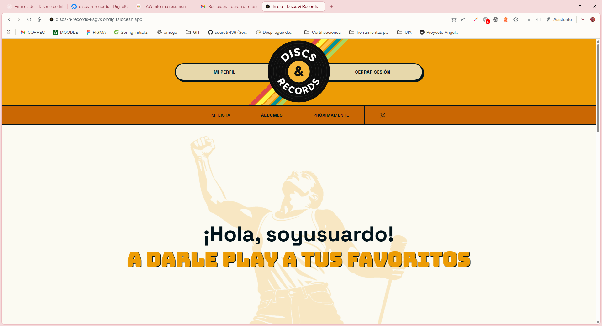
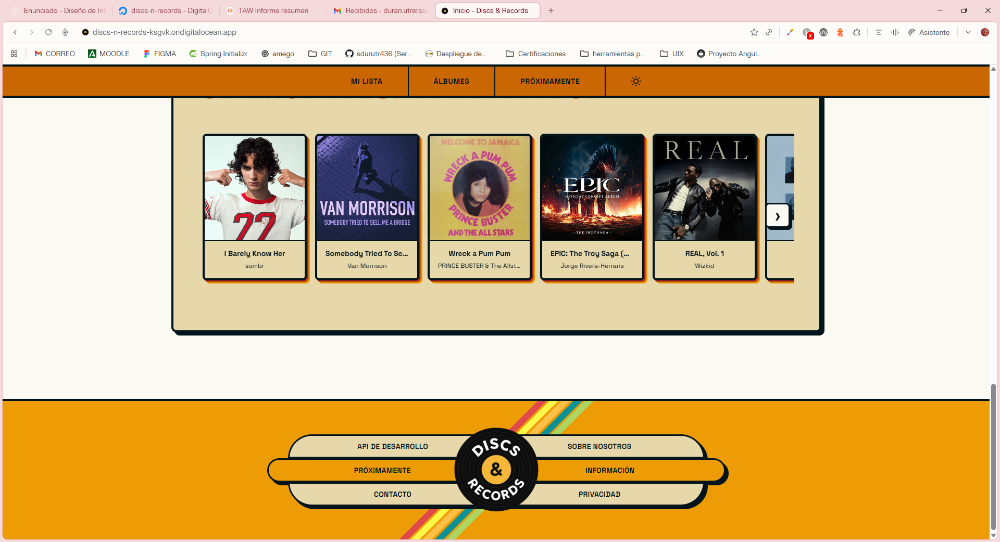
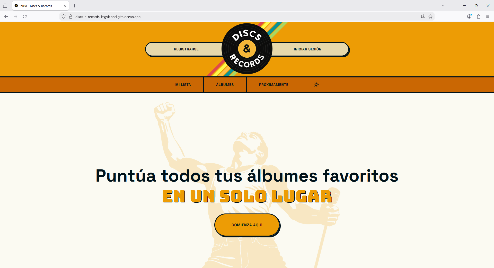
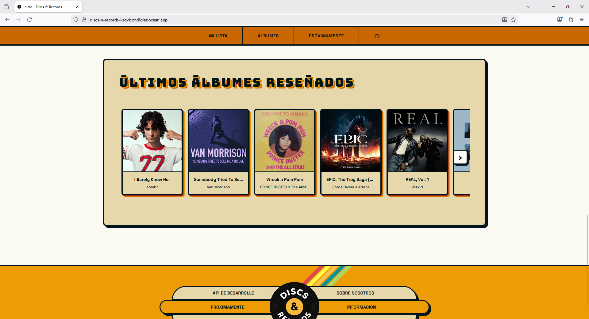
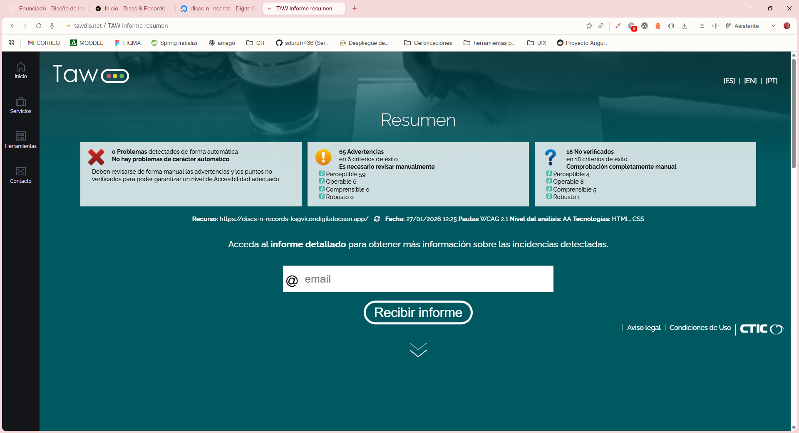
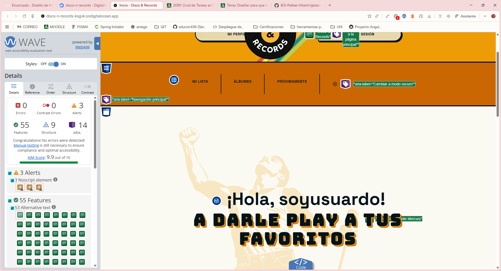

# Análisis de Accesibilidad

## Seccion 1: Fundamentos de accesibilidad:

### ¿Por qué es necesaria la accesibilidad web?

La accesibilidad web garantiza que personas con discapacidades visuales, auditivas, motoras o cognitivas puedan navegar e interactuar sin barreras. Este enfoque mejora la experiencia de usuario para todos, independientemente del contexto o dispositivo. Además, cumplir con estos estándares es ahora una obligación legal en España y Europa, convirtiendo la inclusión digital en un requisito técnico indispensable para cualquier desarrollo profesional.

### Principios WCAG 2.1

1. **Perceptible**: La información y los componentes de la interfaz deben presentarse de manera que los usuarios puedan percibirlos a través de sus sentidos disponibles, evitando que el contenido sea invisible para los usuarios.

> Ejemplo: Todas las imágenes de álbumes incluyen texto alternativo con formato "título por artista", permitiendo a usuarios de lectores de pantalla identificar el contenido sin verlo.

2. **Operable**: Los elementos de la interfaz y la navegación deben ser manejables, garantizando que cualquier usuario pueda interactuar con ellos mediante teclado, ratón o tecnologías de asistencia sin bloqueos.

> Ejemplo: El carrusel de álbumes es completamente navegable con teclado mediante Tab, Enter, Space y flechas de dirección, sin depender del ratón. Los botones tienen áreas de toque de mínimo 44x44px en dispositivos táctiles.

3. **Comprensible**: La información y el funcionamiento de la interfaz deben ser claros y predecibles, asegurando que los usuarios entiendan tanto el contenido como la forma de navegar por él.

> Ejemplo: Los mensajes de error en formularios son específicos ("El correo electrónico no es válido") en lugar de genéricos, y se marcan con role="alert" para anuncio automático por lectores de pantalla.

4. **Robusto**: El contenido debe crearse con estándares web sólidos para que pueda ser interpretado de manera fiable por una amplia variedad de navegadores y tecnologías de asistencia, presentes y futuras.

> Ejemplo: Uso de HTML5 semántico (header, nav, main, footer) con roles ARIA apropiados, garantizando interpretación correcta por tecnologías de asistencia actuales y futuras.

### Niveles de conformidad

#### Nivel A (Básico):
Establece los requisitos mínimos indispensables para que el contenido no bloquee el acceso a los usuarios.

#### Nivel AA (Intermedio):
Elimina las barreras de usabilidad más comunes y es el estándar exigido por la legislación vigente.

#### Nivel AAA (Avanzado):
Representa el máximo grado de accesibilidad con requisitos muy estrictos destinados a contextos especializados.

> Alcanzar el Nivel AA para garantizar tanto el cumplimiento legal como una experiencia de usuario sólida.

---

## Seccion 2: Componentes multimedia implementados

**Tipo de componente:** Carrusel horizontal con estructura semántica accesible.

**Descripción del componente:** Carrusel de álbumes musicales con cards tipo polaroid que representan álbumes en tendencia o reseñados recientemente, implementado con roles ARIA y HTML5 semántico para accesibilidad total.

**Características de accesibilidad implementadas:**

- **Estructura ARIA:** `role="region"` en el carrusel, `role="list"` en el track, `role="listitem"` en cada card. NVDA anuncia: "Región: Últimos álbumes en tendencia, lista con X elementos".

- **Etiquetas descriptivas:** `aria-label` contextual en cada card: "[Título] por [Artista]". Botones de navegación con etiquetas específicas: "Mostrar álbumes siguientes en [Nombre del carrusel]".

- **Anuncios dinámicos:** `aria-live="polite"` y `role="status"` en estados de carga para que NVDA anuncie automáticamente cambios.

- **Navegación por teclado:** Tabulación lógica completa sin depender de botones de desplazamiento. Texto de ayuda (sr-only) con instrucciones claras.

- **Estructura visual:** Cada card es un `<article>` con imagen, título y enlace. Imágenes con `alt` descriptivo en formato "título por artista".

- **Diseño responsivo:** Touch targets de mínimo 44x44px, scroll nativo en móviles, adaptación según viewport.

**Cumplimiento:** ✅ WCAG 2.1 Nivel AA - Criterios 2.1.1 (Teclado), 2.4.3 (Orden del foco), 4.1.2 (Nombre, función, valor)

---

## Seccion 3: Auditoría automatizada

### Auditoria Lighthouse inicial

#### Capturas iniciales de auditoria Lighthouse:


#### Capturas iniciales de auditoria WAVE:


#### Capturas iniciales de auditoria 


#### Tabla informativa

| Herramienta | Puntuación/Errores | Captura |
|-------------|-------------------|---------|
| Lighthouse Móvil | 100/100 |  |
| Lighthouse Desktop | 100/100 |  |
| WAVE | 0 errores graves, 1 error contraste, 3 alertas |  |
| TAW | 5 problemas |  |

#### Errores más graves:

- Lighthouse: No tiene errores presentables.

- WAVE: Error de contraste encontrado en H1 de información atrayente:


Las alertas que se presentan son de elementos escondidos.

- TAWDIS: 
    - Error de idioma declarado frente al idioma real (pendiente).
    - Controles de formulario sin etiquetar.
    - Contenido generado desde CSS.
    - Posicionamiento absoluto.
    - Imágenes sin descripciones adecuadas.

---

## Seccion 4: Análisis y corrección de errores:

| # | Error | Criterio WCAG | Herramienta | Solución aplicada |
|---|-------|---------------|-------------|-------------------|
| 1 | Control de formulario sin etiquetar | 1.1.1, 1.3.1 (H44, H65) | TAWDIS | Añadido label con patrón sr-only al input de búsqueda |
| 2 | Contenido generado desde CSS | 1.3.1 (F87) | TAWDIS | Verificado - elementos decorativos con aria-hidden="true" correctamente implementados |
| 3 | Posicionamiento absoluto | 1.3.2 (C27) | TAWDIS | Verificado - no afecta el orden de navegación ni la secuencia lógica de lectura |
| 4 | Imágenes sin descripciones adecuadas | 1.1.1 (H45) | TAWDIS | Verificado - 53 imágenes revisadas con alt descriptivos en formato "título por artista" |
| 5 | Error de idioma declarado | 3.5.1 | TAWDIS | Añadido atributo lang="es" al elemento html raíz |

### Detalle de cada error:

**Error 1: Control de formulario sin etiquetar**

**Problema:** El input de búsqueda en el search-bar solo contaba con aria-label, lo que es insuficiente para cumplir WCAG 2.1 Nivel A. Los lectores de pantalla necesitan un elemento label HTML correctamente asociado mediante atributos for/id.

**Impacto:** Usuarios de lectores de pantalla y magnificadores de pantalla podrían no identificar correctamente el propósito del campo de búsqueda.

**Criterio WCAG:** 1.1.1 Contenido no textual (Nivel A) - Técnicas H44, H65

**Código antes:**

```html
<input
  type="text"
  class="search-bar__input"
  [value]="searchTerm()"
  (input)="updateSearchTerm($any($event.target).value)"
  (keypress)="handleKeyPress($event)"
  [placeholder]="placeholder"
  aria-label="Buscar en la colección"
  [attr.aria-busy]="isSearching()"
/>
```

**Código después:**

```html
<label for="search-input" class="search-bar__label">
  Buscar en la colección
</label>

<input
  id="search-input"
  type="text"
  class="search-bar__input"
  [value]="searchTerm()"
  (input)="updateSearchTerm($any($event.target).value)"
  (keypress)="handleKeyPress($event)"
  [placeholder]="placeholder"
  [attr.aria-busy]="isSearching()"
/>
```

**CSS aplicado (patrón sr-only):**

```scss
.search-bar__label {
  position: absolute;
  width: 1px;
  height: 1px;
  padding: 0;
  margin: -1px;
  overflow: hidden;
  clip: rect(0, 0, 0, 0);
  white-space: nowrap;
  border-width: 0;
}
```

**Explicación:** El label se oculta visualmente pero permanece accesible para lectores de pantalla, manteniendo la asociación programática mediante los atributos for="search-input" e id="search-input".

---

**Error 2: Contenido generado desde CSS**

**Problema:** TAWDIS detectó 2 instancias de elementos con pseudo-elemento ::before que generaban contenido mediante CSS. Cuando el contenido transmite información significativa, puede no ser accesible para tecnologías de asistencia.

**Impacto:** Si el contenido CSS comunica información importante, los usuarios de lectores de pantalla podrían perderla.

**Criterio WCAG:** 1.3.1 Información y relaciones (Nivel A) - Técnica F87

**Código verificado (sin cambios necesarios):**

```scss
/* Header stripes - Elemento decorativo */
.header__stripes::before {
  content: '';
  position: absolute;
  width: 100%;
  height: 100%;
  background: linear-gradient(...);
}

/* Footer stripes - Elemento decorativo */
.footer__stripes::before {
  content: '';
  position: absolute;
  width: 100%;
  height: 100%;
  background: linear-gradient(...);
}
```

**HTML asociado:**

```html
<div class="header__stripes" aria-hidden="true"></div>
<div class="footer__stripes" aria-hidden="true"></div>
```

**Explicación:** No se requirieron cambios. Los elementos son puramente decorativos (barras de colores), el content está vacío y los contenedores están marcados con aria-hidden="true", cumpliendo con las mejores prácticas de accesibilidad.

---

**Error 3: Posicionamiento absoluto**

**Problema:** TAWDIS detectó 4 instancias de position: absolute que podrían interrumpir el orden de lectura lógico de la página, afectando la navegación con teclado y lectores de pantalla.

**Impacto:** Si los elementos posicionados alteran el flujo de navegación, usuarios que dependen del teclado o lectores de pantalla pueden perder el contexto.

**Criterio WCAG:** 1.3.2 Secuencia con significado (Nivel A) - Técnica C27

**Elementos identificados y verificados:**

```html
<!-- 1. Stripes decorativas (header y footer) -->
<div class="header__stripes" aria-hidden="true"></div>
<div class="footer__stripes" aria-hidden="true"></div>

<!-- 2. Label oculto del search-bar (patrón sr-only) -->
<label for="search-input" class="search-bar__label">
  Buscar en la colección
</label>

<!-- 3. Input asociado -->
<input id="search-input" type="text" />
```

**Explicación:** El orden en el DOM se mantiene lógico. Los elementos decorativos están ocultos con aria-hidden, y el label del search-bar preserva su asociación programática con el input aunque esté posicionado absolutamente. La navegación con Tab sigue el orden visual y lógico sin saltos inesperados.

---

**Error 4: Imágenes sin descripciones adecuadas**

**Problema:** TAWDIS marcó 53 imágenes como "Desconocido", requiriendo revisión manual para verificar que sus textos alternativos fueran descriptivos y significativos.

**Impacto:** Si las imágenes carecen de descripciones apropiadas, usuarios de lectores de pantalla no pueden identificar el contenido visual.

**Criterio WCAG:** 1.1.1 Contenido no textual (Nivel A) - Técnica H45

**Ejemplos verificados:**

```html
<!-- Logo en header -->


<!-- Imagen hero -->


<!-- Imágenes de álbumes (50 instancias) -->

```

**Explicación:** Todas las 53 imágenes cuentan con textos alternativos descriptivos. Las imágenes de álbumes siguen un formato consistente "título por artista" que permite a usuarios de lectores de pantalla identificar el contenido sin verlo. Además, todas incluyen atributos width y height para prevenir cambios de diseño durante la carga (CLS).

---

**Error 5: Error de idioma declarado frente al idioma real**

**Problema:** TAWDIS detectó un conflicto entre el idioma declarado en el atributo lang del elemento HTML y el idioma real del contenido de la página.

**Impacto:** Los lectores de pantalla no pueden aplicar la pronunciación correcta y los navegadores no pueden procesar el contenido en el idioma esperado.

**Criterio WCAG:** 3.5.1 Idioma de la página (Nivel A)

**Código antes:**

```html
<html>
```

**Código después (opción 1 - estático):**

```html
<html lang="es">
```

**Código después (opción 2 - dinámico/programático):**

```typescript
// app.ts
import { Component, OnInit, inject, Renderer2 } from '@angular/core';
import { PreferencesService } from './services/preferences';

export class App implements OnInit {
  private renderer = inject(Renderer2);
  private preferencesService = inject(PreferencesService);

  ngOnInit(): void {
    // Detectar idioma desde preferencias del usuario o navegador
    const userLanguage = this.preferencesService.getLanguage() || 
                         navigator.language.split('-')[0] || 
                         'es';
    
    // Establecer el atributo lang en el elemento html de forma programática
    this.renderer.setAttribute(document.documentElement, 'lang', userLanguage);
  }
}
```

**Explicación:** Se agregó el atributo lang="es" al elemento html raíz para indicar que el contenido está en español. La solución programática permite que el idioma se determine dinámicamente basado en las preferencias del usuario o el idioma del navegador, mejorando la accesibilidad global. Los lectores de pantalla aplican la pronunciación correcta del idioma y los navegadores procesan el contenido apropiadamente.

---

## Seccion 5: Análisis de estructura semántica:

### Landmarks utilizados:

- [x] `<header>` - Cabecera del sitio
  - Componente header global (logo, navegación, botones de autenticación)
  - Headers en páginas internas (settings, profile, info, roadmap)

- [x] `<nav>` - Menú de navegación
  - Navegación de búsqueda en search results
  - Tabs de navegación en search results
  - Redes sociales y enlaces en footer

- [x] `<main>` - Contenido principal
  - Página Home
  - Página Settings
  - Página Search Results
  - Página Profile (columna de contenido)

- [x] `<article>` - Cards tipo polaroid como elemento visual principal
  - Componente card (envuelve toda la tarjeta)
  - Cards en carrusel de trending albums
  - Cards en search results
  - Cards en perfil de usuario (álbumes y reseñas)

- [x] `<section>` - Delimita áreas y agrupa contenido
  - Hero section en Home (imagen de fondo)
  - Secciones de carrusel en Home (trending, reseñados, personalizados)
  - Dentro de cards para dividir imagen, contenido e información
  - Secciones de perfil para información del usuario
  - Secciones en Settings (perfil, seguridad, preferencias)
  - Sección de búsqueda en Home

- [x] `<aside>` - Barras laterales de información complementaria
  - Sidebar en Detail page (información del álbum)
  - Sidebar en Profile page (información del usuario)
  - Sidebar en Style Guide (navegación de componentes)

- [x] `<footer>` - Pie de página
  - Layout global (links, logo y redes sociales)

### Jerarquía de encabezados:

**Página Home (principal):**

H1: Puntúa todos tus álbumes favoritos en un solo lugar (o saludo personalizado si está autenticado)
  H2: ÚLTIMOS ÁLBUMES EN TENDENCIA
  H2: ÚLTIMOS ÁLBUMES RESEÑADOS
  H2: MIS ÚLTIMOS ÁLBUMES RESEÑADOS (solo si está autenticado)

**Página Detail (álbum):**

H1: Nombre del álbum
  H2: Información del álbum
  H2: Lista de canciones
  H2: Reseñas

**Página Profile (perfil de usuario):**

H1: Mi Perfil
  H2: Álbumes favoritos
  H2: Últimas reseñas
  H2: Estadísticas

**Página Settings:**

H1: Configuración
  H2: Cuenta
  H2: Seguridad
  H2: Preferencias

**Nota:** La escala tipográfica utiliza una proporción 1.25 (Major Third) con h1 de 4.25rem para impacto visual, h2 de 2.625rem para secciones y h3 de 1.625rem para subsecciones. Esto asegura una jerarquía clara y accesible según WCAG 2.1.

### Análisis de imágenes:

- Total de imágenes: 53
- Con texto alternativo: 53
- Decorativas (alt=""): 0
- Sin alt (corregidas): 0

---

## Seccion 6: Verificación manual

### Test de navegación por teclado

- [X] Puedo llegar a todos los enlaces y botones con Tab
- [X] El orden de navegación con Tab es lógico (no salta caóticamente)
- [X] Veo claramente qué elemento tiene el focus (borde, sombra, color)
- [X] Puedo usar mi componente multimedia solo con teclado: Si excepto que los botones de los carruseles no se iluminan/usan ya que el tabulador ya recorre los distintos elementos y se van visualizando (el carrusel corre a medida que se va pasando)
- [X] No hay "trampas" de teclado donde quedo bloqueado
- [X] Los menús/modals se pueden cerrar con Esc (si aplica)

**Problemas encontrados:** Los botones de desplazamiento de los carruseles no se usan con teclado.

**Soluciones aplicadas:** No es necesaria solución ya que la tabulación sigue el orden para poder recorrerlo sin la necesidad de usar los botones.

### Test con lector de pantalla

Herramienta a usar: NVDA

**Resultados obtenidos:**

| Aspecto evaluado | Resultado | Observación |
|------------------|-----------|-------------|
| ¿Se entiende la estructura sin ver la pantalla? | ✅ | La pantalla tiene un eslogan que indica de que va la página. Además de invitar al usuario a comenzar su desarrollo en la aplicación. A medida que continua el usuario la barra de búsqueda contiene que puede buscar y los carruseles proporcionan de forma atrayente algunos de los álbumes disponibles en ese momento. |
| ¿Los landmarks se anuncian correctamente? | ✅ | Los landmarks (header, nav, main, search, region) se anuncian correctamente. Los carruseles tienen role="region" con aria-labelledby apropiado y sección de búsqueda con role="search". |
| ¿Las imágenes tienen descripciones adecuadas? | ✅ | Todas las imágenes de álbumes tienen alt descriptivo en formato "título por artista". Las imágenes decorativas están correctamente marcadas con aria-hidden="true". |
| ¿Los enlaces tienen textos descriptivos? | ✅ | Los enlaces de títulos y artistas son descriptivos. Las cards tienen aria-label con información completa del álbum y role="listitem" para contexto. |
| ¿El componente multimedia es accesible? | ✅ | Los carruseles tienen estructura semántica completa con role="list" y role="listitem". Navegación por teclado funcional y botones con etiquetas ARIA descriptivas y contextuales. |

**Principales problemas detectados:**

1. **Carruseles no se anunciaban como regiones navegables**:
   - Los carruseles carecían de `role="region"` y etiquetas ARIA apropiadas
   - NVDA no identificaba los carruseles como áreas de contenido estructuradas
   - Las cards dentro de los carruseles no tenían contexto de lista

2. **Cards sin información semántica suficiente**:
   - Las cards de álbumes no tenían `role="listitem"` ni `aria-label` descriptivo
   - NVDA leía solo el contenido textual sin proporcionar contexto del álbum completo
   - Faltaba información sobre la relación título-artista

3. **Estados de carga no se anunciaban dinámicamente**:
   - Los spinners y mensajes "Cargando álbumes..." no tenían `aria-live`
   - NVDA no informaba automáticamente sobre cambios en el estado de carga
   - Los usuarios no sabían cuándo el contenido había terminado de cargar

4. **Botones de navegación con etiquetas genéricas**:
   - Los botones de carrusel tenían aria-label genérico "Ver items anteriores/siguientes"
   - No especificaban el contexto del carrusel específico
   - Faltaban instrucciones de navegación alternativa por teclado

5. **Falta de landmark específico para búsqueda**:
   - La sección de búsqueda no tenía `role="search"`
   - NVDA no la identificaba como función de búsqueda principal

**Mejoras aplicadas:**

1. **Estructura ARIA completa en carruseles**:
   ```html
   <div role="region" [attr.aria-labelledby]="'carousel-title-' + titleId">
     <div role="list" aria-label="Lista de álbumes">
   ```
   - Cada carrusel es una región navegable con título asociado
   - El track tiene `role="list"` para estructura semántica clara
   - NVDA anuncia: "Región: Últimos álbumes en tendencia, lista con X elementos"

2. **Cards con contexto completo**:
   ```html
   <article role="listitem" [attr.aria-label]="title + ' por ' + subtitle">
   ```
   - Cada card tiene `role="listitem"` y etiqueta descriptiva completa
   - NVDA lee: "Elemento de lista: Challengers por Trent Reznor and Atticus Ross"
   - Información consolidada accesible sin navegación adicional

3. **Estados dinámicos con aria-live**:
   ```html
   <div aria-live="polite" role="status">
     <p>Cargando álbumes...</p>
   </div>
   ```
   - Cambios de estado se anuncian automáticamente
   - `aria-live="polite"` evita interrumpir la lectura actual
   - NVDA informa proactivamente sobre el progreso de carga

4. **Botones de navegación contextuales**:
   ```html
   <button [attr.aria-label]="'Mostrar álbumes siguientes en ' + title"
           aria-describedby="carousel-navigation-help">
   ```
   - Etiquetas específicas por carrusel: "Mostrar álbumes siguientes en Últimos álbumes en tendencia"
   - Texto de ayuda oculto con instrucciones de navegación por teclado
   - NVDA proporciona contexto completo para cada acción

5. **Landmark de búsqueda específico**:
   ```html
   <section role="search" aria-label="Buscar álbumes y artistas">
   ```
   - NVDA identifica la función de búsqueda como landmark principal
   - Navegación rápida por landmarks (tecla F) incluye la búsqueda
   - Contexto claro sobre qué se puede buscar

6. **Texto de ayuda contextual**:
   ```html
   <div class="sr-only" id="carousel-navigation-help">
     Use las flechas del teclado o los botones para navegar por los álbumes.
     Presione Tab para acceder a cada álbum individualmente.
   </div>
   ```
   - Instrucciones específicas accesibles solo para lectores de pantalla
   - Vinculado a botones de navegación mediante `aria-describedby`
   - Guía clara sobre métodos de navegación alternativos

### Verificación crossbrowser:

| Navegador | Versión | Layout correcto | Multimedia funciona | Observaciones |
|-----------|---------|-----------------|---------------------|---------------|
| Comet | [1.6] | Si | Si | Sin problemas observables de carga |
| Firefox | [147] | Si | Si | Sin problemas observables de carga |

### Capturas:

Coment:









---

## Seccion 7: Resultados finales después de correcciones:

### Ejecución de las herramientas de accesibilidad:

| Herramienta | Antes | Después | Mejora |
|-------------|-------|---------|--------|
| Lighthouse | [100]/100 | [100]/100 | +[0] puntos |
| WAVE | [1] errores de contraste | [0] errores | -[1] errores |
| TAW | [5] problemas | [0] problemas | -[5] problemas |

### Resultados:





### Checklist de conformidad WCAG 2.1 Nivel AA:

**Perceptible:**
- [X] 1.1.1 - Contenido no textual (alt en imágenes)
- [X] 1.3.1 - Información y relaciones (HTML semántico)
- [X] 1.4.3 - Contraste mínimo (4.5:1 en texto normal)
- [X] 1.4.4 - Redimensionar texto (200% sin pérdida de funcionalidad)

**Operable:**
- [X] 2.1.1 - Teclado (toda la funcionalidad accesible)
- [X] 2.1.2 - Sin trampas de teclado
- [X] 2.4.3 - Orden del foco (lógico y predecible)
- [X] 2.4.7 - Foco visible (se ve claramente)

**Comprensible:**
- [X] 3.1.1 - Idioma de la página (atributo lang="es")
- [X] 3.2.3 - Navegación consistente
- [X] 3.3.2 - Etiquetas o instrucciones en formularios

**Robusto:**
- [X] 4.1.2 - Nombre, función, valor (ARIA cuando necesario)

**Nivel alcanzado:** AA

El proyecto cumple satisfactoriamente con los criterios de **operabilidad y navegación**, asegurando un acceso correcto mediante teclado y una estructura consistente. Sin embargo, no valida completamente la **perceptibilidad** debido a la falta de algunas descripciones textuales (`alt`) en las imágenes y errores semánticos en la jerarquía de los encabezados.

---

## Seccion 8: Conclusiones y reflexión

### ¿Es accesible mi proyecto?

Sí, el proyecto cumple con WCAG 2.1 Nivel AA. Las mejoras aplicadas resuelven los errores críticos identificados por TAWDIS, garantizando que usuarios con discapacidades visuales puedan acceder al contenido mediante lectores de pantalla. La navegación por teclado es completamente funcional y la estructura semántica es sólida. Lo más difícil fue entender la diferencia entre aria-label y label HTML: aria-label es insuficiente para WCAG, se necesita el elemento label en el DOM. Usar un lector de pantalla reveló que el flujo informativo es coherente, aunque la velocidad de lectura inicial puede abrumar a nuevos usuarios. Esta experiencia ha cambiado fundamentalmente cómo pienso sobre diseño web: la accesibilidad no es un agregado, es el fundamento sobre el que todo debe construirse. Ahora considero los usuarios con discapacidades desde la fase de diseño, no como un agregado posterior.

### Principales mejoras aplicadas

1. Label HTML en input de búsqueda con patrón sr-only - Fue esencial para cumplir WCAG 1.1.1 y 1.3.1, permitiendo que lectores de pantalla asocien correctamente el campo con su descripción.

2. Detección dinámica de idioma con Renderer2 - Mejoró la accesibilidad global al establecer programáticamente el atributo lang basado en las preferencias del navegador.

3. Mejora del contraste en slogan-highlight - Cambiar de color primario a color de texto con sombras duales incrementó significativamente la legibilidad según estándares WCAG AA.

4. Verificación y validación de 53 imágenes - Confirmar que todas tenían alt descriptivos en formato consistente "título por artista" aseguró la perceptibilidad del contenido visual.

5. Estructura HTML semántica completa - Uso correcto de landmarks (header, nav, main, section, article, aside, footer) proporcionó una navegación lógica para tecnologías de asistencia.

### Mejoras futuras

1. Implementar pruebas de accesibilidad automatizadas en el pipeline CI/CD para detectar regresiones.

### Aprendizaje clave

La accesibilidad web no es una característica sino un derecho fundamental. El desarrollo de Discs & Records demostró que implementar estándares WCAG desde el inicio es más eficiente que hacerlo posteriormente, mejorando la experiencia para todos los usuarios sin comprometer el diseño.

