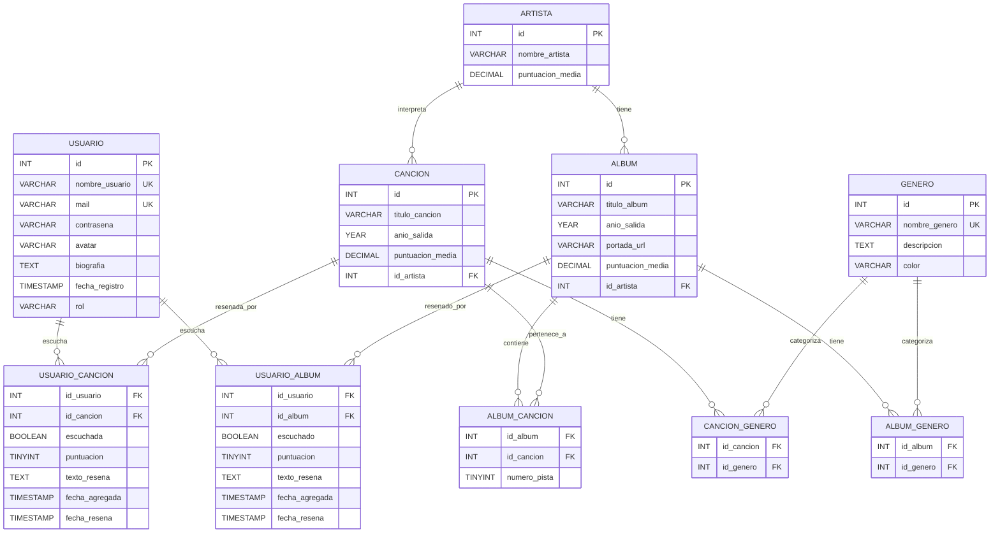

# Modelo Entidad-Relación y Backend Implementado: Discs & Records

> **Proyecto:** Discs & Records  
> **Tipo:** Aplicación web estilo Letterboxd para música  
> **Última actualización:** 12 de enero de 2026  
> **Versión Spring Boot:** 3.5.6 | **Java:** 21

---

## Resumen del Sistema

Sistema de catalogación, valoración y reseña de música donde los usuarios pueden:
- 🎵 Marcar canciones y álbumes como "escuchados"
- ⭐ Asignar puntuaciones (1-5 estrellas)
- ✍️ Escribir reseñas personales
- 📊 Ver estadísticas de géneros favoritos
- 🔍 Explorar música por artista, género y tendencias
- 🎧 Integración con Deezer API para datos musicales

---

## Entidades Principales

### 1. Usuario
| Atributo | Tipo | Restricciones |
|----------|------|---------------|
| ID_Usuario | INT | PK, AUTO_INCREMENT |
| Nombre_usuario | VARCHAR(50) | UNIQUE, NOT NULL |
| Mail | VARCHAR(100) | UNIQUE, NOT NULL |
| Contraseña | VARCHAR(255) | NOT NULL (hasheada) |
| Avatar | VARCHAR(255) | NULL (URL o ruta) |
| Biografia | TEXT | NULL (opcional) |
| Fecha_registro | TIMESTAMP | DEFAULT CURRENT_TIMESTAMP |

**Descripción:**
Representa a los usuarios registrados. La API incluye endpoints de lectura pública y operaciones protegidas con roles (ADMIN/MODERATOR) o restricciones por usuario autenticado, según el controlador.

---

### 2. Artista
| Atributo | Tipo | Restricciones |
|----------|------|---------------|
| ID_Artista | INT | PK, AUTO_INCREMENT |
| Nombre_artista | VARCHAR(100) | NOT NULL |
| Puntuacion_media | DECIMAL(3,2) | NULL (calculado) |

**Descripción:**
Representa artistas musicales. Existen endpoints para listado, búsqueda por nombre, detalle por ID y rutas anidadas para acceder a álbumes y canciones del artista.

---

### 3. Canción
| Atributo | Tipo | Restricciones |
|----------|------|---------------|
| ID_Cancion | INT | PK, AUTO_INCREMENT |
| Titulo_cancion | VARCHAR(150) | NOT NULL |
| Anio_salida | YEAR | NULL (opcional) |
| Puntuacion_media | DECIMAL(3,2) | NULL (calculado) |
| ID_Artista | INT | FK → Artista, NOT NULL |

**Descripción:**
Representa canciones individuales. Se observan endpoints con búsqueda por título, consulta por artista y operaciones CRUD protegidas por roles.

---

### 4. Álbum
| Atributo | Tipo | Restricciones |
|----------|------|---------------|
| ID_Album | INT | PK, AUTO_INCREMENT |
| Titulo_album | VARCHAR(150) | NOT NULL |
| Anio_salida | YEAR | NOT NULL |
| Portada_URL | VARCHAR(255) | NULL |
| Puntuacion_media | DECIMAL(3,2) | NULL (calculado) |
| ID_Artista | INT | FK → Artista, NOT NULL |

**Descripción:**
Representa álbumes musicales. La API incluye endpoints de búsqueda por título, consulta por artista y operaciones de creación/actualización/borrado protegidas por roles.

---

### 5. Género
| Atributo | Tipo | Restricciones |
|----------|------|---------------|
| ID_Genero | INT | PK, AUTO_INCREMENT |
| Nombre_genero | VARCHAR(50) | UNIQUE, NOT NULL |
| Descripcion | TEXT | NULL (opcional) |
| Color | VARCHAR(7) | NULL (hex color para UI) |

**Descripción:**
Catálogo de géneros musicales con endpoints públicos de lectura y endpoints protegidos para operaciones de mantenimiento (según roles).

---

## Tablas de Relación (Intermedias)

### 6. Usuario_Cancion
| Atributo | Tipo | Restricciones |
|----------|------|---------------|
| ID_Usuario | INT | FK → Usuario, NOT NULL |
| ID_Cancion | INT | FK → Cancion, NOT NULL |
| Escuchada | BOOLEAN | DEFAULT TRUE |
| Puntuacion | TINYINT | NULL, CHECK (1-5) |
| Texto_resena | TEXT | NULL (opcional) |
| Fecha_agregada | TIMESTAMP | DEFAULT CURRENT_TIMESTAMP |
| Fecha_resena | TIMESTAMP | NULL |

**PK Compuesta:** (ID_Usuario, ID_Cancion)

**Descripción:**
Representa la lista de canciones escuchadas/reseñadas por usuario.

---

### 7. Usuario_Album
| Atributo | Tipo | Restricciones |
|----------|------|---------------|
| ID_Usuario | INT | FK → Usuario, NOT NULL |
| ID_Album | INT | FK → Album, NOT NULL |
| Escuchado | BOOLEAN | DEFAULT TRUE |
| Puntuacion | TINYINT | NULL, CHECK (1-5) |
| Texto_resena | TEXT | NULL (opcional) |
| Fecha_agregada | TIMESTAMP | DEFAULT CURRENT_TIMESTAMP |
| Fecha_resena | TIMESTAMP | NULL |

**PK Compuesta:** (ID_Usuario, ID_Album)

**Descripción:**
Representa la lista de álbumes escuchados/reseñados por usuario.

---

### 8. Cancion_Genero
| Atributo | Tipo | Restricciones |
|----------|------|---------------|
| ID_Cancion | INT | FK → Cancion, NOT NULL |
| ID_Genero | INT | FK → Genero, NOT NULL |

**PK Compuesta:** (ID_Cancion, ID_Genero)

---

### 9. Album_Genero
| Atributo | Tipo | Restricciones |
|----------|------|---------------|
| ID_Album | INT | FK → Album, NOT NULL |
| ID_Genero | INT | FK → Genero, NOT NULL |

**PK Compuesta:** (ID_Album, ID_Genero)

---

### 10. Album_Cancion
| Atributo | Tipo | Restricciones |
|----------|------|---------------|
| ID_Album | INT | FK → Album, NOT NULL |
| ID_Cancion | INT | FK → Cancion, NOT NULL |
| Numero_pista | TINYINT | NULL (orden en el álbum) |

**PK Compuesta:** (ID_Album, ID_Cancion)

---

## Diagrama Entidad-Relación (ER)

### Diagrama Visual (Mermaid)



> **Visualización:** GitHub, GitLab y VS Code (con extensión) renderizan Mermaid automáticamente.

### Cardinalidades (Notación Crow's Foot)

```
Usuario (1) ────── (N) Usuario_Cancion (N) ────── (1) Cancion
Usuario (1) ────── (N) Usuario_Album (N) ────── (1) Album

Artista (1) ────── (N) Cancion
Artista (1) ────── (N) Album

Album (N) ────── (M) Cancion  [a través de Album_Cancion]

Cancion (N) ────── (M) Genero  [a través de Cancion_Genero]
Album (N) ────── (M) Genero  [a través de Album_Genero]
```

### Notación de Cardinalidades

- **1:N** → Un registro en A se relaciona con muchos en B, pero cada registro en B pertenece a un único A
- **N:M** → Muchos registros en A se relacionan con muchos en B (requiere tabla intermedia)

---

## Funcionalidades del Perfil de Usuario

### Tres pestañas principales:

**1. Canciones Escuchadas**
```sql
SELECT * FROM Usuario_Cancion 
WHERE ID_Usuario = ?
ORDER BY Fecha_agregada DESC;
```

**2. Álbumes Escuchados**
```sql
SELECT * FROM Usuario_Album 
WHERE ID_Usuario = ?
ORDER BY Fecha_agregada DESC;
```

**3. Reseñas (Autoconstruida)**
```sql
SELECT 'cancion' AS tipo, c.Titulo_cancion AS titulo, 
       uc.Puntuacion, uc.Texto_resena, uc.Fecha_resena
FROM Usuario_Cancion uc
JOIN Cancion c ON uc.ID_Cancion = c.ID_Cancion
WHERE uc.ID_Usuario = ? AND uc.Texto_resena IS NOT NULL

UNION ALL

SELECT 'album' AS tipo, a.Titulo_album AS titulo,
       ua.Puntuacion, ua.Texto_resena, ua.Fecha_resena
FROM Usuario_Album ua
JOIN Album a ON ua.ID_Album = a.ID_Album
WHERE ua.ID_Usuario = ? AND ua.Texto_resena IS NOT NULL

ORDER BY Fecha_resena DESC;
```

---

## Queries Útiles

### Calcular puntuación media de un artista
```sql
SELECT 
    (SELECT AVG(uc.Puntuacion) FROM Usuario_Cancion uc
     JOIN Cancion c ON uc.ID_Cancion = c.ID_Cancion
     WHERE c.ID_Artista = ? AND uc.Puntuacion IS NOT NULL) +
    (SELECT AVG(ua.Puntuacion) FROM Usuario_Album ua
     JOIN Album a ON ua.ID_Album = a.ID_Album
     WHERE a.ID_Artista = ? AND ua.Puntuacion IS NOT NULL)
) / 2 AS Puntuacion_media_artista;
```

### Géneros más escuchados por un usuario
```sql
SELECT g.Nombre_genero, COUNT(*) AS veces_escuchado
FROM Genero g
JOIN Cancion_Genero cg ON g.ID_Genero = cg.ID_Genero
JOIN Usuario_Cancion uc ON cg.ID_Cancion = uc.ID_Cancion
WHERE uc.ID_Usuario = ?
GROUP BY g.ID_Genero
ORDER BY veces_escuchado DESC
LIMIT 5;
```

### Álbumes en tendencia (más reseñados recientemente)
```sql
SELECT a.*, COUNT(ua.ID_Usuario) AS num_reviews
FROM Album a
JOIN Usuario_Album ua ON a.ID_Album = ua.ID_Album
WHERE ua.Fecha_resena >= DATE_SUB(NOW(), INTERVAL 7 DAY)
  AND ua.Texto_resena IS NOT NULL
GROUP BY a.ID_Album
ORDER BY num_reviews DESC
LIMIT 10;
```

---

## Implementación Backend

### Arquitectura del Proyecto

```
backend/src/main/java/com/discsandrecords/api/
├── config/                    # Configuración de la aplicación
│   ├── LoggingInterceptor.java      # Interceptor de logging HTTP
│   ├── OpenApiConfig.java           # Configuración Swagger/OpenAPI
│   ├── PasswordEncoderConfig.java   # BCrypt para contraseñas
│   └── WebConfig.java               # Configuración web (CORS, interceptores)
├── controllers/               # Controladores REST (8 controllers)
│   ├── AlbumController.java
│   ├── ArtistaController.java
│   ├── AuthController.java          # Login/Register públicos
│   ├── CancionController.java
│   ├── DeezerProxyController.java   # Proxy para evitar CORS con Deezer API
│   ├── GeneroController.java
│   ├── ResenaController.java
│   └── UsuarioController.java
├── dto/                       # Data Transfer Objects (21 DTOs)
│   ├── AlbumResponseDTO.java
│   ├── ArtistaResponseDTO.java
│   ├── AuthResponseDTO.java
│   ├── CancionResponseDTO.java
│   ├── CreateAlbumDTO.java
│   ├── CreateArtistaDTO.java
│   ├── CreateCancionDTO.java
│   ├── CreateGeneroDTO.java
│   ├── CreateResenaAlbumDTO.java
│   ├── CreateResenaCancionDTO.java
│   ├── CreateUsuarioDTO.java
│   ├── GeneroResponseDTO.java
│   ├── LoginRequestDTO.java
│   ├── PageResponseDTO.java         # DTO genérico para paginación
│   ├── RegisterRequestDTO.java
│   ├── ResenaAlbumResponseDTO.java
│   ├── ResenaCancionResponseDTO.java
│   ├── UpdateResenaDTO.java
│   ├── UpdateUsuarioDTO.java
│   ├── UsuarioEstadisticasDTO.java  # Estadísticas de perfil
│   └── UsuarioResponseDTO.java
├── entities/                  # Entidades JPA (16 entidades)
│   ├── Album.java
│   ├── AlbumCancion.java / AlbumCancionId.java
│   ├── AlbumGenero.java / AlbumGeneroId.java
│   ├── Artista.java
│   ├── Cancion.java
│   ├── CancionGenero.java / CancionGeneroId.java
│   ├── Genero.java
│   ├── Role.java                    # Enum: ROLE_USER, ROLE_MODERATOR, ROLE_ADMIN
│   ├── Usuario.java                 # Implementa UserDetails
│   ├── UsuarioAlbum.java / UsuarioAlbumId.java
│   └── UsuarioCancion.java / UsuarioCancionId.java
├── exceptions/                # Manejo de excepciones
│   ├── BusinessRuleException.java
│   ├── DuplicateResourceException.java
│   ├── GlobalExceptionHandler.java  # @ControllerAdvice centralizado
│   └── ResourceNotFoundException.java
├── repositories/              # Repositorios JPA (7 repositorios)
│   ├── AlbumRepository.java
│   ├── ArtistaRepository.java
│   ├── CancionRepository.java
│   ├── GeneroRepository.java
│   ├── UsuarioAlbumRepository.java
│   ├── UsuarioCancionRepository.java
│   └── UsuarioRepository.java
├── security/                  # Seguridad JWT
│   ├── JwtAuthenticationFilter.java # Filtro de autenticación JWT
│   ├── JwtService.java              # Generación/validación de tokens
│   └── SecurityConfig.java          # Configuración Spring Security
├── services/                  # Lógica de negocio (7 servicios)
│   ├── AlbumService.java
│   ├── ArtistaService.java
│   ├── AuthService.java             # Login/Register
│   ├── CancionService.java
│   ├── GeneroService.java
│   ├── ResenaService.java
│   └── UsuarioService.java          # Implementa UserDetailsService
└── DiscsAndRecordsApplication.java  # Clase principal
```

---

### Controladores REST y Endpoints

#### 1. AuthController (`/api/auth`)
| Método | Endpoint | Acceso | Descripción |
|--------|----------|--------|-------------|
| POST | `/login` | Público | Login y obtención de token JWT |
| POST | `/register` | Público | Registro de nuevo usuario |
| GET | `/me` | Autenticado | Obtener datos del usuario actual |

#### 2. UsuarioController (`/api/usuarios`)
| Método | Endpoint | Acceso | Descripción |
|--------|----------|--------|-------------|
| GET | `/` | Público | Listar todos los usuarios |
| GET | `/paginado` | Público | Listar con paginación |
| GET | `/{id}` | Público | Obtener usuario por ID |
| GET | `/username/{nombreUsuario}` | Público | Buscar por nombre de usuario |
| GET | `/{id}/estadisticas` | Público | Estadísticas del perfil (géneros, conteos) |
| POST | `/` | ADMIN | Crear usuario administrativamente |
| PUT | `/{id}` | ADMIN o propio usuario | Actualizar usuario |
| DELETE | `/{id}` | ADMIN | Eliminar usuario |

#### 3. ArtistaController (`/api/artistas`)
| Método | Endpoint | Acceso | Descripción |
|--------|----------|--------|-------------|
| GET | `/` | Público | Listar todos los artistas |
| GET | `/paginado` | Público | Listar con paginación y ordenación |
| GET | `/{id}` | Público | Obtener artista por ID |
| GET | `/buscar?nombre=` | Público | Buscar por nombre |
| GET | `/{id}/albums` | Público | Álbumes del artista |
| GET | `/{id}/albums/paginado` | Público | Álbumes paginados |
| GET | `/{id}/canciones` | Público | Canciones del artista |
| GET | `/{id}/canciones/paginado` | Público | Canciones paginadas |
| POST | `/` | ADMIN/MODERATOR | Crear artista |
| PUT | `/{id}` | ADMIN/MODERATOR | Actualizar artista |
| DELETE | `/{id}` | ADMIN | Eliminar artista |

#### 4. AlbumController (`/api/albumes`)
| Método | Endpoint | Acceso | Descripción |
|--------|----------|--------|-------------|
| GET | `/` | Público | Listar todos los álbumes |
| GET | `/paginado` | Público | Listar con paginación |
| GET | `/{id}` | Público | Obtener álbum por ID |
| GET | `/buscar?titulo=` | Público | Buscar por título |
| GET | `/artista/{idArtista}` | Público | Álbumes de un artista |
| POST | `/` | ADMIN/MODERATOR | Crear álbum |
| PUT | `/{id}` | ADMIN/MODERATOR | Actualizar álbum |
| DELETE | `/{id}` | ADMIN | Eliminar álbum |

#### 5. CancionController (`/api/canciones`)
| Método | Endpoint | Acceso | Descripción |
|--------|----------|--------|-------------|
| GET | `/` | Público | Listar todas las canciones |
| GET | `/paginado` | Público | Listar con paginación |
| GET | `/{id}` | Público | Obtener canción por ID |
| GET | `/buscar?titulo=` | Público | Buscar por título |
| GET | `/artista/{idArtista}` | Público | Canciones de un artista |
| POST | `/` | ADMIN/MODERATOR | Crear canción |
| PUT | `/{id}` | ADMIN/MODERATOR | Actualizar canción |
| DELETE | `/{id}` | ADMIN | Eliminar canción |

#### 6. GeneroController (`/api/generos`)
| Método | Endpoint | Acceso | Descripción |
|--------|----------|--------|-------------|
| GET | `/` | Público | Listar todos los géneros |
| GET | `/paginado` | Público | Listar con paginación |
| GET | `/{id}` | Público | Obtener género por ID |
| GET | `/buscar?nombre=` | Público | Buscar por nombre |
| POST | `/` | ADMIN/MODERATOR | Crear género |
| PUT | `/{id}` | ADMIN/MODERATOR | Actualizar género |
| DELETE | `/{id}` | ADMIN | Eliminar género |

#### 7. ResenaController (`/api/resenas`)
| Método | Endpoint | Acceso | Descripción |
|--------|----------|--------|-------------|
| GET | `/albumes/{albumId}` | Público | Reseñas de un álbum |
| GET | `/albumes/usuario/{usuarioId}` | Público | Reseñas de álbumes del usuario |
| GET | `/albumes/{albumId}/usuario/{usuarioId}` | Público | Reseña específica |
| POST | `/albumes` | Autenticado (propio) | Crear reseña de álbum |
| PUT | `/albumes/{albumId}/usuario/{usuarioId}` | Autor o ADMIN | Actualizar reseña |
| DELETE | `/albumes/{albumId}/usuario/{usuarioId}` | Autor o ADMIN | Eliminar reseña |
| GET | `/canciones/{cancionId}` | Público | Reseñas de una canción |
| GET | `/canciones/usuario/{usuarioId}` | Público | Reseñas de canciones del usuario |
| POST | `/canciones` | Autenticado (propio) | Crear reseña de canción |
| PUT | `/canciones/{cancionId}/usuario/{usuarioId}` | Autor o ADMIN | Actualizar reseña |
| DELETE | `/canciones/{cancionId}/usuario/{usuarioId}` | Autor o ADMIN | Eliminar reseña |

#### 8. DeezerProxyController (`/api/deezer`)
| Método | Endpoint | Acceso | Descripción |
|--------|----------|--------|-------------|
| GET | `/**` | Público | Proxy genérico para Deezer API (evita CORS) |

**Ejemplo:** `GET /api/deezer/chart/0/albums?limit=50` → Redirige a `https://api.deezer.com/chart/0/albums?limit=50`

---

### Sistema de Seguridad

#### Arquitectura de Seguridad JWT

```
┌──────────────────────────────────────────────────────────┐
│                   PETICIÓN HTTP                          │
└──────────────────────────────────────────────────────────┘
                           │
                           ▼
┌──────────────────────────────────────────────────────────┐
│               CORS Filter                                │
│  - Orígenes: localhost:4200, *.ondigitalocean.app       │
└──────────────────────────────────────────────────────────┘
                           │
                           ▼
┌──────────────────────────────────────────────────────────┐
│           JwtAuthenticationFilter                        │
│  - Extrae token del header Authorization                │
│  - Valida token (firma, expiración)                     │
│  - Establece SecurityContext                            │
└──────────────────────────────────────────────────────────┘
                           │
                           ▼
┌──────────────────────────────────────────────────────────┐
│           Authorization Filter                           │
│  - @PreAuthorize en métodos                             │
│  - hasRole(), hasAnyRole(), isAuthenticated()           │
└──────────────────────────────────────────────────────────┘
                           │
                           ▼
┌──────────────────────────────────────────────────────────┐
│                   CONTROLLER                             │
└──────────────────────────────────────────────────────────┘
```

#### Roles del Sistema
| Rol | Permisos |
|-----|----------|
| `ROLE_USER` | Crear/editar/eliminar sus propias reseñas |
| `ROLE_MODERATOR` | USER + Crear/editar artistas, álbumes, canciones, géneros |
| `ROLE_ADMIN` | MODERATOR + Eliminar cualquier contenido + Gestión de usuarios |

#### Configuración JWT
```properties
# application.properties
jwt.secret=${JWT_SECRET:dev-secret-key-for-local-development}
jwt.expiration=${JWT_EXPIRATION:86400000}  # 24 horas
```

---

### Manejo de Excepciones (GlobalExceptionHandler)

| Excepción | Código HTTP | Respuesta |
|-----------|-------------|-----------|
| `MethodArgumentNotValidException` | 400 | `{"error": "VALIDATION_ERROR", "message": "..."}` |
| `ResourceNotFoundException` | 404 | `{"error": "NOT_FOUND", "message": "..."}` |
| `DuplicateResourceException` | 409 | `{"error": "DUPLICATE_RESOURCE", "message": "..."}` |
| `BusinessRuleException` | 400 | `{"error": "<ruleCode>", "message": "..."}` |
| `BadCredentialsException` | 401 | `{"error": "UNAUTHORIZED", "message": "Credenciales inválidas"}` |
| `Exception` (general) | 500 | `{"error": "INTERNAL_SERVER_ERROR", "message": "..."}` |

---

### DTO de Paginación (PageResponseDTO)

Todos los endpoints `/paginado` soportan los siguientes parámetros:

| Parámetro | Default | Descripción |
|-----------|---------|-------------|
| `page` | 0 | Número de página (0-indexed) |
| `size` | 10 | Elementos por página |
| `sortBy` | id | Campo de ordenación |
| `sortDir` | asc | Dirección (asc/desc) |

**Respuesta:**
```json
{
  "content": [...],
  "page": 0,
  "size": 10,
  "totalElements": 150,
  "totalPages": 15,
  "first": true,
  "last": false
}
```

---

### Estadísticas de Usuario (UsuarioEstadisticasDTO)

Endpoint: `GET /api/usuarios/{id}/estadisticas`

```json
{
  "totalAlbumesEscuchados": 45,
  "totalCancionesEscuchadas": 320,
  "totalResenasAlbumes": 12,
  "totalResenasCanciones": 28,
  "puntuacionMediaDada": 3.8,
  "generosMasEscuchados": [
    {"generoId": 1, "nombreGenero": "Rock", "color": "#E91E63", "conteo": 85},
    {"generoId": 3, "nombreGenero": "Jazz", "color": "#9C27B0", "conteo": 42}
  ]
}
```

---

### Observabilidad (Spring Boot Actuator)

| Endpoint | Descripción |
|----------|-------------|
| `/actuator/health` | Estado de la aplicación (usado por Docker healthcheck) |
| `/actuator/info` | Información de la aplicación |

**Healthcheck Docker:**
```dockerfile
HEALTHCHECK --interval=30s --timeout=10s --start-period=120s --retries=10 \
  CMD curl -f http://localhost:8080/actuator/health || exit 1
```

---

### Logging de Peticiones (LoggingInterceptor)

Cada petición HTTP recibe un `X-Request-ID` único para trazabilidad:

```
[2026-01-12 10:30:45] REQUEST: GET /api/artistas/1 | Request-ID: a1b2c3d4-e5f6-...
[2026-01-12 10:30:45] RESPONSE: 200 OK | Duration: 45ms | Request-ID: a1b2c3d4-e5f6-...
```

---

### Documentación OpenAPI/Swagger

- **Swagger UI:** `http://localhost:8080/swagger-ui.html`
- **OpenAPI JSON:** `http://localhost:8080/api-docs`

**Autenticación en Swagger UI:**
1. Login con `POST /api/auth/login`
2. Copiar el token de la respuesta
3. Click en "Authorize" (🔒)
4. Pegar el token (sin "Bearer ")

---

### Perfiles de Configuración

| Perfil | Base de Datos | Uso |
|--------|--------------|-----|
| `default` | H2 (memoria) | Desarrollo local |
| `dev` | H2 (memoria) | Desarrollo con logs detallados |
| `docker` | MariaDB | Contenedores Docker |
| `test` | H2 (memoria) | Tests automatizados |

```bash
# Activar perfil
SPRING_PROFILES_ACTIVE=docker ./mvnw spring-boot:run
```

---

### Tests Automatizados

**Cobertura de tests:**

| Tipo | Archivos | Descripción |
|------|----------|-------------|
| Controllers | 5 tests | `AlbumControllerTest`, `ArtistaControllerTest`, `CancionControllerTest`, `GeneroControllerTest`, `AuthControllerTest` |
| Services | 2 tests | `AlbumServiceTest`, `AuthServiceTest` |
| Integration | 2 tests | `AuthIntegrationTest`, `AuthorizationIntegrationTest` |
| Repositories | - | Tests JPA |

**Tecnologías de testing:**
- `@WebMvcTest` - Tests de controladores aislados
- `@SpringBootTest` - Tests de integración
- `@DataJpaTest` - Tests de repositorios
- MockMvc + `@WithMockUser` - Simulación de autenticación

---

## Decisiones de Diseño

### Simplificaciones (MVP)
- **No colaboraciones:** Un artista por canción/álbum (simplifica relaciones)
- **No playlists temáticas:** Solo listas "escuchadas" por usuario
- **No sistema social:** Sin seguidores, likes ni comentarios en reseñas
- **No historial de reproducción:** Solo marca "escuchado" (sin registro de cada play)
- **Integración Deezer:** Datos musicales vía API externa (no almacenamiento local masivo)

### Decisiones Técnicas
- **JWT Stateless:** Sin sesiones en servidor, escalabilidad horizontal
- **Records para DTOs:** Inmutabilidad y código limpio (Java 21)
- **BCrypt:** Hashing de contraseñas con factor de trabajo por defecto
- **Proxy Deezer:** Evita problemas CORS llamando desde el servidor

---

## Dependencias Principales (pom.xml)

| Dependencia | Versión | Propósito |
|-------------|---------|-----------|
| Spring Boot | 3.5.6 | Framework base |
| Spring Security | (parent) | Autenticación/autorización |
| Spring Data JPA | (parent) | Persistencia |
| jjwt-api | 0.12.6 | Gestión JWT |
| springdoc-openapi | 2.7.0 | Documentación Swagger |
| H2 Database | (parent) | BD desarrollo/tests |
| MariaDB Client | (parent) | BD producción |
| PostgreSQL | (parent) | BD alternativa |
| Lombok | (parent) | Reducción boilerplate |

---

## Índices Recomendados

```sql
-- Para búsquedas rápidas
CREATE INDEX idx_cancion_artista ON Cancion(ID_Artista);
CREATE INDEX idx_album_artista ON Album(ID_Artista);
CREATE INDEX idx_usuario_cancion_fecha ON Usuario_Cancion(ID_Usuario, Fecha_agregada);
CREATE INDEX idx_usuario_album_fecha ON Usuario_Album(ID_Usuario, Fecha_agregada);

-- Para filtros por género
CREATE INDEX idx_cancion_genero ON Cancion_Genero(ID_Genero);
CREATE INDEX idx_album_genero ON Album_Genero(ID_Genero);

-- Para búsquedas por nombre
CREATE INDEX idx_artista_nombre ON Artista(Nombre_artista);
CREATE INDEX idx_cancion_titulo ON Cancion(Titulo_cancion);
CREATE INDEX idx_album_titulo ON Album(Titulo_album);
```

---

## Constraints y Validaciones

```sql
-- Puntuaciones válidas (1-5 estrellas)
ALTER TABLE Usuario_Cancion 
ADD CONSTRAINT chk_puntuacion_cancion CHECK (Puntuacion BETWEEN 1 AND 5);

ALTER TABLE Usuario_Album 
ADD CONSTRAINT chk_puntuacion_album CHECK (Puntuacion BETWEEN 1 AND 5);

-- Email válido
ALTER TABLE Usuario 
ADD CONSTRAINT chk_email_formato CHECK (Mail LIKE '%_@__%.__%');

-- Año de salida válido
ALTER TABLE Cancion 
ADD CONSTRAINT chk_anio_cancion CHECK (Anio_salida BETWEEN 1900 AND YEAR(CURDATE()));

ALTER TABLE Album 
ADD CONSTRAINT chk_anio_album CHECK (Anio_salida BETWEEN 1900 AND YEAR(CURDATE()));
```

---

## Historial de Cambios

| Fecha | Cambio |
|-------|--------|
| 2026-01-12 | Documentación completa de controladores, DTOs, seguridad y arquitectura |
| 2025-12-15 | Versión inicial del modelo E-R |
