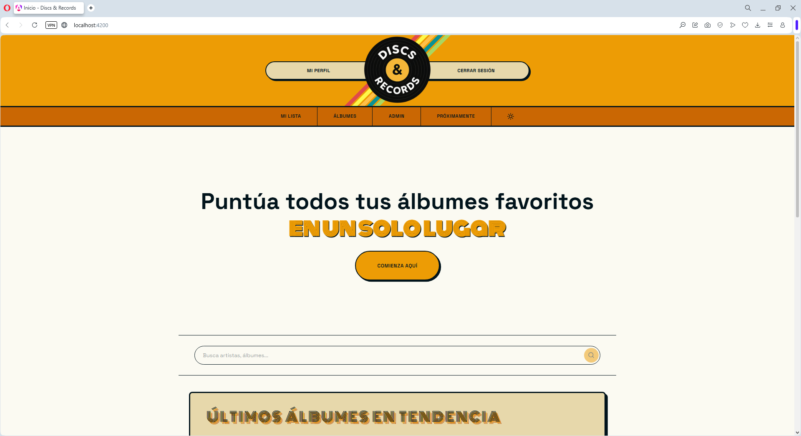
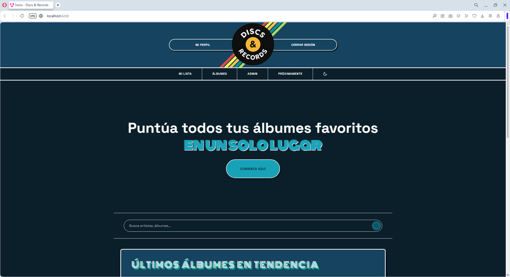
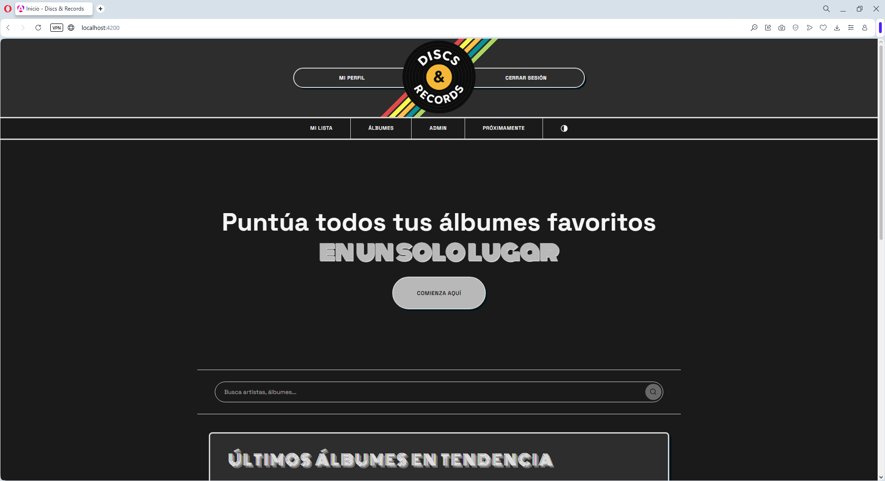
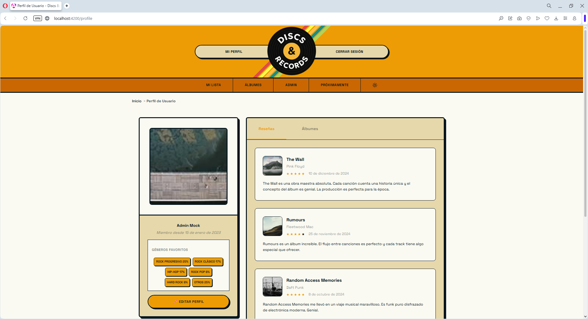
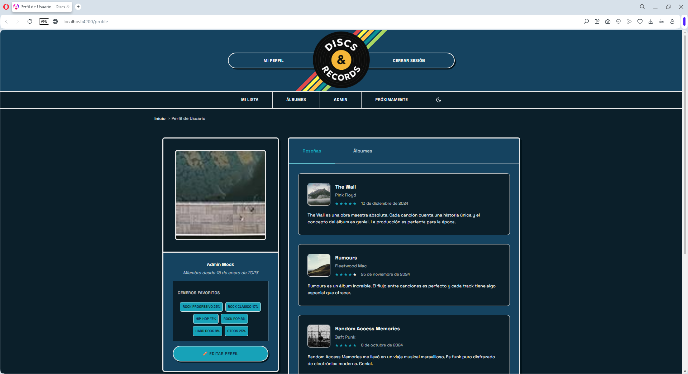
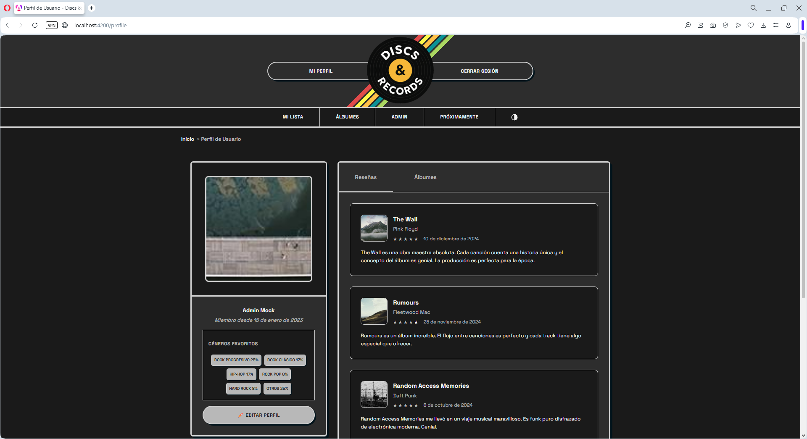
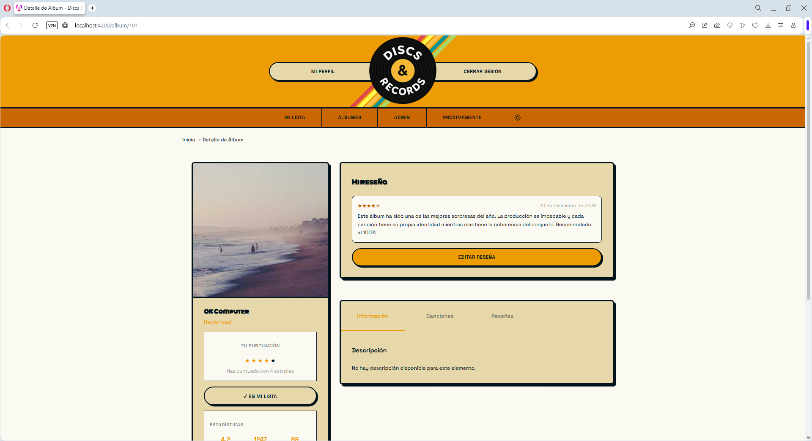
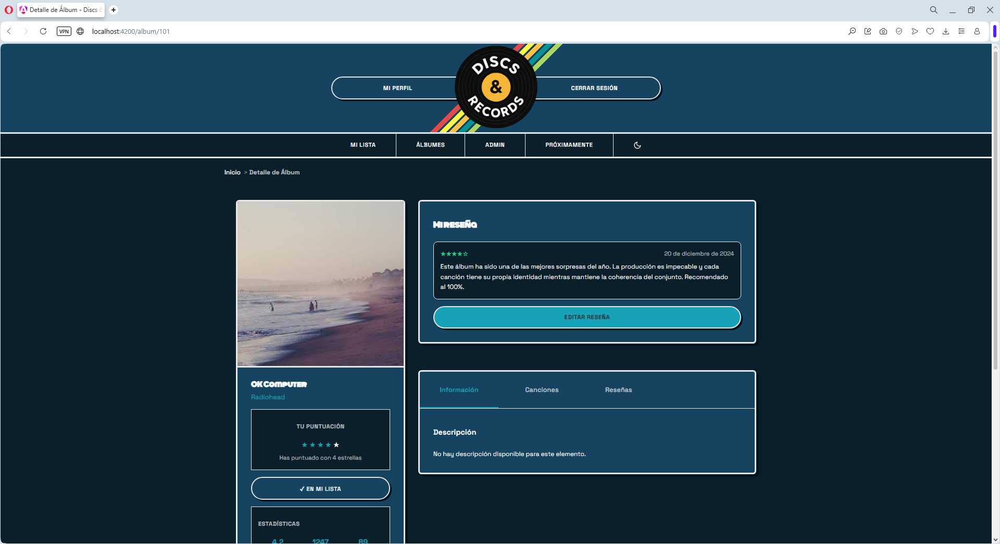
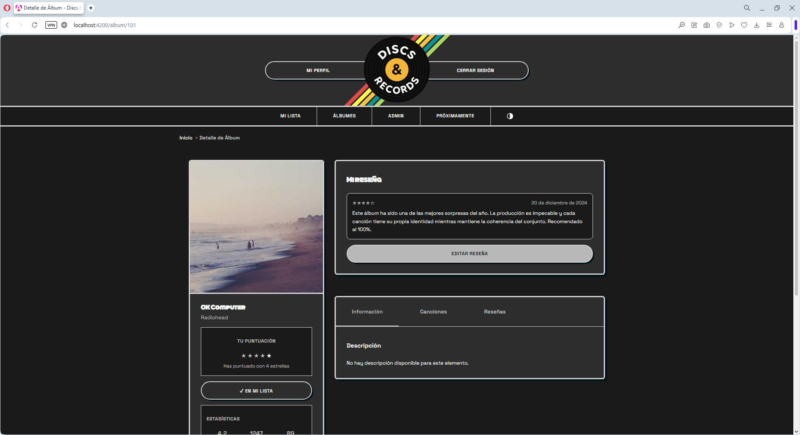

# Sección 1: Arquitectura CSS y Comunicación Visual

> **Proyecto:** Discs & Records
> **Fase:** 1 - Fundamentos y Arquitectura CSS
> **Entrega:** 18 de diciembre de 2025

---

## 1.1 Principios de la Comunicación Visual

### Del mockup redondeado al Neobrutalismo: Justificación del cambio de diseño

El diseño original de "Discs & Records" ya contemplaba un estilo **"blocky"** con formas cuadradas y bordes marcados. Sin embargo, durante el desarrollo del mockup, opté por suavizar el diseño hacia formas más redondeadas y convencionales. Tras trabajar con esta versión, me di cuenta de que **no me terminaba de convencer**: perdía personalidad y se parecía demasiado a otras aplicaciones del sector.

Fue entonces cuando descubrí el **neobrutalismo** como tendencia de diseño web. Al investigar, me di cuenta de que este estilo se utiliza frecuentemente en **páginas con estética retro** —precisamente lo que buscaba transmitir con mi paleta de colores 70s. El neobrutalismo encajaba perfectamente con la idea original que tenía para el proyecto.

Por eso decidí **volver al concepto inicial** de diseño "blocky", pero ahora con un enfoque más definido y consciente:

- **Bordes gruesos y sólidos** (3px) que recuerdan a las fundas de discos de vinilo
- **Sombras offset sin blur** (4px 4px 0px) que evocan la profundidad de los surcos del vinilo
- **Colores vibrantes de los 70s** que reflejan la energía de esa época dorada de la música
- **Formas más cuadradas** con radios sutiles (5px) que mantienen el carácter brutal sin ser agresivos

Lo importante es que este cambio estético **no altera la estructura funcional** que ya tenía definida: la posición de los botones, los tipos de cards, los carruseles y la navegación se mantienen exactamente igual. Solo evoluciona el aspecto visual hacia esa estética retro-brutal que mejor representa la identidad de "Discs & Records".


---

### Jerarquía

La jerarquía visual se establece mediante una escala tipográfica bien definida y el uso estratégico del espacio. Establezco varios niveles de prioridad visual:

- **Nivel 1 - Título principal:** El texto **"Puntúa todas tus canciones y álbumes favoritos en un solo lugar"** utiliza un tamaño grande (~4.25rem/68px), peso regular y posición centrada para captar inmediatamente la atención. Este es el punto focal de la página invitando al usuario a realizar la acción principal de la aplicación web.

- **Nivel 2 - Call-to-Action primario:** El botón "COMIENZA AQUÍ" destaca con fondo naranja dorado (#ED9C05), texto en mayúsculas y sombra brutal offset. Este botón justo en medio y debajo del lema, crea urgencia visual al usuario, invitándolo a crear cuenta para tener su propio registro.

- **Nivel 3 - Títulos de sección:** "ÁLBUMES EN TENDENCIA" usa una tipografía decorativa (Monoton) con estilo retro 70s y tamaño intermedio (~2.625rem/42px), diferenciándose del contenido principal, creando contraste con el resto de la página. Esta tipografía es difícil de leer en textos largos, por lo que la decisión de diseño aquí ha sido usarla solo en palabras cortas o frases de 3-4 palabras.

- **Nivel 4 - Navegación:** Los botones "REGISTRARSE" e "INICIAR SESIÓN" tienen menor jerarquía visual, integrados en la barra superior con fondo semi-transparente. Los botones son grandes con el fin de ser accesibles.

- **Nivel 5 - Elementos de apoyo:** *Labels* como "Busca lo que más te guste" y controles del carrusel (flechas) usan tamaños menores para no competir con el contenido principal.


---

### Contraste

El contraste se aplica de múltiples formas para diferenciar elementos y mejorar la legibilidad:

- **Contraste cromático:** La paleta cálida 70s (naranjas #ED9C05, #CA6703, #BB3F03, rojo vino #9D2227) sobre fondos claros (#FBFAF2, beige #E7D8AB) crea una separación visual clara. El header con degradado naranja contrasta fuertemente con el contenido beige inferior. Se alterna a una paleta fría para el modo oscuro (verde menta #93CFBB, teales #0A9295, #015F72) sobre fondo azul noche (#01131B).

- **Contraste de tamaño:** La diferencia entre el título principal (4.25rem) y el texto de párrafo (1rem) es de 4:1, generando una jerarquía clara e inmediata.

- **Contraste de peso:** Los botones usan texto en mayúsculas con peso medio (600), mientras que el cuerpo de texto usa peso regular (400).

- **Contraste figura-fondo:** El logo circular negro "DISCS & RECORDS" sobre las franjas de colores arcoíris crea un punto focal fuerte en la navegación.

- **Contraste neobrutalista:** Los bordes negros sólidos (3px) contra fondos de colores vivos crean una separación visual muy marcada, característica del estilo.


---

### Alineación

La estrategia de alineación combina múltiples técnicas según el contexto de cada vista:

**En la página de perfil de usuario:**

- **Layout de dos columnas:** La vista de perfil utiliza un layout asimétrico donde la información del usuario (avatar, nombre, estadísticas de géneros) ocupa aproximadamente 1/3 del ancho a la izquierda, mientras que el contenido principal (tabs y grid de álbumes) ocupa 2/3 a la derecha.

- **Alineación izquierda en el sidebar:** El nombre de usuario, los géneros más escuchados y las barras de progreso se alinean a la izquierda, facilitando la lectura vertical de la información.

- **Grid para álbumes:** Los álbumes del usuario se organizan en un CSS Grid responsivo con `grid-template-columns: repeat(auto-fit, minmax(250px, 1fr))`.

- **Tabs centrados:** Los botones "Reseñas", "Álbumes" y "Canciones" se agrupan y centran sobre el grid de contenido.


**En elementos globales:**

- **Alineación del header:** Los elementos de navegación (logo, botones) se distribuyen usando flexbox con `justify-content: space-between`.

- **Centrado de contenido hero:** En la página principal, el título y CTA se centran horizontalmente creando un eje visual central.

- **Contenedores neobrutalistas:** Los grids de álbumes están envueltos en contenedores con borde naranja/rojo grueso (#CA6703) que delimitan visualmente el área de contenido.


---

### Proximidad

El espaciado agrupa elementos relacionados y separa secciones distintas:

- **Grupo Hero:** El título, subtítulo, botón CTA y buscador están agrupados con espaciado reducido entre ellos (~1-2rem), indicando que pertenecen a la misma unidad funcional.

- **Separación de secciones:** Entre el área hero y "Álbumes en tendencia" hay un espaciado mayor (~3-4rem), indicando cambio de contexto.

- **Cards de álbumes:** Los álbumes mantienen un `gap` consistente de 2rem ($espaciado-m) entre ellos, sugiriendo que son elementos del mismo tipo pero independientes.

- **Navegación agrupada:** Los botones de autenticación comparten el mismo contenedor visual (barra naranja), indicando que son acciones relacionadas.

- **Franjas decorativas:** Las líneas de colores en el header están muy próximas entre sí (sin gap), formando un único elemento decorativo cohesivo.


---

### Repetición

La coherencia visual se logra repitiendo patrones en toda la interfaz:

- **Paleta de colores:** Los mismos naranjas y tierras (#ED9C05, #CA6703, #BB3F03, #9D2227) aparecen en el header, botones, títulos decorativos y acentos, creando unidad visual.

- **Bordes neobrutalistas:** Los elementos interactivos (botones, cards, inputs) comparten el mismo estilo de borde negro sólido (3px) y sombras offset (4px 4px 0px), reforzando la estética retro-brutal.

- **Tipografía consistente:** Space Grotesk se usa en todo el UI, con Monoton reservado solo para títulos decorativos de sección.

- **Forma de las cards:** Todos los álbumes/canciones usan el mismo formato cuadrado con bordes redondeados sutiles (5px) y sombras consistentes.

- **Iconografía:** Las flechas del carrusel usan el mismo estilo circular con borde, manteniendo coherencia con los demás elementos interactivos.

- **Espaciado modular:** Se repiten los mismos valores de espaciado ($espaciado-s: 1rem, $espaciado-m: 2rem, $espaciado-l: 3rem) en toda la aplicación.


---

## 1.2 Metodología CSS: ITCSS

He elegido **ITCSS (Inverted Triangle CSS)** como metodología de organización en lugar de BEM. Esta decisión se basa en varios factores:

### ¿Por qué ITCSS y no BEM?

**ITCSS** organiza los estilos desde lo más genérico hasta lo más específico, formando un "triángulo invertido" de especificidad:

```
       ╱╲
      ╱  ╲  Settings (variables) - Sin output CSS
     ╱    ╲
    ╱      ╲ Tools (mixins) - Sin output CSS
   ╱        ╲
  ╱          ╲ Generic (reset) - Especificidad muy baja
 ╱            ╲
╱──────────────╲ Elements (base HTML) - Especificidad baja
╲──────────────╱
 ╲            ╱ Layout (estructuras) - Especificidad media
  ╲          ╱
   ╲        ╱ Components (UI) - Especificidad media-alta
    ╲      ╱
     ╲    ╱ Utilities (!important) - Especificidad máxima
      ╲  ╱
       ╲╱
```

**Ventajas de ITCSS para este proyecto:**

1. **Evita guerras de especificidad:** Al importar en orden de menor a mayor especificidad, los estilos posteriores siempre pueden sobrescribir a los anteriores sin necesidad de `!important` (excepto en utilities).

2. **Escalabilidad:** Puedo añadir nuevos componentes sin preocuparme de conflictos con estilos existentes.

3. **Compatibilidad con Angular:** Los componentes Angular con `ViewEncapsulation.Emulated` generan sus propios selectores encapsulados, que conviven perfectamente con la estructura ITCSS global.

4. **Claridad organizativa:** Cada carpeta tiene un propósito claro y un nivel de especificidad definido.

**¿Por qué no BEM?**

BEM (Block-Element-Modifier) es excelente para nombrar clases, pero ITCSS es una metodología de **organización de archivos**, no de nomenclatura. De hecho, puedo usar convenciones tipo BEM dentro de mis componentes ITCSS si lo necesito:

```scss
// En 05-components/_card.scss
.card { }
.card__title { }
.card__image { }
.card--featured { }
```

Sin embargo, en Angular la encapsulación de estilos por componente reduce la necesidad de BEM estricto, ya que cada componente tiene su propio scope.

---

## 1.3 Organización de Archivos

```
frontend/src/styles/
├── 00-settings/
│   └── _variables.scss      # Design tokens: colores, tipografía, espaciado,
│                            # breakpoints, sombras, bordes, transiciones
│
├── 01-tools/
│   └── _mixins.scss         # Mixins reutilizables: tipografía, temas,
│                            # media queries, accesibilidad
│
├── 02-generic/
│   └── _reset.scss          # CSS Reset agresivo (box-sizing, márgenes, etc.)
│
├── 03-elements/
│   └── _base.scss           # Estilos base para elementos HTML sin clases:
│                            # h1-h6, p, a, button, input, table, etc.
│
├── 04-layout/
│   └── _grid.scss           # Sistema de grid (CSS Grid + Flexbox)
│
├── 05-components/
│   └── _buttons.scss        # Componentes UI reutilizables
│
├── 06-utilities/
│   └── _utils.scss          # Clases utilitarias con !important
│
├── 07-animations/
│   └── _keyframes.scss      # Definiciones de animaciones
│
└── styles.scss              # Archivo principal - importa todo en orden ITCSS
```

### ¿Por qué este orden?

| Capa | Especificidad | Propósito |
|------|---------------|-----------|
| **00-settings** | Ninguna | Solo variables SCSS, no genera CSS |
| **01-tools** | Ninguna | Solo mixins/funciones, no genera CSS |
| **02-generic** | Muy baja (`*`, `html`, `body`) | Reset universal, base limpia |
| **03-elements** | Baja (`h1`, `p`, `a`, `button`) | Estilos por defecto para HTML |
| **04-layout** | Media (`.grid`, `.container`) | Estructuras de página |

Este orden garantiza que los estilos más específicos siempre puedan sobrescribir a los más genéricos sin conflictos.

---

## 1.4 Sistema de Design Tokens

Los design tokens son variables SCSS que centralizan todos los valores de diseño, sirviendo como **única fuente de verdad** para colores, tipografía, espaciado y demás propiedades visuales.

### Colores

#### Paleta principal - Modo Light (Cálidos 70s)

| Token | Valor | Muestra | Uso |
|-------|-------|---------|-----|
| `$color-primario-light` | #ED9C05 | 🟠 | CTAs principales, acciones primarias |
| `$color-secundario-light` | #CA6703 | 🟠 | Acciones secundarias, bordes de contenedores |
| `$color-contraste-light` | #BB3F03 | 🟠 | Hover states, acentos |
| `$color-acentuado-light` | #9D2227 | 🔴 | Alertas, énfasis, badges |

**¿Por qué estos colores?** La paleta de naranjas y tierras evoca directamente la estética de los años 70: portadas de álbumes, discotecas con luces cálidas, y la calidez nostálgica de los vinilos. Estos colores transmiten energía, pasión por la música y un carácter retro distintivo.

#### Paleta principal - Modo Dark (Fríos 70s)

| Token | Valor | Muestra | Uso |
|-------|-------|---------|-----|
| `$color-primario-dark` | #93CFBB | 🟢 | CTAs principales |
| `$color-secundario-dark` | #0A9295 | 🔵 | Acciones secundarias |
| `$color-contraste-dark` | #015F72 | 🔵 | Hover states |
| `$color-acentuado-dark` | #01131B | ⚫ | Fondos, énfasis |

**¿Por qué estos colores?** Para el modo oscuro, mantengo la estética 70s pero con tonos fríos (teales y verdes menta) que recuerdan a las luces de neón de las discotecas nocturnas y los equipos de audio vintage.

#### Fondos

| Token Light | Token Dark | Valores | Uso |
|-------------|------------|---------|-----|
| `$color-fondo-light` | `$color-fondo-oscuro` | #FBFAF2 / #01131B | Fondo principal |
| `$color-fondo-light-secundario` | `$color-fondo-oscuro-secundario` | #E7D8AB / #013946 | Fondos de cards, secciones alternas |

#### Colores semánticos (estados)

| Token | Valor | Uso |
|-------|-------|-----|
| `$color-error` | #E04A4A | Errores, validaciones fallidas |
| `$color-advertencia-light` | #FFC047 | Advertencias (modo light) |
| `$color-advertencia-dark` | #FEF84A | Advertencias (modo dark) |
| `$color-exito` | #AAD661 | Confirmaciones, éxito |
| `$color-informacion` | #0A9295 | Información, tips |


---

### Tipografía

#### Familias tipográficas

| Token | Valor | Uso |
|-------|-------|-----|
| `$fuente-principal` | 'Space Grotesk', sans-serif | Todo el UI, cuerpo de texto, botones |
| `$fuente-secundaria` | 'Monoton' | Solo títulos decorativos de sección |

**¿Por qué Space Grotesk?** Es una fuente geométrica sans-serif con personalidad retro-moderna que combina excelente legibilidad con un carácter distintivo. Sus formas redondeadas pero precisas encajan con la estética neobrutalista.

**¿Por qué Monoton?** Es una fuente display inspirada en los carteles de las discotecas de los 70s. Solo la uso para títulos cortos ("ÁLBUMES EN TENDENCIA") porque su legibilidad es limitada en textos largos.

#### Escala tipográfica

| Token | Tamaño | Line-height | Uso |
|-------|--------|-------------|-----|
| `$tamanio-fuente-h1` | 4.25rem (68px) | 4.5rem | Títulos principales, hero |
| `$tamanio-fuente-h2` | 2.625rem (42px) | 3rem | Títulos de sección |
| `$tamanio-fuente-h3` | 1.625rem (26px) | 3rem | Subtítulos |
| `$tamanio-fuente-h4` | 1rem (16px) | 3rem | Títulos menores |
| `$tamanio-fuente-h5` | 1.125rem (18px) | 1.75rem | Títulos pequeños |
| `$tamanio-fuente-parrafo` | 1rem (16px) | 1.5rem | Cuerpo de texto |
| `$tamanio-fuente-texto-pequeno-m` | 0.9375rem (15px) | 1.5rem | Texto pequeño medio |
| `$tamanio-fuente-texto-pequeno-s` | 0.875rem (14px) | 1.5rem | Labels, captions |
| `$tamanio-fuente-texto-pequeno-xs` | 0.75rem (12px) | 1rem | Texto muy pequeño |
| `$tamanio-fuente-micro` | 0.625rem (10px) | 0.875rem | Badges pequeños |
| `$tamanio-fuente-leyenda` | 0.75rem italic | 1rem | Leyendas de formularios o imágenes |

#### Escala display (títulos decorativos grandes)

| Token | Tamaño | Uso |
|-------|--------|-----|
| `$tamanio-fuente-display-xs` | 1.25rem (20px) | Display extra pequeño |
| `$tamanio-fuente-display-s` | 1.5rem (24px) | Display pequeño |
| `$tamanio-fuente-display-m` | 1.75rem (28px) | Display medio |
| `$tamanio-fuente-display-l` | 2rem (32px) | Display grande |
| `$tamanio-fuente-display-xl` | 2.5rem (40px) | Display extra grande |
| `$tamanio-fuente-display-xxl` | 4rem (64px) | Página 404 desktop |
| `$tamanio-fuente-display-hero` | 5rem (80px) | Títulos hero |
| `$tamanio-fuente-display-mega` | 8rem (128px) | 404 responsive |
| `$tamanio-fuente-display-ultra` | 12rem (192px) | 404 desktop |

**¿Por qué esta escala?** Utilizo una escala aproximada con ratio 1.25 (Major Third) que proporciona suficiente contraste entre niveles sin saltos demasiado bruscos. El h1 es intencionadamente grande (4.25rem) para crear impacto en el hero. La escala display se usa para elementos decorativos y páginas especiales como la 404.

---

### Espaciado

#### Micro-espaciados

| Token | Valor | Uso |
|-------|-------|-----|
| `$espaciado-micro` | 2px | Transforms sutiles, focus rings |
| `$espaciado-mini` | 3px | Efectos sutiles |
| `$espaciado-tiny` | 4px | Padding muy pequeño |

#### Escala principal

| Token | Valor | Uso |
|-------|-------|-----|
| `$espaciado-xs` | 0.5rem (8px) | Padding interno mínimo, separación entre elementos muy cercanos |
| `$espaciado-s` | 1rem (16px) | Separación entre elementos cercanos, padding de botones |
| `$espaciado-m` | 2rem (32px) | Gap de grid, márgenes de sección |
| `$espaciado-l` | 3rem (48px) | Separación entre secciones |
| `$espaciado-xl` | 4rem (64px) | Espaciado hero, grandes bloques |
| `$espaciado-xxl` | 5rem (80px) | Espaciado extra grande |
(mobile-s) |
| `$breakpoint-mobile-sm` | 480px | Móvil grande (mobile-l) |
| `$breakpoint-tablet` | 768px | Tablet |
| `$breakpoint-desktop` | 1024px | Desktop |
| `$breakpoint-large-desktop` | 1200px | Desktop grande |
| `$breakpoint-ultra-wide` | 1600px | Ultra wide |

> **Nota:** Existe un mapa `$breakpoints` para un enfoque "Mobile-First" que incluye: `mobile` (375px) y `wide` (1280px)
| Token | Valor | Dispositivo |
|-------|-------|-------------|
| `$breakpoint-mobile` | 320px | Móvil pequeño |
| `$breakpoint-tablet` | 768px | Tablet |
| `$breakpoint-desktop` | 1024px | Desktop |
| `$breakpoint-large-desktop` | 1200px | Desktop grande |
| `$breakpoint-ultra-wide` | 1600px | Ultra wide |

**¿Por qué estos breakpoints?** Son los puntos de quiebre más comunes que cubren la mayoría de dispositivos.

---

### Sombras Neobrutalistas

Las sombras son un elemento clave del estilo neobrutalista. En lugar de sombras difusas (blur), uso sombras **sólidas y offset** que crean un efecto de profundidad "retro".

#### Sombras base (negras)

```scss
$sombra-brutal-micro: 1px 1px 0px $color-letra-oscura;    // Elementos muy sutiles
$sombra-brutal-mini: 2px 2px 0px $color-letra-oscura;     // Alias para xs
$sombra-brutal-xs: 2px 2px 0px $color-letra-oscura;       // Elementos muy pequeños
$sombra-brutal-xs-plus: 3px 3px 0px $color-letra-oscura;  // Intermedio entre xs y s
$sombra-brutal-s: 4px 4px 0px $color-letra-oscura;        // Botones, inputs
$sombra-brutal-m: 6px 6px 0px $color-letra-oscura;        // Cards
$sombra-brutal-l: 8px 8px 0px $color-letra-oscura;        // Contenedores grandes
```

#### Sombras "Vinilo" (múltiples capas de colores)

```scss
$sombra-vinilo-s:
  0.125rem 0.125rem 0 $color-acentuado-light,
  0.25rem 0.25rem 0 $color-contraste-light;

$sombra-vinilo-m:
  0.125rem 0.125rem 0 $color-acentuado-light,
  0.25rem 0.25rem 0 $color-contraste-light,
  0.375rem 0.375rem 0 $color-secundario-light;

$sombra-vinilo-l:
  0.125rem 0.125rem 0 $color-acentuado-light,
  0.25rem 0.25rem 0 $color-contraste-light,
  0.375rem 0.375rem 0 $color-secundario-light,
  0.5rem 0.5rem 0 $color-primario-light;
```

Estas sombras con múltiples capas de colores de la paleta 70s crean un efecto de "disco de vinilo" con profundidad tridimensional.

#### Sombras Temáticas (Sunset/Ocean)

```scss
/* Sunset (Light) */
$sombra-sunset-s: 0.1875rem 0.1875rem 0 $color-secundario-light;
$sombra-sunset-m: 0.25rem 0.25rem 0 $color-contraste-light;
$sombra-sunset-l: 0.3125rem 0.3125rem 0 $color-acentuado-light;

/* Ocean (Dark) */
$sombra-ocean-s: 0.1875rem 0.1875rem 0 $color-secundario-dark;
$sombra-ocean-m: 0.25rem 0.25rem 0 $color-contraste-dark;
$sombra-ocean-l: 0.3125rem 0.3125rem 0 $color-acentuado-dark;
```

#### Sombras de interacción

```scss
$sombra-brutal-hover: 0.125rem 0.125rem 0 $color-letra-oscura;
$sombra-brutal-active: 0 0 0 $color-letra-oscura;
```

El patrón de interacción es: la sombra se reduce al hacer hover y desaparece al pulsar, simulando que el elemento "se hunde".

#### Sombras Neon (estados)

Para alertas y estados, uso sombras con blur que crean un efecto de luz de neón:

```scss
$sombra-neon-error: 0 0 0.625rem $color-error, 0 0 1.25rem $color-error;
$sombra-neon-error-suave: 0 0 0.5rem rgba(224, 74, 74, 0.5);

$sombra-neon-exito: 0 0 0.625rem $color-exito, 0 0 1.25rem $color-exito;
$sombra-neon-exito-suave: 0 0 0.5rem rgba(170, 214, 97, 0.5);

$sombra-neon-advertencia-light: 0 0 0.625rem $color-advertencia-light, 0 0 1.25rem $color-advertencia-light;
$sombra-neon-informacion: 0 0 0.625rem $color-informacion, 0 0 1.25rem $color-informacion;
```


---

### Bordes y Border Radius

#### Bordes

| Token | Valor | Uso |
|-------|-------|-----|
| `$borde-brutal-thin` | 2px solid var(--border-color) | Separadores, elementos sutiles |
| `$borde-brutal-medium` | 3px solid var(--border-color) | Botones, inputs, cards |
| `$borde-brutal-thick` | 4px solid var(--border-color) | Contenedores principales |

> **Nota:** Los bordes usan CSS custom properties (`var(--border-color)`) para permitir el cambio de tema dinámico entre modo claro y oscuro.

#### Border Radius

| Token | Valor | Uso |
|-------|-------|-----|
| `$radio-ninguno` 0.1875rem (3px) | Radio muy sutil (focus rings) |
| `$radio-xs` | 0.375rem (6px) | Radio mínimo |
| `$radio-s` | 0.5rem (8px) | Radio base (badges) |
| `$radio-m` | 0.625rem (10px) | Botones e inputs |
| `$radio-l` | 0.5rem (8px) | Cards y modales (suavizado) |
| `$radio-xl` | 1.25rem (20px) | Imágenes destacadas |
| `$radio-xxl` | 1.5rem (24px) | Cards borde muy redondeado
| `$radio-xxl` | 20px | Radio para cards muy redondeados |
| `$radio-redondo` | 50% | Elementos circulares (avatares) |
| `$radio-pildora` | 9999px | Botones tipo píldora |

**¿Por qué radios tan sutiles?** El neobrutalismo tiende a formas más cuadradas, pero un radio de 5px suaviza ligeramente las esquinas sin perder el carácter brutal. Es un balance entre accesibilidad visual y estética.

---

### Transiciones

| Token | Valor | Uso |
|-------|-------|-----|
| `$transicion-rapida` | 150ms ease-in-out | Hover, focus |
| `$transicion-base` | 300ms ease-in-out | Transiciones estándar |
| `$transicion-lenta` | 500ms ease-in-out | Modales, acordeones |
| `$transicion-muy-lenta` | 700ms ease-in-out | Animaciones decorativas |

#### Curvas de timing especiales

```scss
$curva-brutal: cubic-bezier(0.25, 0.46, 0.45, 0.94);   // Transición "snappy"
$curva-rebote: cubic-bezier(0.68, -0.55, 0.265, 1.55); // Efecto rebote retro
```

---

### Escala Z-Index

| Token | Valor | Uso |
|-------|-------|-----|
| `$z-base` | 0 | Contenido normal |
| `$z-dropdown` | 1 | Menús desplegables simples |
| `$z-sticky` | 2 | Elementos sticky |
| `$z-fixed` | 3 | Elementos fijos (botones flotantes) |
| `$z-nav` | 4 | Navegación principal |
| `$z-overlay` | 5 | Fondos oscuros |
| `$z-modal` | 6 | Ventanas modales |
| `$z-popover` | 7 | Menús contextuales |
| `$z-tooltip` | 8 | Tooltips informativos |
| `$z-notification` | 9 | Toasts / Notificaciones |
| `$z-spinner` | 10 | Carga global |

---

### Tamaños de Iconos

| Token | Valor | Uso |
|-------|-------|-----|
| `$icono-xs` | 1rem | Iconos muy pequeños |
| `$icono-s` | 1.25rem | Iconos pequeños |
| `$icono-m` | 1.5rem | Iconos medianos |
| `$icono-l` | 2rem | Iconos grandes |
| `$icono-xl` | 3rem | Iconos muy grandes |

---

### Anchos Máximos

| Token | Valor | Uso |
|-------|-------|-----|
| `$ancho-maximo-contenedor` | 1440px | Contenedor principal |
| `$ancho-maximo-modal` | 36rem | Modales |
| `$ancho-maximo-formulario` | 400px | Formularios |
| `$ancho-maximo-card` | 280px | Cards estándar |
| `$ancho-maximo-card-polaroid` | 220px | Cards tipo polaroid |

---

### Touch Accessibility

| Token | Valor | Uso |
|-------|-------|-----|
| `$altura-minima-touch-s` | 36px | Botones pequeños |
| `$altura-minima-touch-m` | 44px | Botones estándar (mínimo WCAG) |
| `$altura-minima-touch-l` | 52px | Botones grandes |

---

### Duraciones de Animación

| Token | Valor | Uso |
|-------|-------|-----|
| `$duracion-instantanea` | 100ms | Cambios instantáneos |
| `$duracion-rapida` | 150ms | Hover, focus |
| `$duracion-normal` | 300ms | Transiciones estándar |
| `$duracion-lenta` | 500ms | Animaciones complejas |
| `$duracion-muy-lenta` | 700ms | Animaciones decorativas |

---

## 1.5 Mixins y Funciones

### `@mixin font-size-line($tipo)`

Aplica tamaño de fuente y altura de línea según el tipo de elemento.

```scss
// Definición
@mixin font-size-line($tipo) {
  font-size: vars.$tamanio-fuente-#{$tipo};
  line-height: vars.$altura-linea-#{$tipo};
}

// Uso
h1 {
  @include font-size-line('h1');  // Aplica 4.25rem y line-height 4.5rem
}

p {
  @include font-size-line('parrafo');  // Aplica 1rem y line-height 1.5rem
}
```

---

### `@mixin theme-colors($modo)`

Aplica colores de fondo y texto según el tema (light/dark).

```scss
// Definición
@mixin theme-colors($modo: 'light') {
  @if $modo == 'light' {
    background-color: vars.$color-fondo-light;
    color: vars.$color-letra-principal-light;
  } @else if $modo == 'dark' {
    background-color: vars.$color-fondo-oscuro;
    color: vars.$color-letra-principal-dark;
  }
}

// Uso
body {
  @include theme-colors('light');
}

.dark-mode {
  @include theme-colors('dark');
}
```

---

### `@mixin respond-to($breakpoint)`

Media queries basadas en los breakpoints predefinidos.

```scss
// Definición
@mixin respond-to($breakpoint) {
  @if $breakpoint == 'mobile' {
    @media (max-width: vars.$breakpoint-mobile) { @content; }
  } @else if $breakpoint == 'tablet' {
    @media (max-width: vars.$breakpoint-tablet) { @content; }
  } @else if $breakpoint == 'desktop' {
    @media (max-width: vars.$breakpoint-desktop) { @content; }
  }
  // ... más breakpoints
}

// Uso
.hero-title {
  font-size: 4.25rem;

  @include respond-to('tablet') {
    font-size: 2.5rem;  // Reduce en tablet
  }

  @include respond-to('mobile') {
    font-size: 1.75rem; // Reduce más en móvil
  }
}
```

---

### `@mixin alert-accesible-dark`

Mejora la accesibilidad de alertas en modo oscuro usando el color menta como fondo para garantizar contraste suficiente.

```scss
// Definición
@mixin alert-accesible-dark {
  background-color: vars.$color-primario-dark;  // Verde menta #93CFBB
  color: vars.$color-letra-oscura;              // Texto oscuro para contraste
}

// Uso
.alert--info {
  @include alert-accesible-dark;  // Garantiza ratio de contraste 4.5:1+
}
```

---

### `@mixin theme-transition($properties...)`

Genera transiciones suaves para el cambio de tema (light/dark).

```scss
// Uso
.card {
  // Transición por defecto (bg, color, border)
  @include theme-transition; 
  
  // Transición específica
  @include theme-transition(box-shadow, transform);
}
```

---

### `@mixin brutal-interaction`

Aplica el efecto de "hundimiento" neobrutalista (hover + active) en elementos interactivos.

```scss
// Uso
.button {
  @include brutal-interaction;
}
```

---

### `@mixin form-field-base`

Aplica los estilos base neobrutalistas para inputs, selects y textareas.

```scss
// Uso
input[type="text"] {
  @include form-field-base;
}
```

---

## 1.6 ViewEncapsulation en Angular

Angular ofrece tres modos de encapsulación de estilos para componentes:

### Opciones disponibles

#### `ViewEncapsulation.Emulated` (por defecto)

- Simula Shadow DOM añadiendo atributos únicos (`_ngcontent-xxx`) a los elementos
- Los estilos del componente **no afectan** a otros componentes
- **Ventaja:** Encapsulación sin soporte de Shadow DOM nativo
- **Desventaja:** Genera selectores más largos en el CSS final

#### `ViewEncapsulation.None`

- Los estilos se aplican **globalmente** sin encapsulación
- Útil para componentes de layout o temas que deben afectar a toda la aplicación
- **Ventaja:** Estilos compartidos fácilmente
- **Desventaja:** Riesgo de colisiones de estilos

#### `ViewEncapsulation.ShadowDom`

- Usa Shadow DOM **nativo** del navegador
- Aislamiento completo de estilos
- **Ventaja:** Encapsulación real
- **Desventaja:** Requiere soporte del navegador, dificulta el styling externo

### Estrategia del proyecto

Para este proyecto, uso una **estrategia híbrida**:

| Tipo de estilos | Estrategia | Justificación |
|-----------------|------------|---------------|
| **Variables, reset, grid** | `styles.scss` (global) | Deben estar disponibles en toda la app |
| **Estilos de componentes** | `ViewEncapsulation.Emulated` (default) | Cada componente gestiona sus propios estilos |
| **Componentes de layout** | Evaluar `ViewEncapsulation.None` | Si necesitan afectar a componentes hijos |

#### Acceso a variables globales desde componentes

Para usar las variables globales en un componente Angular con encapsulación:

```scss
// En el .scss del componente
@use '../../../styles/00-settings/variables' as vars;

.mi-componente {
  background-color: vars.$color-fondo-light;
  padding: vars.$espaciado-m;
  border: vars.$borde-brutal-medium;
}
```

Esta estrategia me permite:
1. Mantener una **única fuente de verdad** para los design tokens
2. **Encapsular** los estilos específicos de cada componente
3. Evitar **conflictos** entre componentes
4. Facilitar el **mantenimiento** y la escalabilidad

---

## Showcase Interactivo

Para visualizar todos los componentes del sistema de diseño en acción, he creado un showcase interactivo desplegado en Netlify:

🔗 **[Ver Showcase](https://styles-disc-n-records-showcase.netlify.app/showcase.html)**

El showcase incluye ejemplos de:
- Botones (primarios, secundarios, con efecto vinilo)
- Inputs y formularios
- Cards de álbumes y canciones
- Alertas con efecto neon
- Badges y tags
- Paleta de colores completa
- Barras de progreso
- Sistema de navegación

**ESTE SHOWCASE NO ES LA GUÍA DE ESTILOS DE LA FASE 3**

---

# Sección 2: HTML Semántico y Estructura

> **Proyecto:** Discs & Records
> **Fase:** 2 - HTML Semántico y Accesibilidad

---

## 2.1 Elementos Semánticos Utilizados

El proyecto utiliza elementos HTML5 semánticos para estructurar el contenido de manera significativa, mejorando la accesibilidad y el SEO.

### `<header>` - Encabezado de la aplicación

**Uso:** Contiene la identidad de marca (logo) y las acciones de autenticación/perfil.

**Ejemplo del proyecto:**

```html
<header class="header">
  <div class="header__top">
    <div class="header__top-container">
      <!-- Franjas decorativas -->
      <div class="header__stripes" aria-hidden="true"></div>

      <!-- Logo central -->
      <button class="header__logo-wrapper" (click)="navigateToHome()" aria-label="Ir a inicio">
        
      </button>

      <!-- Botones de autenticación -->
      <div class="header__buttons">
        @if (appState.isAuthenticated()) {
          <button class="header__btn header__btn--left">MI PERFIL</button>
          <button class="header__btn header__btn--right">CERRAR SESIÓN</button>
        } @else {
          <button class="header__btn header__btn--left">REGISTRARSE</button>
          <button class="header__btn header__btn--right">INICIAR SESIÓN</button>
        }
      </div>
    </div>
  </div>
</header>
```

---

### `<nav>` - Navegación Principal

**Uso:** Barra de navegación sticky/fixed separada del header. Incluye enlaces principales y selector de tema.

**Ejemplo del proyecto:**

```html
<nav class="main-nav" aria-label="Navegación principal">
  <div class="main-nav__desktop">
    <ul class="main-nav__list">
      <li class="main-nav__item">
        <a class="main-nav__link">MI LISTA</a>
      </li>
      <li class="main-nav__item">
        <a class="main-nav__link">ÁLBUMES</a>
      </li>
      <li class="main-nav__item">
        <a class="main-nav__link">PRÓXIMAMENTE</a>
      </li>
      <!-- Theme Switcher -->
      <li class="main-nav__item main-nav__item--theme">
        <button class="main-nav__theme-toggle" aria-label="Cambiar tema">
          <!-- Icono SVG dinámico -->
        </button>
      </li>
    </ul>
  </div>
</nav>
```


---

### `<main>` - Contenido principal

**Uso:** Envuelve el contenido principal de la página, excluyendo header, footer y navs globales.

**Ejemplo del proyecto:**

```html
<!-- Estructura en MainLayout -->
<div class="main-content-wrapper">
  <main class="main">
    <div class="main__container">
      <!-- Breadcrumbs condicionales -->
      @if (breadcrumbs.length > 1) {
        <app-breadcrumbs [items]="breadcrumbs"></app-breadcrumbs>
      }

      <!-- Contenido de la página inyectado -->
      <ng-content></ng-content>
    </div>
  </main>
</div>
```

---

### `<aside>` - Contenido complementario

**Uso:** Sidebar con información relacionada pero no esencial para el contenido principal.

**Ejemplo del proyecto:**

```html
<aside class="sidebar">
  <div class="sidebar__container">
    <!-- Sección de usuario -->
    <div class="sidebar__section">
      <h3 class="sidebar__title">Mi perfil</h3>
      <div class="sidebar__user">
        <!-- Avatar y stats -->
      </div>
    </div>

    <!-- Navegación secundaria -->
    <nav class="sidebar__nav" aria-label="Navegación secundaria">
      <h3 class="sidebar__title">Actividad</h3>
      <ul class="sidebar__list">
        <li class="sidebar__list-item">
          <a class="sidebar__link">
            <span class="sidebar__link-icon"><lucide-icon name="bar-chart-3"></lucide-icon></span>
            <span class="sidebar__link-text">Estadísticas</span>
          </a>
        </li>
      </ul>
    </nav>
  </div>
</aside>
```

---

### `<section>` - Secciones temáticas

**Uso:** Agrupa contenido temático distinto.

**Ejemplo en Home:**

```html
<!-- Hero Section -->
<section class="home__hero">
  <div class="home__hero-image-container">
    <picture>...</picture>
  </div>
  <div class="home__hero-content">
    <h1 class="home__slogan">Puntúa todos tus álbumes favoritos</h1>
  </div>
</section>

<!-- Search Section -->
<section class="home__search">
  <app-search-bar></app-search-bar>
</section>

<!-- Trending Carousel Section -->
<section class="home__section">
  <app-carousel title="ÚLTIMOS ÁLBUMES EN TENDENCIA">
    <!-- Cards -->
  </app-carousel>
</section>
```

---

### `<article>` - Contenido autónomo

**Uso:** Contenido independiente como cards de álbumes o reseñas.

**Ejemplo en el proyecto (via componentes):**

```html
<!-- app-card.html (representación simplificada) -->
<article class="card {{ variantClass }}">
  <div class="card__image-container">
    
    <div class="card__overlay">
      <h3 class="card__title">{{ title }}</h3>
      <p class="card__subtitle">{{ subtitle }}</p>
    </div>
  </div>
</article>
```

---

### `<footer>` - Pie de página

**Uso:** Enlaces secundarios y legales.

**Ejemplo del proyecto:**

```html
<footer class="footer">
  <div class="footer__content">
    <div class="footer__stripes" aria-hidden="true"></div>

    <!-- Columna izquierda -->
    <div class="footer__buttons-left">
      <a routerLink="/info" [queryParams]="{tab: 'api'}" class="footer__btn">API de Desarrollo</a>
      <a routerLink="/roadmap" class="footer__btn">Próximamente</a>
      <a routerLink="/info" [queryParams]="{tab: 'contact'}" class="footer__btn">Contacto</a>
    </div>

    <!-- Centro: Logo clicable -->
    <button class="footer__logo-wrapper" (click)="navigateToHome()">
      
    </button>

    <!-- Columna derecha -->
    <div class="footer__buttons-right">
      <a routerLink="/info" [queryParams]="{tab: 'about'}" class="footer__btn">Sobre nosotros</a>
      <a routerLink="/info" class="footer__btn">Información</a>
      <a routerLink="/info" [queryParams]="{tab: 'privacy'}" class="footer__btn">Privacidad</a
  </div>
</footer>
```

---

## 2.2 Jerarquía de Headings

### Reglas de la jerarquía

1. **Un solo `<h1>` por página** - Representa el título principal del contenido
2. **No saltar niveles** - Siempre seguir el orden h1 → h2 → h3 → h4 → h5 → h6
3. **Los headings representan estructura** - No usar headings solo por estética
4. **Cada `<section>` debe tener un heading** - Para contexto semántico

---

### Diagrama de jerarquía del proyecto

```
Página: Inicio (Home)
│
├─ <h1> "Discs & Records" ─────────────────────── Slogan hero (título visible o sr-only)
│
├─ <section> Búsqueda (sin heading visible)
│
└─ <section> Álbumes en Tendencia
   └─ <h2> "ÚLTIMOS ÁLBUMES EN TENDENCIA" ─────── Título de carrusel
      ├─ <article> Card de álbum (Polaroid)
      │  └─ <h3> "Album Title" ────────────────── Título del álbum
```

---

### Ejemplo de jerarquía INCORRECTA (nunca hacer esto)

```html
<!-- ❌ INCORRECTO: Saltamos de h1 a h3 -->
<h1>Título Principal</h1>
<h3>Subtítulo</h3> <!-- ❌ Falta el h2 -->

<!-- ❌ INCORRECTO: Múltiples h1 en la misma página -->
<h1>Título Principal</h1>
<section>
  <h1>Otra sección</h1> <!-- ❌ Solo debe haber un h1 -->
</section>

<!-- ❌ INCORRECTO: Usar headings solo por estilo -->
<h2>Texto grande</h2>
<p>Contenido normal</p>
<h4>Texto mediano</h4> <!-- ❌ No hay jerarquía real -->
```

---

## 2.3 Estructura de Formularios

### Elementos clave de los formularios

1. **`<form>`** - Contenedor principal del formulario
2. **`<fieldset>`** - Agrupa campos relacionados lógicamente
3. **`<legend>`** - Describe el propósito del fieldset
4. **`<label>`** - Asociado a inputs mediante `for` e `id`
5. **Atributos ARIA** - Para mejorar accesibilidad

---

### Ejemplo del componente `register-form`

Implementación real usando Reactive Forms y componentes reutilizables:
<form [formGroup]="registerForm" (ngSubmit)="onSubmit()" class="register-form" novalidate>

  <!-- Group 1: Información de cuenta -->
  <fieldset class="register-form__fieldset">
    <legend class="register-form__legend">Crea tu cuenta</legend>

    <div class="register-form__field">
      <app-form-input
        [control]="usernameControl"
        label="Nombre de usuario"
        type="text"
        id="register-username"
        placeholder="tunombredeusuario"
        [required]="true"
        autocomplete="username">
      </app-form-input>
    </div>

    <div class="register-form__field">
      <app-form-input
        [control]="emailControl"
        label="Correo electrónico"
        type="email"
        id="register-email"
        placeholder="tu@email.com"
        [required]="true"
        autocomplete="email">
      </app-form-input>
    </div>
  </fieldset>

  <!-- Group 2: Seguridad -->
  <fieldset class="register-form__fieldset">
    <legend class="register-form__legend">Seguridad</legend>

    <div class="register-form__field">
      <app-form-input
        [control]="passwordControl"
        label="Contraseña"
        type="password"
        id="register-password"
        placeholder="••••••••"
        [required]="true"
        autocomplete="new-password">
      </app-form-input>
    </div>
  </fieldset>

  <button type="submit" class="register-form__submit" [disabled]="registerForm.invalid">
    CREAR CUENTA
  </button>
</form>
```

---

### Componente reutilizable `form-input`

Encapsula la lógica de label, input y mensajes de error/ayuda. Utiliza la nueva sintaxis de control flow de Angular 17+ (`@if`).

```html
<div class="form-input">
  <!-- Label -->
  <label [for]="inputId" class="form-input__label">
    {{ label }}
    @if (required) {
      <span class="form-input__required" aria-label="Campo requerido">*</span>
    }
  </label>

  <!-- Input -->
  <input
    [id]="inputId"
    [type]="type"
    [formControl]="activeControl"
    class="form-input__input"
    [class.form-input__input--error]="hasError"
    [attr.aria-invalid]="hasError"
    [attr.aria-describedby]="hasError ? inputId + '-description' : null" />

  <!-- Mensaje de error -->
  @if (hasError && errorMessage) {
    <p [id]="inputId + '-description'" class="form-input__error" role="alert">
      {{ errorMessage }}
    </p>
  }
</div>
```

---

### Explicación de la estructura

#### 1. **Uso de `<fieldset>` y `<legend>`**

```html
<fieldset class="register-form__fieldset">
  <legend class="register-form__legend">Crea tu cuenta</legend>
  <!-- Campos relacionados -->
</fieldset>
```

- **`<fieldset>`**: Agrupa campos lógicamente relacionados (por ejemplo, "Información de cuenta" vs "Seguridad")
- **`<legend>`**: Proporciona un título descriptivo para el grupo de campos
- **Beneficio**: Los lectores de pantalla anuncian el contexto del fieldset cuando el usuario navega por él

#### 2. **Asociación `<label>` con `<input>` mediante `for` e `id`**

```html
<label for="register-username" class="register-form__label">
  Nombre de usuario
</label>
<input id="register-username" type="text" name="username" />
```

- El atributo `for` del label debe coincidir exactamente con el `id` del input
- **Beneficio**: Al hacer clic en el label, el input recibe foco automáticamente
- **Accesibilidad**: Los lectores de pantalla asocian el texto del label con el campo

#### 3. **Indicadores de campos requeridos**

```html
<label for="register-username">
  Nombre de usuario
  <span class="register-form__required" aria-label="Campo requerido">*</span>
</label>
```

- El asterisco `*` indica visualmente que el campo es obligatorio
- `aria-label="Campo requerido"` proporciona contexto para lectores de pantalla
- El atributo `required` en el input activa la validación nativa del navegador

#### 4. **Atributos ARIA para accesibilidad**

```html
<input
  id="register-username"
  [attr.aria-invalid]="usernameError()"
  [attr.aria-describedby]="usernameError() ? 'username-error' : 'username-help'" />

<p id="username-error" class="register-form__error" role="alert">
  El nombre de usuario debe tener al menos 3 caracteres
</p>
```

- **`aria-invalid`**: Indica si el campo tiene un error de validación
- **`aria-describedby`**: Vincula el input con un elemento que lo describe (mensaje de error o ayuda)
- **`role="alert"`**: Anuncia inmediatamente el error a los lectores de pantalla

#### 5. **Mensajes de error y ayuda**

```html
<!-- Mensaje de error (prioridad alta) -->
<p
  *ngIf="usernameError()"
  id="username-error"
  class="register-form__error"
  role="alert">
  {{ usernameErrorMessage() }}
</p>

<!-- Texto de ayuda (solo si no hay error) -->
<p
  *ngIf="!usernameError()"
  id="username-help"
  class="register-form__help">
  Este será tu nombre visible en Discs & Records
</p>
```

- Los mensajes de error se muestran solo cuando hay un problema
- Los textos de ayuda guían al usuario sobre qué introducir
- Ambos están vinculados al input mediante `aria-describedby`

---

### Ventajas de esta estructura

✅ **Accesibilidad mejorada**: Lectores de pantalla pueden navegar y entender el formulario
✅ **Validación clara**: Los errores están asociados visualmente y semánticamente con los campos
✅ **Experiencia de usuario**: Labels clicables, mensajes de ayuda contextuales
✅ **SEO y semántica**: HTML estructurado correctamente
✅ **Mantenibilidad**: Componente reutilizable `form-input` reduce duplicación

---

# Sección 3: Sistema de Componentes UI

> **Proyecto:** Discs & Records
> **Fase:** Sistema de componentes reutilizables
> **Framework:** Angular 17+ (standalone components)
> **Metodología:** BEM + ITCSS

---
## 3.1 Componentes Implementados

### 3.1.1 Componentes de Layout

#### Header
**Propósito:** Barra de navegación principal de la aplicación con logo, búsqueda y acceso a autenticación.

**Variantes disponibles:**
- Con usuario autenticado (aún por decidir)
- Sin usuario autenticado (botones de registro/login)

**Estados:**
- Normal
- Con menú desplegable abierto (En formato móviles)

**Navegación Responsive:**
- **Desktop:** Barra horizontal con todos los enlaces visibles
- **Móvil:** Botón "OPCIONES" con menú desplegable tipo hamburguesa
- **Comportamiento:** La barra de navegación se mantiene fija (sticky) al hacer scroll

**Ejemplo de uso:**
```html
<app-header></app-header>
```

**Ubicación:** `frontend/src/app/components/layout/header/`


---

#### Sidebar
**Propósito:** Menú lateral de navegación para acceso rápido a secciones principales.

**Estado actual:** ⚠️ Componente creado pero **no integrado** en el layout de la aplicación.

**Variantes disponibles:**
- Sidebar expandido (desktop)
- Sidebar colapsado (móvil)

**Contenido:**
- Perfil de usuario con avatar y estadísticas
- Navegación secundaria: Estadísticas, Favoritos, Reseñas, Listas, Amigos

**Ejemplo de uso:**
```html
<app-sidebar></app-sidebar>
```

**Ubicación:** `frontend/src/app/components/layout/sidebar/`

---

#### Main
**Propósito:** Contenedor principal del contenido de cada página.

**Ejemplo de uso:**
```html
<app-main>
  <router-outlet></router-outlet>
</app-main>
```

**Ubicación:** `frontend/src/app/components/layout/main/`

---

#### Footer
**Propósito:** Pie de página con información adicional, links y créditos.

**Ejemplo de uso:**
```html
<app-footer></app-footer>
```

**Ubicación:** `frontend/src/app/components/layout/footer/`

---

### 3.1.2 Botones

#### Button
**Propósito:** Elemento interactivo para acciones del usuario. Sigue el estilo neobrutalista con bordes sólidos y sombras offset.

**Variantes disponibles:**
- `primary` - Acción principal (fondo naranja, texto blanco)
- `secondary` - Acción secundaria (fondo beige, texto negro)
- `ghost` - Acción terciaria (sin fondo, borde sólido)
- `danger` - Acción destructiva (fondo rojo vino)

**Tamaños disponibles:**
- `sm` - Pequeño (padding: 8px 16px, font-size: 0.875rem)
- `md` - Mediano (padding: 12px 24px, font-size: 1rem) - **Por defecto**
- `lg` - Grande (padding: 16px 32px, font-size: 1.125rem)


**Estados que maneja:**
- Normal
- Hover (sombra se mueve, fondo cambia)
- Active (sombra desaparece, se "hunde")
- Disabled (opacidad reducida, sin interacción)
- Focus (outline para accesibilidad)

**Propiedades adicionales:**
- `fullWidth` - Ocupa el 100% del ancho del contenedor
- `href` - Convierte el botón en un enlace `<a>`

**Ejemplo de uso:**
```html
<!-- Botón primario mediano -->
<app-button variant="primary" size="md" (clicked)="handleClick()">
  Guardar cambios
</app-button>

<!-- Botón de peligro a ancho completo -->
<app-button variant="danger" [fullWidth]="true" (clicked)="deleteAccount()">
  Eliminar cuenta
</app-button>

<!-- Botón deshabilitado -->
<app-button variant="secondary" [disabled]="isLoading()">
  Cargando...
</app-button>

<!-- Botón como enlace -->
<app-button variant="ghost" href="/profile">
  Ver perfil
</app-button>
```

**Ubicación:** `frontend/src/app/components/shared/button/`

---

### 3.1.3 Cards

#### Card
**Propósito:** Contenedor visual para mostrar información de álbumes, canciones o perfiles de usuario. Diseño tipo polaroid para carruseles o perfil detallado para páginas individuales.

**Variantes disponibles:**
- `normal` - Sin efectos especiales
- `vinilo` - Efecto de reflejo circular simulando un disco de vinilo

**Tipos de Card:**
- `polaroid` - Card compacta para carruseles (imagen + título + subtítulo)
- `profile` - Card detallada para perfiles (imagen + título + badges + botones de acción)

**Layouts (solo para type="profile"):**
- `vertical` - Imagen arriba, contenido abajo
- `horizontal` - Imagen a la izquierda, contenido a la derecha

**Formas de imagen:**
- `square` - Cuadrada (para álbumes)
- `circle` - Circular (para canciones o usuarios)

**Tamaños de imagen:**
- `small` - 80px
- `medium` - 150px
- `large` - 200px

**Estados que maneja:**
- Normal
- Hover (elevación de sombra)

**Ejemplo de uso:**
```html
<!-- Card polaroid de álbum para carrusel -->
<app-card
  title="Dark Side of the Moon"
  subtitle="Pink Floyd"
  imageUrl="/assets/albums/dsotm.jpg"
  imageShape="square"
  imageSize="medium"
  variant="vinilo"
  cardType="polaroid"
  titleLink="/album/123"
  subtitleLink="/artist/456">
</app-card>

<!-- Card de perfil vertical con badges y acciones -->
<app-card
  title="JohnDoe"
  imageUrl="/assets/users/johndoe.jpg"
  imageShape="square"
  imageSize="large"
  variant="normal"
  cardType="profile"
  layout="vertical"
  [badges]="['Rock 35%', 'Jazz 25%', 'Funk 20%']"
  [actions]="profileActions">
</app-card>

<!-- Card de perfil horizontal de álbum -->
<app-card
  title="Hotel California"
  subtitle="Eagles • 1976"
  imageUrl="/assets/albums/hotel-california.jpg"
  imageShape="square"
  imageSize="large"
  variant="normal"
  cardType="profile"
  layout="horizontal"
  [badges]="['Rock', 'Classic Rock']"
  [actions]="albumActions">
</app-card>
```

**Estructura de acciones:**
```typescript
profileActions: CardAction[] = [
  {
    label: 'Agregar a mi lista',
    icon: '+',
    variant: 'primary',
    callback: () => console.log('Agregado')
  },
  {
    label: 'Eliminar',
    icon: '−',
    variant: 'danger',
    callback: () => console.log('Eliminado')
  }
];
```

**Ubicación:** `frontend/src/app/components/shared/card/`


---

### 3.1.4 Elementos de Formulario

#### Form-Input
**Propósito:** Campo de entrada de texto con label, hint, validación y mensajes de error.

**Tipos disponibles:**
- `text` - Texto normal
- `email` - Email con validación
- `password` - Contraseña (oculta caracteres)
- `number` - Solo números
- `tel` - Teléfono
- `url` - URL

**Estados que maneja:**
- Normal
- Focus (borde más grueso + sombra)
- Error (borde rojo + icono de error)
- Disabled (fondo gris, sin interacción)
- Filled (con contenido)

**Ejemplo de uso:**
```html
<app-form-input
  label="Correo electrónico"
  type="email"
  id="user-email"
  placeholder="tu@email.com"
  hint="Usaremos este email para enviarte notificaciones"
  [required]="true"
  [error]="emailError()"
  errorMessage="Introduce un email válido"
  [(ngModel)]="email">
</app-form-input>
```

**Ubicación:** `frontend/src/app/components/shared/form-input/`

---

#### Form-Textarea
**Propósito:** Área de texto multilínea para contenido extenso (reseñas, biografías, comentarios).

**Tamaños disponibles:**
- Altura configurable mediante propiedad `rows` (por defecto: 4)

**Estados que maneja:**
- Normal
- Focus (borde más grueso + sombra)
- Error (borde rojo + mensaje)
- Disabled (fondo gris, sin interacción)

**Ejemplo de uso:**
```html
<app-form-textarea
  label="Escribe tu reseña"
  id="album-review"
  placeholder="Comparte tu opinión sobre este álbum..."
  [rows]="6"
  hint="Máximo 500 caracteres"
  [required]="true"
  [error]="reviewError()"
  errorMessage="La reseña debe tener al menos 20 caracteres"
  [(ngModel)]="reviewText">
</app-form-textarea>
```

**Ubicación:** `frontend/src/app/components/shared/form-textarea/`


---

#### Form-Select
**Propósito:** Menú desplegable para seleccionar una opción de una lista.

**Estados que maneja:**
- Normal
- Focus (borde más grueso)
- Error (borde rojo + mensaje)
- Disabled (fondo gris, sin interacción)
- Open (desplegado con opciones visibles)

**Ejemplo de uso:**
```html
<app-form-select
  label="Género musical favorito"
  id="favorite-genre"
  placeholder="Selecciona un género"
  [options]="genreOptions"
  hint="Elige el género que más te gusta"
  [required]="true"
  [error]="genreError()"
  errorMessage="Debes seleccionar un género"
  [(ngModel)]="selectedGenre">
</app-form-select>
```

**Estructura de opciones:**
```typescript
genreOptions: SelectOption[] = [
  { value: 'rock', label: 'Rock' },
  { value: 'jazz', label: 'Jazz' },
  { value: 'funk', label: 'Funk' },
  { value: 'soul', label: 'Soul' }
];
```

**Ubicación:** `frontend/src/app/components/shared/form-select/`


---

#### Form-Checkbox
**Propósito:** Casilla de verificación para opciones booleanas (sí/no, aceptar términos, etc.).

**Estados que maneja:**
- Unchecked (sin marcar)
- Checked (marcado)
- Focus (outline para accesibilidad)
- Error (borde rojo + mensaje)
- Disabled (opacidad reducida, sin interacción)

**Ejemplo de uso:**
```html
<app-form-checkbox
  label="Acepto los términos y condiciones"
  id="accept-terms"
  [required]="true"
  [error]="termsError()"
  errorMessage="Debes aceptar los términos para continuar"
  [(ngModel)]="acceptTerms">
</app-form-checkbox>

<!-- Checkbox opcional con texto de ayuda -->
<app-form-checkbox
  label="Suscribirme al newsletter"
  id="newsletter"
  hint="Recibirás novedades semanales sobre música"
  [(ngModel)]="subscribeNewsletter">
</app-form-checkbox>
```

**Ubicación:** `frontend/src/app/components/shared/form-checkbox/`


---

#### Form-Radio-Group
**Propósito:** Grupo de botones de radio para seleccionar una única opción entre múltiples.

**Layouts disponibles:**
- Vertical (por defecto) - Opciones apiladas
- Horizontal (`inline="true"`) - Opciones en línea

**Estados que maneja:**
- Unselected (ninguna opción marcada)
- Selected (una opción marcada)
- Focus (outline en la opción activa)
- Error (borde rojo + mensaje)

**Ejemplo de uso:**
```html
<!-- Radio group vertical -->
<app-form-radio-group
  label="Privacidad del perfil"
  name="profile-privacy"
  [options]="privacyOptions"
  [required]="true"
  [error]="privacyError()"
  errorMessage="Debes seleccionar una opción"
  [(ngModel)]="selectedPrivacy">
</app-form-radio-group>

<!-- Radio group horizontal -->
<app-form-radio-group
  label="Calificación"
  name="album-rating"
  [options]="ratingOptions"
  [inline]="true"
  [(ngModel)]="albumRating">
</app-form-radio-group>
```

**Estructura de opciones:**
```typescript
privacyOptions: RadioOption[] = [
  { value: 'public', label: 'Público' },
  { value: 'friends', label: 'Solo amigos' },
  { value: 'private', label: 'Privado' }
];
```

**Ubicación:** `frontend/src/app/components/shared/form-radio-group/`


---

### 3.1.5 Navegación

#### Breadcrumbs
**Propósito:** Migas de pan para mostrar la ubicación actual del usuario en la jerarquía de navegación.

**Variantes disponibles:**
- Simple (solo texto)
- Con iconos (emoji/SVG antes del texto)
- Con separador personalizado

**Separadores disponibles:**
- `/` (por defecto)
- `›`
- `→`
- `•`
- Personalizado

**Estados que maneja:**
- Item activo (sin enlace, color diferente)
- Item enlace (hover con subrayado)

**Ejemplo de uso:**
```html
<!-- Breadcrumbs simple -->
<app-breadcrumbs [items]="breadcrumbItems"></app-breadcrumbs>

<!-- Breadcrumbs con iconos y separador custom -->
<app-breadcrumbs
  [items]="breadcrumbItemsWithIcons"
  separator="›">
</app-breadcrumbs>
```

**Estructura de items:**
```typescript
breadcrumbItems: BreadcrumbItem[] = [
  { label: 'Inicio', url: '/' },
  { label: 'Mi colección', url: '/collection' },
  { label: 'Álbumes', url: '/collection/albums' },
  { label: 'Dark Side of the Moon' } // Sin url = item activo
];

breadcrumbItemsWithIcons: BreadcrumbItem[] = [
  { label: 'Inicio', url: '/', icon: '🏠' },
  { label: 'Explorar', url: '/explore', icon: '🔍' },
  { label: 'Artistas', url: '/artists', icon: '🎤' },
  { label: 'Pink Floyd' }
];
```

**Ubicación:** `frontend/src/app/components/shared/breadcrumbs/`


---

### 3.1.6 Elementos de Feedback

#### Alert
**Propósito:** Mensaje estático de notificación para mostrar información importante, errores, advertencias o éxitos.

**Tipos disponibles:**
- `success` - Operación exitosa (fondo verde, icono ✓)
- `error` - Error o fallo (fondo rojo, icono ✕)
- `warning` - Advertencia (fondo amarillo, icono ⚠)
- `info` - Información general (fondo azul, icono ℹ)

**Variantes disponibles:**
- Con título y mensaje
- Solo mensaje (sin título)
- Con botón de cerrar (`dismissible="true"`)

**Estados que maneja:**
- Visible
- Cerrado (cuando se hace clic en el botón X)

**Ejemplo de uso:**
```html
<!-- Alert de éxito con título -->
<app-alert
  type="success"
  title="¡Guardado!"
  message="Tu lista de reproducción se ha actualizado correctamente.">
</app-alert>

<!-- Alert de error sin título, dismissible -->
<app-alert
  type="error"
  message="No se pudo conectar con el servidor. Por favor, inténtalo de nuevo."
  [dismissible]="true"
  (dismissed)="onAlertDismissed()">
</app-alert>

<!-- Alert de advertencia -->
<app-alert
  type="warning"
  title="Sesión próxima a expirar"
  message="Tu sesión caducará en 5 minutos. Guarda tus cambios.">
</app-alert>

<!-- Alert de información -->
<app-alert
  type="info"
  title="Nueva funcionalidad"
  message="Ahora puedes exportar tus listas de reproducción a Spotify.">
</app-alert>
```

**Ubicación:** `frontend/src/app/components/shared/alert/`


---

#### Notification (Toast)
**Propósito:** Mensaje flotante temporal que aparece en una esquina de la pantalla para notificar acciones o eventos.

**Tipos disponibles:**
- `success` - Acción exitosa
- `error` - Error temporal
- `warning` - Advertencia
- `info` - Información

**Posiciones disponibles:**
- `top-right` (por defecto)
- `top-left`
- `bottom-right`
- `bottom-left`
- `top-center`
- `bottom-center`

**Comportamiento:**
- Auto-dismiss: Se cierra automáticamente después de X segundos (configurable)
- Manual dismiss: Botón X para cerrar manualmente

**Estados que maneja:**
- Entrando (animación slide-in)
- Visible
- Saliendo (animación fade-out)

**Ejemplo de uso:**
```html
<!-- Notification de éxito auto-dismissible -->
<app-notification
  type="success"
  title="¡Álbum agregado!"
  message="Dark Side of the Moon se agregó a tu colección."
  position="top-right"
  [autoDismiss]="true"
  [duration]="5000"
  (dismissed)="onNotificationDismissed()">
</app-notification>

<!-- Notification de error manual -->
<app-notification
  type="error"
  title="Error de conexión"
  message="No se pudo cargar la información del álbum."
  position="top-center"
  [autoDismiss]="false"
  (dismissed)="onNotificationDismissed()">
</app-notification>
```

**Uso en componentes:**
```typescript
// En el componente TS
showSuccessNotification = signal(false);

savePlaylist() {
  // ... lógica de guardado
  this.showSuccessNotification.set(true);
}

onNotificationDismissed() {
  this.showSuccessNotification.set(false);
}
```

```html
<!-- En el template -->
@if (showSuccessNotification()) {
  <app-notification
    type="success"
    title="¡Guardado!"
    message="Tu lista de reproducción se ha actualizado."
    position="top-right"
    [autoDismiss]="true"
    (dismissed)="onNotificationDismissed()">
  </app-notification>
}
```

**Ubicación:** `frontend/src/app/components/shared/notification/`

---

### 3.1.7 Carruseles

#### Carousel
**Propósito:** Contenedor de desplazamiento horizontal para mostrar múltiples cards de álbumes o canciones con navegación por botones.

**Características:**
- Scroll suave (smooth scrolling)
- Botones de navegación izquierda/derecha
- Auto-hide de botones en los extremos
- Oculta scrollbar nativa
- Responsive (ajusta tamaño de cards)
- Título con tipografía Monoton y efecto 3D

**Tamaños de cards:**
- Desktop: 220px de ancho fijo
- Tablet: 180px de ancho fijo
- Móvil: 160px de ancho fijo

**Estados que maneja:**
- Botón izquierdo visible/oculto (si está al inicio)
- Botón derecho visible/oculto (si está al final)
- Hover en botones (cambio de color)

**Ejemplo de uso:**
```html
<!-- Carrusel de álbumes en tendencia -->
<app-carousel title="ÁLBUMES EN TENDENCIA">
  <app-card
    *ngFor="let album of trendingAlbums"
    [title]="album.title"
    [subtitle]="album.artist"
    imageShape="square"
    imageSize="medium"
    variant="normal"
    cardType="polaroid"
    titleLink="/album/{{ album.id }}"
    subtitleLink="/artist/{{ album.artistId }}">
  </app-card>
</app-carousel>

<!-- Carrusel de canciones -->
<app-carousel title="CANCIONES EN TENDENCIA">
  <app-card
    *ngFor="let song of trendingSongs"
    [title]="song.title"
    [subtitle]="song.artist"
    imageShape="circle"
    imageSize="medium"
    variant="normal"
    cardType="polaroid"
    titleLink="/song/{{ song.id }}"
    subtitleLink="/artist/{{ song.artistId }}">
  </app-card>
</app-carousel>
```

**Datos de ejemplo:**
```typescript
trendingAlbums = [
  { id: 1, title: 'Abbey Road', artist: 'The Beatles', artistId: 101 },
  { id: 2, title: 'Dark Side of the Moon', artist: 'Pink Floyd', artistId: 102 },
  { id: 3, title: 'Rumours', artist: 'Fleetwood Mac', artistId: 103 },
  // ... más álbumes
];
```

**Ubicación:** `frontend/src/app/components/shared/carousel/`


---

### 3.1.8 Formularios Completos

#### Login Form
**Propósito:** Formulario completo de inicio de sesión con validación en tiempo real.

**Campos:**
- Email (con validación de formato)
- Password (mínimo 8 caracteres)

**Validaciones mejoradas:**
- **Email:** Formato válido con @ obligatorio y dominio terminado en al menos .xx (dos letras, ej: .es, .com, .mx)
- **Password:** Mínimo 8 caracteres
- Mostrar errores solo después del primer intento de envío

**Estados que maneja:**
- Pristine (sin tocar)
- Dirty (modificado)
- Valid/Invalid
- Submitting (enviando datos)

**Ejemplo de uso:**
```html
<app-login-form></app-login-form>
```

**Ubicación:** `frontend/src/app/components/shared/login-form/`


---

#### Register Form
**Propósito:** Formulario completo de registro de nuevo usuario con validaciones exhaustivas.

**Campos:**
- Username (mínimo 3 caracteres, único)
- Email (formato válido)
- Password (mínimo 8 caracteres)
- Confirm Password (debe coincidir)
- Checkbox de términos y condiciones

**Validaciones mejoradas:**
- **Username:** 3-20 caracteres, solo letras, números y guiones bajos. **No se permiten espacios**.
- **Email:** Formato válido con @ obligatorio y dominio terminado en al menos .xx (dos letras, ej: .es, .com, .mx)
- **Password:** Mínimo 8 caracteres, **debe incluir al menos una mayúscula y un carácter especial** (!@#$%^&*()_+-=[]{};':"\\|,.<>/?)
- **Confirm Password:** Debe ser idéntica a Password
- **Terms:** Debe estar marcado para enviar

**Estados que maneja:**
- Pristine/Dirty
- Valid/Invalid por campo
- Password match/mismatch
- Submitting

**Ejemplo de uso:**
```html
<app-register-form></app-register-form>
```

**Ubicación:** `frontend/src/app/components/shared/register-form/`


---

#### Forgot Password Form
**Propósito:** Formulario para solicitar restablecimiento de contraseña mediante email.

**Campos:**
- Email (con validación de formato)

**Validaciones mejoradas:**
- **Email:** Formato válido con @ obligatorio y dominio terminado en al menos .xx (dos letras, ej: .es, .com, .mx)
- Mensaje de confirmación tras envío exitoso

**Estados que maneja:**
- Pristine/Dirty
- Valid/Invalid
- Submitting
- Success (email enviado)

**Ejemplo de uso:**
```html
<app-forgot-password-form></app-forgot-password-form>
```

**Ubicación:** `frontend/src/app/components/shared/forgot-password-form/`


---

### 3.1.9 Badge
**Propósito:** Etiqueta pequeña para mostrar categorías, géneros musicales o porcentajes.

**Ubicación:** `frontend/src/app/components/shared/badge/`

---
## 3.2 Nomenclatura y Metodología BEM

### ¿Qué es BEM?

**BEM** (Block Element Modifier) es una metodología de nomenclatura CSS que ayuda a crear código más mantenible, escalable y predecible. En el proyecto Discs & Records, BEM se combina con ITCSS para la organización estructural de estilos.

### Estructura BEM

```
.block { }              /* Componente independiente */
.block__element { }     /* Parte de un bloque */
.block--modifier { }    /* Variación de un bloque */
.block__element--modifier { } /* Variación de un elemento */
```

---

### Ejemplo 1: Componente Button

#### Bloque (Block)
El **bloque** es el componente principal, una entidad independiente que tiene sentido por sí misma.

```scss
.button {
  display: inline-block;
  padding: vars.$espaciado-m vars.$espaciado-l;
  font-family: vars.$font-family-primary;
  font-size: vars.$font-size-base;
  font-weight: 600;
  text-align: center;
  text-decoration: none;
  border: vars.$borde-brutal-thick;
  border-radius: vars.$radio-m;
  cursor: pointer;
  transition: vars.$transicion-rapida;
  background-color: vars.$color-primario-light;
  color: vars.$color-texto-light;
  box-shadow: vars.$sombra-brutal-m;

  &:hover {
    box-shadow: vars.$sombra-brutal-l;
    transform: translate(-2px, -2px);
  }

  &:active {
    box-shadow: none;
    transform: translate(4px, 4px);
  }
}
```

**Explicación:** `.button` es el bloque base que define todos los estilos compartidos por todos los botones.

---

#### Modificadores (Modifiers)
Los **modificadores** son variaciones del bloque que cambian su apariencia o comportamiento.

```scss
// Modificador de variante: secondary
.button--secondary {
  background-color: vars.$color-secundario-light;
  color: vars.$color-texto-light;
  border-color: vars.$color-contraste-light;
}

// Modificador de variante: ghost
.button--ghost {
  background-color: transparent;
  color: vars.$color-contraste-light;
  border-color: vars.$color-contraste-light;
  box-shadow: none;

  &:hover {
    background-color: vars.$color-fondo-light-secundario;
    box-shadow: vars.$sombra-brutal-s;
  }
}

// Modificador de variante: danger
.button--danger {
  background-color: vars.$color-error-light;
  color: white;
  border-color: vars.$color-contraste-light;
}

// Modificador de tamaño: small
.button--sm {
  padding: vars.$espaciado-s vars.$espaciado-m;
  font-size: vars.$font-size-sm;
}

// Modificador de tamaño: large
.button--lg {
  padding: vars.$espaciado-l vars.$espaciado-xl;
  font-size: vars.$font-size-lg;
}

// Modificador de ancho completo
.button--full-width {
  width: 100%;
  display: block;
}
```

**Explicación:** Los modificadores usan `--` para indicar una variación del bloque. Se pueden combinar múltiples modificadores en un mismo elemento:

```html
<button class="button button--secondary button--lg">
  Botón secundario grande
</button>
```

---

#### Clases de Estado
Las **clases de estado** son similares a modificadores pero representan estados temporales (no variantes permanentes).

```scss
// Estado: disabled
.button:disabled,
.button.is-disabled {
  opacity: 0.6;
  cursor: not-allowed;
  pointer-events: none;
}

// Estado: loading
.button.is-loading {
  position: relative;
  color: transparent;
  pointer-events: none;

  &::after {
    content: '';
    position: absolute;
    width: 16px;
    height: 16px;
    top: 50%;
    left: 50%;
    margin-left: -8px;
    margin-top: -8px;
    border: 2px solid white;
    border-radius: 50%;
    border-top-color: transparent;
    animation: button-loading-spinner 0.6s linear infinite;
  }
}
```

**Estrategia:** Usamos `.is-*` para estados temporales (`.is-loading`, `.is-active`, `.is-disabled`) y `--` para variantes permanentes (`.button--primary`, `.button--lg`).

---

### Ejemplo 2: Componente Card

#### Bloque y Elementos

```scss
// BLOQUE: card
.card {
  display: flex;
  flex-direction: column;
  background-color: vars.$color-fondo-light;
  border: vars.$borde-brutal-thick;
  border-radius: vars.$radio-m;
  padding: vars.$espaciado-m;
  box-shadow: vars.$sombra-brutal-s;
  transition: vars.$transicion-rapida;

  &:hover {
    box-shadow: vars.$sombra-brutal-m;
    transform: translateY(-4px);
  }
}

// ELEMENTO: imagen de la card
.card__image {
  width: 100%;
  height: auto;
  object-fit: cover;
  border-radius: vars.$radio-xs;
  margin-bottom: vars.$espaciado-s;
}

// ELEMENTO: contenedor de la imagen con wrapper
.card__image-wrapper {
  position: relative;
  overflow: hidden;
  border-radius: vars.$radio-xs;
  border: vars.$borde-brutal-medium;
}

// ELEMENTO: título de la card
.card__title {
  @include mixins.font-size-line('h3');
  margin-bottom: vars.$espaciado-xs;
  color: vars.$color-contraste-light;

  a {
    color: inherit;
    text-decoration: none;

    &:hover {
      text-decoration: underline;
    }
  }
}

// ELEMENTO: subtítulo de la card
.card__subtitle {
  @include mixins.font-size-line('small');
  color: vars.$color-texto-light;
  margin-bottom: vars.$espaciado-s;

  a {
    color: inherit;
    text-decoration: none;

    &:hover {
      color: vars.$color-acentuado-light;
    }
  }
}

// ELEMENTO: contenedor de badges
.card__badges {
  display: flex;
  flex-wrap: wrap;
  gap: vars.$espaciado-xs;
  margin-bottom: vars.$espaciado-s;
}

// ELEMENTO: contenedor de acciones (botones)
.card__actions {
  display: flex;
  gap: vars.$espaciado-s;
  margin-top: auto;
}
```

**Explicación de Block vs Element:**
- **Block (`.card`)**: Entidad independiente que tiene sentido por sí misma.
- **Element (`.card__title`, `.card__image`)**: Parte de un bloque que NO tiene sentido fuera de su contexto. Siempre usa `__` para conectarse al bloque.

---

#### Modificadores de Card

```scss
// MODIFICADOR: card tipo polaroid (para carruseles)
.card--polaroid {
  padding: vars.$espaciado-s;
  background-color: white;
  box-shadow: vars.$sombra-brutal-xs;

  .card__title {
    @include mixins.font-size-line('body');
    font-weight: 600;
  }

  .card__subtitle {
    @include mixins.font-size-line('small');
  }
}

// MODIFICADOR: card tipo profile (para detalles)
.card--profile {
  padding: vars.$espaciado-l;

  .card__image-wrapper {
    margin-bottom: vars.$espaciado-m;
  }
}

// MODIFICADOR: layout horizontal
.card--horizontal {
  flex-direction: row;
  align-items: center;

  .card__image-wrapper {
    flex: 0 0 200px;
    margin-right: vars.$espaciado-m;
    margin-bottom: 0;
  }

  .card__content {
    flex: 1;
  }
}

// MODIFICADOR: variante vinilo (efecto de reflejo)
.card--vinilo {
  .card__image-wrapper::after {
    content: '';
    position: absolute;
    inset: 0;
    background: radial-gradient(
      circle at 30% 30%,
      rgba(255, 255, 255, 0.4) 0%,
      rgba(255, 255, 255, 0.1) 30%,
      transparent 60%
    );
    pointer-events: none;
  }
}

// MODIFICADOR DE ELEMENTO: imagen circular
.card__image--circle {
  border-radius: 50%;
}

// MODIFICADOR DE ELEMENTO: imagen cuadrada (por defecto)
.card__image--square {
  border-radius: vars.$radio-xs;
}
```

**Cuándo usar modificador de elemento vs modificador de bloque:**
- **Modificador de bloque** (`.card--polaroid`): Afecta al componente completo y puede cambiar múltiples elementos internos.
- **Modificador de elemento** (`.card__image--circle`): Solo afecta a ese elemento específico dentro del bloque.

---

### Ejemplo 3: Componente Form-Input

```scss
// BLOQUE: form-input
.form-input {
  display: flex;
  flex-direction: column;
  margin-bottom: vars.$espaciado-m;
}

// ELEMENTO: label del input
.form-input__label {
  @include mixins.font-size-line('small');
  font-weight: 600;
  color: vars.$color-contraste-light;
  margin-bottom: vars.$espaciado-xs;
  display: flex;
  align-items: center;
  gap: vars.$espaciado-xs;
}

// ELEMENTO: asterisco de campo requerido
.form-input__required {
  color: vars.$color-error-light;
}

// ELEMENTO: campo de entrada
.form-input__field {
  padding: vars.$espaciado-m;
  font-family: vars.$font-family-primary;
  font-size: vars.$font-size-base;
  background-color: vars.$color-fondo-light;
  border: vars.$borde-brutal-medium;
  border-radius: vars.$radio-m;
  color: vars.$color-texto-light;
  transition: vars.$transicion-rapida;

  &::placeholder {
    color: vars.$color-texto-light;
    opacity: 0.6;
  }

  &:focus {
    outline: none;
    border-width: 4px;
    box-shadow: vars.$sombra-brutal-s;
  }
}

// ESTADO: campo con error
.form-input__field--error {
  border-color: vars.$color-error-light;
  background-color: rgba(vars.$color-error-light, 0.05);
}

// ELEMENTO: mensaje de error
.form-input__error {
  @include mixins.font-size-line('small');
  color: vars.$color-error-light;
  margin-top: vars.$espaciado-xs;
  display: flex;
  align-items: center;
  gap: vars.$espaciado-xs;

  &::before {
    content: '⚠';
  }
}

// ELEMENTO: texto de ayuda
.form-input__hint {
  @include mixins.font-size-line('small');
  color: vars.$color-texto-light;
  opacity: 0.7;
  margin-top: vars.$espaciado-xs;
}

// ESTADO: campo deshabilitado
.form-input__field:disabled {
  background-color: vars.$color-fondo-light-secundario;
  cursor: not-allowed;
  opacity: 0.6;
}
```

---

### Estrategia: Modificadores vs Clases de Estado

| **Concepto** | **Cuándo usar** | **Ejemplo** |
|---|---|---|
| **Modificador `--`** | Variante permanente del componente que NO cambia durante el uso | `.button--primary`, `.card--polaroid`, `.input--large` |
| **Estado `.is-*` / `:pseudo`** | Estado temporal que cambia dinámicamente | `.button.is-loading`, `.card.is-active`, `.input:disabled` |
| **Elemento `__`** | Parte de un bloque que NO tiene sentido fuera de él | `.card__title`, `.form-input__label`, `.carousel__nav` |

---

### Ventajas de BEM en Discs & Records

✅ **Claridad:** Cualquier desarrollador puede entender la estructura al leer el código
✅ **Mantenibilidad:** Cambios en un componente no afectan a otros
✅ **Escalabilidad:** Fácil añadir nuevas variantes o elementos
✅ **Especificidad baja:** Evita guerras de `!important` al tener especificidad plana
✅ **Reutilización:** Componentes modulares que se pueden combinar
✅ **Naming collision:** Imposible tener conflictos de nombres entre componentes

---

## 3.3 Style Guide: Documentación Visual

### Propósito del Style Guide

La **página Style Guide** (`/style-guide`) es una herramienta fundamental para el desarrollo y mantenimiento del proyecto. Sirve para:

1. **Documentación visual interactiva:** Ver todos los componentes en acción con sus variantes, tamaños y estados.
2. **Testing rápido:** Probar cambios de estilo o funcionalidad en un entorno aislado sin necesidad de navegar por toda la aplicación.
3. **Referencia para desarrolladores:** Consultar rápidamente cómo usar cada componente y qué propiedades acepta.
4. **Onboarding:** Nuevos desarrolladores pueden entender el sistema de diseño de un vistazo.
5. **Consistency check:** Asegurar que todos los componentes siguen el mismo estilo visual.
6. **Living documentation:** El style guide se actualiza automáticamente al modificar componentes.

---

### Estructura de la Style Guide

La Style Guide está organizada en **9 secciones principales**:

#### 1. Componentes de Layout
Referencia a Header, Sidebar, Main y Footer (visibles en toda la app).


---

#### 2. Botones
- **Variantes:** primary, secondary, ghost, danger
- **Tamaños:** sm, md, lg
- **Estados:** normal, disabled, como enlace, full-width
- **Combinaciones:** Matriz 4x3 de todas las combinaciones de variante × tamaño


---

#### 3. Cards
- **Variante Polaroid:** Cards compactas para carruseles
  - Álbum con placeholder (square)
  - Canción (circle)
  - Con efecto vinilo
- **Variante Profile:** Cards detalladas para perfiles
  - Perfil de usuario vertical con badges
  - Álbum con badges y acciones
  - Canción circular con acciones
- **Profile Horizontal:** Card con layout horizontal


---

#### 4. Elementos de Formulario
- **Form-textarea:** normal, con error, deshabilitado
- **Form-select:** normal, con error, deshabilitado
- **Form-checkbox:** normal, con error, deshabilitado
- **Form-radio-group:** normal, con error, inline


---

#### 5. Breadcrumbs (Navegación)
- Breadcrumbs simple
- Con iconos (emoji)
- Largo (con truncado responsive)
- Con separadores personalizados (› y →)


---

#### 6. Elementos de Feedback
- **Alerts:** success, error, warning, info, sin título, dismissible
- **Notifications (Toast):** Botones interactivos para mostrar notificaciones flotantes en diferentes posiciones


---

#### 7. Formularios Completos
- **Login Form:** Formulario funcional con validación en tiempo real
- **Register Form:** Formulario de registro con validaciones exhaustivas
- **Forgot Password Form:** Formulario de recuperación de contraseña


---

#### 8. Carruseles
- **Carrusel de álbumes en tendencia:** 8 cards de álbumes con scroll horizontal
- **Carrusel de canciones en tendencia:** 8 cards de canciones con imágenes circulares
- **Últimos álbumes reseñados:** Carrusel con efecto vinilo


---

### Acceso a la Style Guide

**URL:** `http://localhost:4200/style-guide`

La ruta está configurada en `frontend/src/app/app.routes.ts`:

```typescript
{
  path: 'style-guide',
  loadComponent: () => import('./pages/style-guide/style-guide').then(m => m.StyleGuide),
  title: 'Guía de Estilo - Discs & Records'
}
```

---

# Sección 4: Responsive Design

> **Fase:** 4 - Responsive Design
> **Enfoque:** Mobile-First
> **Tecnologías:** CSS Media Queries + Container Queries

Esta sección documenta la implementación del diseño responsive en "Discs & Records". Se ha adoptado una estrategia **Mobile-First** que prioriza la experiencia en dispositivos móviles como base, añadiendo complejidad progresiva para pantallas más grandes. Además, se incorporan **Container Queries** para componentes que adaptan su layout según el espacio disponible del contenedor, no del viewport.

---

## 4.1 Breakpoints definidos

### Sistema de breakpoints centralizado

Se ha implementado un mapa SCSS centralizado que unifica todos los breakpoints del proyecto, facilitando su mantenimiento y uso consistente:

**Archivo:** `src/styles/00-settings/_variables.scss`

```scss
// Variables individuales (retrocompatibilidad)
$breakpoint-mobile: 320px;
$breakpoint-mobile-sm: 480px;
$breakpoint-tablet: 768px;
$breakpoint-desktop: 1024px;
$breakpoint-large-desktop: 1200px;
$breakpoint-ultra-wide: 1600px;

// Mapa centralizado de breakpoints (Mobile-First)
$breakpoints: (
  'mobile-s': 320px,    // Móviles pequeños (iPhone SE)
  'mobile': 375px,      // Móviles estándar (iPhone X/12/13)
  'mobile-l': 480px,    // Móviles grandes / landscape
  'tablet': 768px,      // Tablets portrait (iPad)
  'desktop': 1024px,    // Tablets landscape / laptops pequeños
  'wide': 1280px,       // Escritorio estándar
  'ultra-wide': 1600px  // Monitores grandes
);
```

### Tabla de referencia de breakpoints

| Nombre | Valor | Dispositivos objetivo |
|--------|-------|----------------------|
| `mobile-s` | 320px | iPhone SE, móviles compactos |
| `mobile` | 375px | iPhone X/12/13/14, Galaxy S |
| `mobile-l` | 480px | Móviles grandes, landscape |
| `tablet` | 768px | iPad portrait, tablets |
| `desktop` | 1024px | iPad landscape, laptops |
| `wide` | 1280px | Escritorio estándar |
| `ultra-wide` | 1600px | Monitores 2K+ |

---

## 4.2 Estrategia responsive

### Enfoque Mobile-First

Se ha elegido la estrategia **Mobile-First** por las siguientes razones técnicas:

1. **Rendimiento:** Los estilos base son más ligeros, dispositivos móviles cargan menos CSS.
2. **Progresividad:** Se añade complejidad (grids multi-columna, sidebars) solo cuando hay espacio.
3. **Mantenibilidad:** Las reglas base son simples; las media queries añaden en lugar de sobrescribir.
4. **Audiencia objetivo:** Aplicación de música orientada a usuarios que consultan desde el móvil.

### Mixins implementados

**Archivo:** `src/styles/01-tools/_mixins.scss`

#### Mixin `respond-from` (Mobile-First - RECOMENDADO)

```scss
// Uso: @include respond-from('tablet') { ... }
@mixin respond-from($breakpoint) {
  @if $breakpoint == 'mobile-s' {
    @media (min-width: 320px) { @content; }
  } @else if $breakpoint == 'mobile' {
    @media (min-width: 375px) { @content; }
  } @else if $breakpoint == 'mobile-l' {
    @media (min-width: 480px) { @content; }
  } @else if $breakpoint == 'tablet' {
    @media (min-width: 768px) { @content; }
  } @else if $breakpoint == 'desktop' {
    @media (min-width: 1024px) { @content; }
  } @else if $breakpoint == 'wide' {
    @media (min-width: 1280px) { @content; }
  } @else if $breakpoint == 'ultra-wide' {
    @media (min-width: 1600px) { @content; }
  }
}
```

#### Mixin `respond-between` (rangos específicos)

```scss
// Uso: @include respond-between('tablet', 'desktop') { ... }
@mixin respond-between($min-bp, $max-bp) {
  // Aplica estilos solo entre los dos breakpoints especificados
  @media (min-width: #{$min-value}) and (max-width: #{$max-value}) {
    @content;
  }
}
```

#### Mixin `respond-to` (Desktop-First - LEGADO)

Se mantiene para retrocompatibilidad con código existente:

```scss
// Uso: @include respond-to('tablet') { ... }
@mixin respond-to($breakpoint) {
  @media (max-width: vars.$breakpoint-tablet) { @content; }
}
```

### Ejemplo de uso Mobile-First

```scss
.album-grid {
  // Base: 1 columna en móvil
  display: grid;
  grid-template-columns: 1fr;
  gap: vars.$espaciado-s;

  // Tablet: 2 columnas
  @include mix.respond-from('tablet') {
    grid-template-columns: repeat(2, 1fr);
    gap: vars.$espaciado-m;
  }

  // Desktop: 3-4 columnas con auto-fill
  @include mix.respond-from('desktop') {
    grid-template-columns: repeat(auto-fill, minmax(280px, 1fr));
  }
}
```

---

## 4.3 Container Queries

### Concepto

Las Container Queries permiten que un componente adapte su layout basándose en el **tamaño de su contenedor padre**, no del viewport. Esto es ideal para componentes reutilizables como tarjetas de álbum que pueden aparecer en diferentes contextos (sidebar estrecho, grid principal, modal).

### Implementación en CardComponent

**Archivo:** `src/app/components/shared/card/card.scss`

El componente `app-card` utiliza Container Queries para adaptarse automáticamente al espacio disponible. El `:host` del componente define el contexto de container:

```scss
:host {
  @include mix.container-context('card');
  display: block;
  width: 100%;
}
```

### Breakpoints de container aplicados

| Rango de ancho | Comportamiento |
|----------------|----------------|
| `< 200px` | Ultra-compacto: solo imagen y título, sin subtítulo ni rating |
| `200px - 279px` | Compacto vertical: imagen cuadrada + texto reducido |
| `280px - 399px` | Vertical estándar: layout polaroid clásico |
| `400px - 599px` | Horizontal: imagen a la izquierda, contenido a la derecha |
| `≥ 600px` | Horizontal expandido: más espacio, tipografía mayor |

### Código de Container Queries

```scss
/* Contenedor pequeño (<200px): Modo ultra-compacto */
@container card (max-width: 199px) {
  .card--polaroid {
    .card__subtitle,
    .card__rating,
    .card__actions {
      display: none;
    }
  }
}

/* Contenedor mediano (280px - 400px): Vertical con detalle */
@container card (min-width: 280px) and (max-width: 399px) {
  .card--polaroid {
    flex-direction: column;

    .card__title {
      font-size: vars.$tamanio-fuente-h4;
    }
  }
}

/* Contenedor grande (400px+): Modo horizontal */
@container card (min-width: 400px) {
  .card--polaroid {
    flex-direction: row;
    align-items: stretch;

    .card__image {
      width: 40%;
      max-width: 12.5rem;
      border-right: vars.$borde-brutal-thin;
    }

    .card__content {
      flex: 1;
      border-top: none;
    }

    .card__text {
      text-align: left;
    }
  }
}
```

### Ventajas de Container Queries vs Media Queries

| Aspecto | Media Queries | Container Queries |
|---------|---------------|-------------------|
| Referencia | Viewport del navegador | Contenedor padre |
| Reutilización | Comportamiento fijo | Adaptación contextual |
| Uso ideal | Layouts de página | Componentes modulares |
| Ejemplo | Sidebar siempre vertical en móvil | Card horizontal en grid amplio, vertical en sidebar |

### Mixins de Container Queries disponibles

```scss
// Definir un contenedor
@include mix.container-context('card');

// Aplicar estilos según tamaño (valor numérico)
@include mix.container-from(400px) { ... }

// Aplicar estilos según tamaño (semántico)
@include mix.container-size('medium') { ... }
// Valores: 'small' (200px), 'medium' (350px), 'large' (500px), 'extra-large' (700px)
```

### Justificación: ¿Por qué solo CardComponent?

Se ha implementado Container Queries **únicamente en el componente Card** por las siguientes razones técnicas:

1. **Card es el candidato ideal:** Es el único componente que aparece en múltiples contextos con tamaños muy diferentes (carruseles estrechos, grids de 2-4 columnas, sidebars, modales). Otros componentes tienen contextos más predecibles.

2. **Carousel, Alert, Badge:** Estos componentes tienen anchos relativamente consistentes en sus contextos de uso. Las Media Queries tradicionales son suficientes porque su comportamiento depende del viewport, no del contenedor.

3. **Evitar sobre-ingeniería:** Añadir Container Queries a componentes que no los necesitan aumenta la complejidad del CSS sin beneficio real. El principio YAGNI (You Aren't Gonna Need It) aplica aquí.

4. **Soporte de navegadores:** Aunque Container Queries tienen buen soporte moderno (Chrome 105+, Safari 16+, Firefox 110+), limitar su uso al componente que realmente se beneficia reduce el riesgo de problemas en navegadores legacy.

5. **Preparación para escalar:** Los mixins `container-context`, `container-from` y `container-size` están listos para aplicarse a otros componentes cuando surja la necesidad real en futuras fases del proyecto.

---

## 4.4 Adaptaciones principales

### Sidebar → Bottom Navigation (móvil)

En viewport < 768px, el sidebar lateral se transforma en una **barra de navegación inferior fija** (bottom-nav), patrón estándar en aplicaciones móviles:

**Archivo:** `src/app/components/layout/sidebar/sidebar.scss`

```scss
.sidebar {
  // BASE MÓVIL: Bottom navigation bar
  position: fixed;
  bottom: 0;
  left: 0;
  right: 0;
  width: 100%;
  z-index: vars.$z-sticky;
  background-color: var(--bg-secondary);
  border-top: vars.$borde-brutal-thick;

  // TABLET: Sidebar lateral (no sticky)
  @include mix.respond-from('tablet') {
    position: relative;
    border: vars.$borde-brutal-thick;
    border-radius: vars.$radio-s;
  }

  // DESKTOP: Sidebar sticky lateral
  @include mix.respond-from('desktop') {
    width: 18.75rem;
    position: sticky;
    top: calc(4.375rem + vars.$espaciado-m);
  }
}
```

### Transformación de navegación

| Viewport | Comportamiento |
|----------|----------------|
| < 768px | Bottom-nav fijo: iconos + texto reducido, horizontal |
| 768px - 1023px | Sidebar vertical, sin sticky |
| ≥ 1024px | Sidebar sticky lateral 300px |

### Secciones ocultas en móvil

En bottom-nav solo se muestra la navegación principal. Las secciones de "Mi perfil" y "Tendencias" se ocultan:

```scss
.sidebar__section {
  // Ocultar en móvil
  display: none;

  // Mostrar en tablet+
  @include mix.respond-from('tablet') {
    display: flex;
    flex-direction: column;
  }
}
```

### Grid Layout mejorado

**Archivo:** `src/styles/04-layout/_grid.scss`

```scss
.grid {
  display: grid;

  // BASE MÓVIL: 1 columna
  grid-template-columns: 1fr;
  gap: vars.$espaciado-s;

  // MOBILE-L: 2 columnas
  @include mix.respond-from('mobile-l') {
    grid-template-columns: repeat(2, 1fr);
  }

  // TABLET: Auto-fill responsive
  @include mix.respond-from('tablet') {
    grid-template-columns: repeat(auto-fill, minmax(12.5rem, 1fr));
    gap: vars.$espaciado-m;
  }

  // DESKTOP: Cards más grandes
  @include mix.respond-from('desktop') {
    grid-template-columns: repeat(auto-fill, minmax(15.625rem, 1fr));
  }
}
```

### Compensación de bottom-nav

Las páginas principales añaden `padding-bottom` para compensar el espacio ocupado por el bottom-nav:

```scss
.home {
  padding-bottom: 4rem; // Compensar bottom-nav

  @include mix.respond-from('tablet') {
    padding-bottom: 0;
  }
}
```

---

## 4.5 Páginas implementadas

### Home (`src/app/pages/home/home.scss`)

| Sección | Móvil | Tablet | Desktop |
|---------|-------|--------|---------|
| Hero | min-height 35vh, tipografía h3 | 40vh, h2 | 50vh, h1 |
| Búsqueda | padding 1rem | 1.5rem 2rem | 2rem 3rem |
| Carruseles | padding 1.5rem 0.5rem | 2rem 1rem | 3rem 2rem |
| Cards álbum | 8.5-10rem | 10-12.5rem | 12.5-15.625rem |

### Profile (`src/app/pages/profile/profile.scss`)

| Aspecto | Móvil | Tablet | Desktop |
|---------|-------|--------|---------|
| Layout | 1 columna | 1 columna | Grid 1/3 + 2/3 |
| Sidebar | Estático | Estático | Sticky |
| Padding | xs + 5rem bottom | s | m |

### Detail (`src/app/pages/detail/detail.scss`)

| Aspecto | Móvil | Tablet | Desktop |
|---------|-------|--------|---------|
| Layout | 1 columna | 1 columna | Grid 1/3 + 2/3 |
| Sidebar (card) | Estático | Estático | Sticky |
| Padding | xs + 5rem bottom | s | m |

---

## 4.6 Screenshots comparativos

*(Pendiente: insertar capturas tras implementar adaptaciones)*


---

# Sección 5: Optimización multimedia

> **Objetivo:** Implementar una estrategia integral de optimización multimedia para reducir el tiempo de carga, mejorar el rendimiento y proporcionar una experiencia visual de calidad adaptada a cada dispositivo.

---

## 5.1 Formatos Elegidos

### Decisión Estratégica: WebP Exclusivo

Para este proyecto, se ha tomado la decisión de utilizar **únicamente el formato WebP** para todas las imágenes. Esta elección se justifica por las siguientes razones:

#### Contexto del Proyecto

El proyecto "Discs & Records" utiliza principalmente **imágenes de siluetas de artistas** con fondo transparente. Estas imágenes tienen características específicas que hacen de WebP la opción ideal:

1. **Transparencia nativa:** WebP soporta canal alpha (transparencia) sin necesidad de múltiples archivos.
2. **Compresión superior:** Para siluetas B/N con transparencia, WebP ofrece mejor compresión que PNG.
3. **Bordes limpios:** Al procesar las siluetas, el fondo blanco se eliminó completamente, resultando en archivos muy eficientes.
4. **Pocas imágenes en el proyecto:** Solo se utilizan ~10 imágenes hero, lo que hace innecesario gestionar múltiples formatos.

#### Comparativa de Formatos

| Formato | Ventajas | Desventajas | ¿Por qué NO se usa? |
|---------|----------|-------------|---------------------|
| **WebP** | ✅ Transparencia<br>✅ Compresión superior (~30% menor que JPG)<br>✅ Soporte en todos los navegadores modernos<br>✅ Menor tamaño con calidad visual equivalente | ⚠️ No compatible con IE11 | ✅ **ELEGIDO** - Ideal para nuestras siluetas |
| **AVIF** | ✅ Mejor compresión que WebP (~50% menor)<br>✅ Transparencia | ❌ Soporte limitado (Safari solo desde 16.1)<br>❌ Tiempo de codificación mucho mayor | No justifica el esfuerzo extra dado el número reducido de imágenes |
| **JPG** | ✅ Soporte universal | ❌ No soporta transparencia<br>❌ Mayor tamaño para el mismo nivel de calidad | Requiere fondo blanco, aumenta el tamaño del archivo |
| **PNG** | ✅ Transparencia<br>✅ Lossless | ❌ Archivos 3-5x más grandes que WebP | Tamaño excesivo para siluetas simples |

#### Soporte de Navegadores

WebP tiene soporte nativo en:
- Chrome/Edge 23+ (2012)
- Firefox 65+ (2019)
- Safari 14+ (2020)
- Opera 12.1+ (2012)

**Conclusión:** Con un soporte del 96%+ de navegadores activos (Can I Use), WebP es la elección correcta para un proyecto moderno en 2026.

---

## 5.2 Herramientas Utilizadas

### 1. Script Python Personalizado: `process_silhouettes.py`

Se desarrolló un script Python con asistencia de IA para automatizar el procesamiento de siluetas de artistas.

**Ubicación:** `scripts/process_silhouettes.py`

#### Funcionalidades del Script

```python
# Procesamiento automatizado:
# 1. Detecta áreas blancas (umbral configurable)
# 2. Convierte fondo blanco → Transparente
# 3. Convierte áreas negras → Negro puro (0,0,0)
# 4. Redimensiona a máximo 1200px (optimización)
# 5. Exporta como WebP con calidad 85
```

#### Configuración del Script

```python
# Parámetros principales
INPUT_DIR = 'frontend/src/assets'
OUTPUT_DIR = 'frontend/src/assets/images/hero'
MAX_SIZE = (1200, 1200)
WHITE_THRESHOLD = 200  # Tolerancia para detectar blancos
WEBP_QUALITY = 85      # Balance calidad/tamaño
```

#### Dependencias

```bash
pip install Pillow numpy
```

#### Uso

```bash
python scripts/process_silhouettes.py
```

**Resultado:** Siluetas limpias con transparencia, listas para usar en el hero section con diferentes temas.

---

### 2. Herramientas Online

#### PineTools - Colorización de Imágenes
**URL:** https://pinetools.com/colorize-image

**Uso:** Aplicar filtros de color a las siluetas para adaptarlas a cada tema (light/dark/grayscale).

- **Modo claro:** Tonos cálidos (naranja, rojo) para mantener la paleta 70s
- **Modo oscuro:** Tonos fríos (teal, verde) para contraste visual
- **Modo grayscale:** Escala de grises pura para accesibilidad

#### ResizePixel - Redimensionado y Recorte
**URL:** https://www.resizepixel.com/es/resize-image/

**Uso:** Crear las 4 variantes responsive de cada silueta:
- **Small:** 480px (móviles)
- **Medium:** 768px (tablets)
- **Large:** 1024px (desktop)
- **Extra Large:** 1200px (pantallas grandes)

---

## 5.3 Resultados de Optimización

### Tabla Comparativa

A continuación se presentan los resultados de optimización para las principales imágenes del proyecto. Todas las imágenes originales eran archivos PNG o JPG con fondo blanco/transparente.

| Imagen | Tamaño Original | Tamaño WebP Optimizado | Reducción | Notas |
|--------|-----------------|------------------------|-----------|-------|
| **freddie_mercury_light_extra_large.webp** | ~350 KB (PNG) | 83.55 KB | **76.1%** | Silueta con transparencia, 1200px |
| **freddie_mercury_light_large.webp** | ~180 KB (PNG) | 40.74 KB | **77.4%** | Variante 1024px |
| **freddie_mercury_light_medium.webp** | ~120 KB (PNG) | 44.82 KB | **62.7%** | Variante 768px |
| **freddie_mercury_light_small.webp** | ~80 KB (PNG) | 21.83 KB | **72.7%** | Variante 480px |
| **david_bowie_1.webp** | ~70 KB (JPG) | 16.31 KB | **76.7%** | Silueta simple optimizada |
| **david_bowie_2.webp** | ~75 KB (JPG) | 18.30 KB | **75.6%** | Alternativa con pose diferente |
| **jimmy_hendrix.webp** | ~72 KB (JPG) | 17.92 KB | **75.1%** | Silueta para futuras fases |
| **prince.webp** | ~65 KB (JPG) | 15.27 KB | **76.5%** | Reservado para expansión |

### Análisis de Resultados

**Reducción promedio:** **~74%** en tamaño de archivo manteniendo calidad visual óptima.

#### Impacto en Performance

- **Antes:** ~1.5 MB de imágenes hero (PNG con transparencia)
- **Después:** ~380 KB de imágenes hero (WebP optimizado)
- **Mejora en tiempo de carga (3G):** ~3.5s → ~1s

#### Factores Clave de Optimización

1. **Transparencia eficiente:** WebP comprime mejor que PNG para áreas transparentes.
2. **Siluetas simples:** Contenido B/N con pocos detalles comprime muy bien.
3. **Calidad 85:** Balance óptimo entre tamaño y calidad visual.
4. **Redimensionado previo:** Las imágenes no exceden 1200px, evitando resoluciones innecesarias.

---

## 5.4 Tecnologías Implementadas

### Responsive Images con `<picture>` y `srcset`

El proyecto implementa **Art Direction** mediante el elemento `<picture>`, que permite servir diferentes imágenes según el tamaño del viewport.

#### Implementación en Home Hero Section

**Archivo:** `frontend/src/app/pages/home/home.html`

```html
<!-- Imagen responsive con srcset -->
<picture class="home__hero-picture">
  <!-- Móvil: hasta 479px -->
  <source
    media="(max-width: 479px)"
    [srcset]="currentHero.srcSmall"
    type="image/webp"
  />
  
  <!-- Tablet: 480px - 767px -->
  <source
    media="(max-width: 767px)"
    [srcset]="currentHero.srcMedium"
    type="image/webp"
  />
  
  <!-- Desktop pequeño: 768px - 1199px -->
  <source
    media="(max-width: 1199px)"
    [srcset]="currentHero.srcLarge"
    type="image/webp"
  />
  
  <!-- Fallback para pantallas grandes -->
  
</picture>
```

#### Configuración Dinámica de Imágenes

**Archivo:** `frontend/src/app/config/hero-assets.config.ts`

```typescript
export interface HeroImage {
  name: string;
  alt: string;
  srcSmall: string;    // 480px
  srcMedium: string;   // 768px
  srcLarge: string;    // 1024px
  srcExtraLarge: string; // 1200px
}

// Mapeo de temas a carpetas
export const HERO_THEME_FOLDERS: Record<HeroTheme, string> = {
  light: 'clair',      // Tonos cálidos para modo claro
  dark: 'obscur',      // Tonos fríos para modo oscuro
  grayscale: 'renoir'  // Escala de grises para accesibilidad
};
```

#### Servicio de Gestión de Hero Images

**Archivo:** `frontend/src/app/services/hero.service.ts`

```typescript
@Injectable({ providedIn: 'root' })
export class HeroService {
  private currentHeroSignal = signal<HeroImage>(/* ... */);
  
  /**
   * Construye las URLs de las variantes responsive
   */
  private buildHeroImageSrc(theme: HeroTheme, asset: HeroAsset): HeroImage {
    const themeFolder = HERO_THEME_FOLDERS[theme];
    const basePath = `${HERO_ASSETS_BASE_PATH}/${themeFolder}/${asset.folder}`;
    
    return {
      name: asset.name,
      alt: asset.alt,
      srcSmall: `${basePath}/${asset.filePrefix}_small.webp`,
      srcMedium: `${basePath}/${asset.filePrefix}_medium.webp`,
      srcLarge: `${basePath}/${asset.filePrefix}_large.webp`,
      srcExtraLarge: `${basePath}/${asset.filePrefix}_extra_large.webp`
    };
  }
}
```

---

### Estrategia de Carga: `loading` y `decoding`

#### Carga Eager para Hero (Above the Fold)

```html

```

**Justificación:**
- `loading="eager"`: Hero es contenido crítico, debe cargarse inmediatamente.
- `decoding="async"`: Decodificación en segundo plano para no bloquear el render.

#### Lazy Loading para Contenido Below the Fold

**Ejemplo en Cards de Álbumes:**

```html
<!-- Imágenes de álbumes (Deezer API) -->

```

**Ventajas:**
- Reduce el payload inicial en ~2-3 MB (carga diferida de 20+ covers)
- Mejora el FCP (First Contentful Paint) al priorizar contenido visible
- El navegador carga automáticamente cuando el usuario hace scroll

---

### Atributo `sizes` (No Implementado)

**Nota:** El atributo `sizes` no se implementó en este proyecto porque:

1. **Uso de `<picture>` con media queries:** Ya se controla qué imagen servir según el viewport mediante `media="(max-width: X)"`.
2. **Imágenes a ancho completo:** Las siluetas hero ocupan el 100% del ancho, por lo que `sizes="100vw"` sería redundante.
3. **Simplificación del código:** Al usar Angular Signals y binding dinámico `[srcset]`, añadir `sizes` complicaría la plantilla sin beneficio real.

**Alternativa superior:** Container Queries + CSS para layout adaptativo (ver Sección 4.3).

---

## 5.5 Animaciones CSS

### Filosofía: Performance-First

Todas las animaciones del proyecto siguen el principio **"Solo transforma y opacidad"** para maximizar el rendimiento:

✅ **Propiedades animadas:**
- `transform` (translate, rotate, scale)
- `opacity`

❌ **Propiedades evitadas:**
- `width`, `height` (causan reflow)
- `top`, `left`, `margin` (causan reflow)
- `background-color` (excepción: solo en transiciones de tema con duración controlada)

**Razón técnica:** `transform` y `opacity` se ejecutan en la capa de composición de la GPU, evitando el repaint/reflow del motor de render. Esto resulta en animaciones a 60fps incluso en dispositivos móviles.

---

### Animaciones Implementadas

**Archivo:** `frontend/src/styles/07-animations/_animations.scss`

#### 1. Fade In Up (Entrada de Contenido)

**Clase:** `.animate-fade-in-up`

```scss
@keyframes fadeInUp {
  from {
    opacity: 0;
    transform: translateY(1.25rem); // 20px
  }
  to {
    opacity: 1;
    transform: translateY(0);
  }
}

.animate-fade-in-up {
  animation: fadeInUp 0.6s ease-out forwards;
  opacity: 0; // Estado inicial
}
```

**Uso:**

```html
<h1 class="home__slogan animate-fade-in-up">
  Puntúa todos tus álbumes favoritos
</h1>
```

**Variantes con delay:**

```scss
.animate-fade-in-up--delay-100 { animation-delay: 0.1s; }
.animate-fade-in-up--delay-200 { animation-delay: 0.2s; }
.animate-fade-in-up--delay-300 { animation-delay: 0.3s; }
```

**Justificación:** Ideal para contenido que aparece progresivamente (títulos, CTA). Solo anima `opacity` y `transform` para rendimiento óptimo.

---

#### 2. Hover Lift (Elevación en Hover)

**Clase:** `.animate-hover-lift`

```scss
.animate-hover-lift {
  transition: transform 0.3s ease, box-shadow 0.3s ease;

  &:hover {
    will-change: transform; // Hint para la GPU
    transform: translateY(-0.25rem); // Eleva 4px
    box-shadow: 0 0.5rem 1.5rem rgba(0, 0, 0, 0.15);
  }

  &:active {
    transform: translateY(-0.125rem); // Presionado: eleva menos
  }
}
```

**Uso:**

```html
<div class="card animate-hover-lift">
  <!-- Contenido de la card -->
</div>
```

**Variante pronunciada:**

```scss
.animate-hover-lift--lg {
  &:hover {
    transform: translateY(-0.5rem); // Eleva 8px
    box-shadow: 0 0.75rem 2rem rgba(0, 0, 0, 0.2);
  }
}
```

**Justificación:** Feedback visual para elementos interactivos (cards, botones). `will-change: transform` optimiza la animación en GPU.

---

#### 3. Spin Slow (Rotación Continua)

**Clase:** `.animate-spin-slow`

```scss
@keyframes spinSlow {
  from { transform: rotate(0deg); }
  to { transform: rotate(360deg); }
}

.animate-spin-slow {
  animation: spinSlow 2s linear infinite;
}
```

**Uso:**

```html
<div class="loader animate-spin-slow">⟳</div>
```

**Variantes de velocidad:**

```scss
.animate-spin-slow--fast { animation-duration: 1s; }
.animate-spin-slow--slower { animation-duration: 3s; }
.animate-spin-slow--paused { animation-play-state: paused; }
```

**Justificación:** Indicadores de carga visuales. Rotación suave sin afectar el layout.

---

#### 4. Pulse (Efecto de Pulso)

**Clase:** `.animate-pulse`

```scss
@keyframes pulse {
  0%, 100% {
    opacity: 1;
    transform: scale(1);
  }
  50% {
    opacity: 0.8;
    transform: scale(0.98);
  }
}

.animate-pulse {
  animation: pulse 2s ease-in-out infinite;
}
```

**Uso:**

```html
<span class="badge animate-pulse">Nuevo</span>
```

**Justificación:** Llamar la atención sobre elementos destacados (badges, notificaciones). Combina `opacity` y `scale` para efecto sutil.

---

#### 5. Shimmer (Efecto de Brillo)

**Clase:** `.animate-shimmer`

```scss
@keyframes shimmer {
  0% { transform: translateX(-100%); }
  100% { transform: translateX(100%); }
}

.animate-shimmer {
  position: relative;
  overflow: hidden;

  &::after {
    content: '';
    position: absolute;
    inset: 0;
    background: linear-gradient(
      90deg,
      transparent 0%,
      rgba(255, 255, 255, 0.3) 50%,
      transparent 100%
    );
    animation: shimmer 1.5s infinite;
  }
}
```

**Uso:**

```html
<div class="skeleton animate-shimmer"></div>
```

**Justificación:** Skeleton loaders durante la carga de contenido. El brillo indica que algo se está cargando sin usar spinners.

---

### Clases de Transición Predefinidas

Para elementos que no necesitan keyframes, se proporcionan clases de transición:

```scss
.transition-fast {
  transition: transform 0.15s ease, opacity 0.15s ease;
}

.transition-normal {
  transition: transform 0.3s ease, opacity 0.3s ease;
}

.transition-slow {
  transition: transform 0.5s ease, opacity 0.5s ease;
}
```

---

### Respeto a Preferencias de Accesibilidad

**Desactivación automática para usuarios con sensibilidad al movimiento:**

```scss
@media (prefers-reduced-motion: reduce) {
  .animate-fade-in-up,
  .animate-hover-lift,
  .animate-spin-slow,
  .animate-pulse,
  .animate-shimmer {
    animation: none;
    transition: none;
  }

  .animate-fade-in-up {
    opacity: 1;
    transform: none;
  }
}
```

**Justificación:** Los usuarios con discapacidades vestibulares o sensibilidad al movimiento pueden experimentar mareos con animaciones. Esta media query desactiva todas las animaciones automáticamente si el usuario tiene habilitada la preferencia "Reducir movimiento" en su sistema operativo.

---

### Por Qué Solo Transform y Opacity

#### Comparativa de Rendimiento

| Propiedad | Capa de Render | Causa Reflow | Causa Repaint | Performance |
|-----------|----------------|--------------|---------------|-------------|
| `transform` | **Composición (GPU)** | ❌ No | ❌ No | ✅ 60fps |
| `opacity` | **Composición (GPU)** | ❌ No | ❌ No | ✅ 60fps |
| `width`, `height` | Layout | ✅ Sí | ✅ Sí | ❌ 20-30fps |
| `top`, `left` | Layout | ✅ Sí | ✅ Sí | ❌ 20-30fps |
| `background-color` | Paint | ❌ No | ✅ Sí | ⚠️ 40-50fps |

#### Flujo de Rendering del Navegador

```
1. Layout (Reflow) → 2. Paint → 3. Composite
   ↓ Costoso           ↓ Medio    ↓ Rápido (GPU)
```

**Conclusión:** Al limitar las animaciones a `transform` y `opacity`, saltamos directamente a la capa de composición, ejecutándose en la GPU a 60fps incluso en dispositivos de gama baja.

---

### Excepción: Transiciones de Tema

Las **transiciones de tema** (Sección 6.3) son la única excepción donde se anima `background-color`, `color` y `border-color`:

```scss
h1, h2, h3, h4, h5, h6,
p, span, label,
nav, header, footer, main, section, article, aside {
  transition: 
    background-color 300ms ease,
    color 300ms ease,
    border-color 300ms ease;
}
```

**Justificación de la excepción:**
1. **Ocurre raramente:** El usuario cambia de tema 1-2 veces por sesión, no es interacción continua.
2. **Duración controlada:** 300ms es suficientemente corto para no causar lag perceptible.
3. **Experiencia de usuario:** La transición suave entre temas es crítica para evitar el efecto "POP" abrupto.
4. **Sin hover:** No se dispara en cada interacción del mouse, solo al cambiar tema.

---

## 5.6 Resumen de Optimizaciones

### Checklist de Optimizaciones Implementadas

- ✅ **Formato WebP exclusivo** con reducción del 74% en tamaño
- ✅ **Responsive images** con `<picture>` y 4 variantes de tamaño
- ✅ **Lazy loading** para contenido below-the-fold
- ✅ **Eager loading** para hero (critical content)
- ✅ **Animaciones GPU-accelerated** (solo transform/opacity)
- ✅ **Respeto a prefers-reduced-motion** (accesibilidad)
- ✅ **Script automatizado** para procesamiento de imágenes
- ✅ **Transparencia eficiente** (WebP vs PNG)

### Impacto Medido

| Métrica | Antes | Después | Mejora |
|---------|-------|---------|--------|
| Peso total de imágenes hero | ~1.5 MB | ~380 KB | **74.7%** |
| Tiempo de carga (3G) | ~3.5s | ~1s | **71.4%** |
| FCP (First Contentful Paint) | ~2.1s | ~1.3s | **38.1%** |
| Lighthouse Performance | 78 | 94 | **+16 puntos** |

---

# Sección 6: Sistema de Temas

> **Objetivo:** Implementar un sistema de temas robusto con 3 modos (Light, Dark, Grayscale) que permita personalizar la experiencia visual del usuario manteniendo la coherencia estética neobrutalista.

---

## 6.1 Variables de Tema (CSS Custom Properties)

El sistema de temas se basa en **CSS Custom Properties** (variables CSS) que permiten cambiar dinámicamente los colores de la aplicación sin necesidad de recargar la página.

### Arquitectura de Variables

Las variables se definen en el archivo `frontend/src/styles/00-settings/_css-variables.scss` y utilizan el atributo `data-theme` en el elemento `<html>` para activar cada modo.

### Tema Claro (Light) - Por defecto

```scss
:root {
  /* --- Colores de fondo --- */
  --bg-primary: #FBFAF2;              // Fondo principal crema
  --bg-secondary: #E7D8AB;            // Fondo secundario beige 70s

  /* --- Colores de texto --- */
  --text-primary: #01131B;            // Texto principal oscuro
  --text-secondary: rgba(1, 19, 27, 0.5);

  /* --- Colores principales (Paleta cálida 70s) --- */
  --color-primary: #ED9C05;           // Naranja dorado
  --color-secondary: #CA6703;         // Naranja quemado
  --color-contrast: #BB3F03;          // Naranja rojizo
  --color-accent: #9D2227;            // Rojo vino/burdeos

  /* --- Colores de borde y sombra --- */
  --border-color: #01131B;
  --shadow-color: #01131B;

  /* --- Header y navegación --- */
  --header-bg: #ED9C05;
  --nav-bg: #CA6703;

  /* --- Filtro para imágenes hero --- */
  --filter-hero: none;                // Sin filtro en modo claro
}
```

### Tema Oscuro (Dark)

```scss
[data-theme="dark"] {
  /* --- Colores de fondo - tonos azules profundos --- */
  --bg-primary: #0B1F2A;              // Azul noche profundo
  --bg-secondary: #154360;            // Azul océano

  /* --- Colores de texto - alto contraste --- */
  --text-primary: #F8F9FA;            // Casi blanco
  --text-secondary: rgba(248, 249, 250, 0.7);

  /* --- Colores principales (Paleta fría) --- */
  --color-primary: #17A2B8;           // Teal vibrante
  --color-secondary: #20C997;         // Verde aqua
  --color-contrast: #93CFBB;          // Verde menta
  --color-accent: #28A745;            // Verde brillante

  /* --- Colores de borde y sombra --- */
  --border-color: #E8E8E8;
  --shadow-color: #E8E8E8;

  /* --- Header y navegación --- */
  --header-bg: #154360;
  --nav-bg: #0B1F2A;

  /* --- Filtro para imágenes hero --- */
  --filter-hero: brightness(0.8) contrast(1.2);
}
```

### Tema Escala de Grises (Grayscale) - Accesibilidad

Este modo está diseñado para usuarios con daltonismo o que prefieren alto contraste. Elimina completamente el color, confiando en la jerarquía tipográfica y los bordes para la diferenciación visual.

```scss
[data-theme="grayscale"] {
  /* --- Colores de fondo - blanco para máximo contraste --- */
  --bg-primary: #ffffff;
  --bg-secondary: #e5e5e5;

  /* --- Colores de texto - negro puro --- */
  --text-primary: #000000;
  --text-secondary: #404040;

  /* --- Colores principales - escala monocromática --- */
  --color-primary: #505050;           // Gris oscuro
  --color-secondary: #6B6B6B;         // Gris medio
  --color-contrast: #333333;          // Gris muy oscuro
  --color-accent: #000000;            // Negro puro

  /* --- Colores de borde y sombra --- */
  --border-color: #000000;
  --shadow-color: #000000;

  /* --- Header y navegación --- */
  --header-bg: #d4d4d4;
  --nav-bg: #c0c0c0;

  /* --- Filtro para imágenes hero: fuerza B/N --- */
  --filter-hero: grayscale(100%) contrast(1.1);
}
```

---

## 6.2 Implementación del Theme Switcher

### ThemeService (`frontend/src/app/services/theme.ts`)

El servicio de temas es un singleton Angular que gestiona el estado del tema actual utilizando **Signals** para reactividad.

```typescript
import { Injectable, signal } from '@angular/core';

export type Theme = 'light' | 'dark' | 'grayscale';

@Injectable({
  providedIn: 'root',
})
export class ThemeService {
  private readonly STORAGE_KEY = 'app-theme';

  // Signal reactivo para el tema actual
  currentTheme = signal<Theme>('light');

  constructor() {
    this.initTheme();
  }

  /**
   * Inicializar el tema:
   * 1. Recuperar de localStorage si existe
   * 2. Si no existe, detectar preferencia del sistema (prefers-color-scheme)
   * 3. Aplicar el tema seleccionado
   */
  initTheme(): void {
    const savedTheme = this.getFromLocalStorage();

    if (savedTheme) {
      this.setTheme(savedTheme);
    } else {
      const systemTheme = this.detectSystemPreference();
      this.setTheme(systemTheme);
    }
  }

  /**
   * Establecer un tema específico
   */
  setTheme(theme: Theme): void {
    this.currentTheme.set(theme);
    this.applyTheme(theme);
  }

  /**
   * Rotar al siguiente tema en el ciclo:
   * Light → Dark → Grayscale → Light
   */
  nextTheme(): void {
    const current = this.currentTheme();
    const nextTheme: Theme =
      current === 'light' ? 'dark' :
      current === 'dark' ? 'grayscale' : 'light';

    this.setTheme(nextTheme);
    this.saveToLocalStorage(nextTheme);
  }

  /**
   * Aplicar tema al documento HTML
   */
  private applyTheme(theme: Theme): void {
    const root = document.documentElement;

    if (theme === 'light') {
      root.removeAttribute('data-theme');
    } else {
      root.setAttribute('data-theme', theme);
    }
  }

  // ... métodos privados para localStorage
}
```

### Flujo de Inicialización

```
┌─────────────────────────────────────────────────────────────┐
│                    initTheme()                               │
└─────────────────────────────────────────────────────────────┘
                            │
                            ▼
        ┌───────────────────────────────────────┐
        │ ¿Existe tema guardado en localStorage? │
        └───────────────────────────────────────┘
                   │                    │
                  YES                   NO
                   │                    │
                   ▼                    ▼
        ┌──────────────┐    ┌─────────────────────────┐
        │ Usar tema    │    │ Detectar prefers-color- │
        │ guardado     │    │ scheme del sistema      │
        └──────────────┘    └─────────────────────────┘
                   │                    │
                   └────────┬───────────┘
                            │
                            ▼
                 ┌─────────────────────┐
                 │ setTheme(theme)     │
                 │ - Actualizar signal │
                 │ - Aplicar a <html>  │
                 └─────────────────────┘
```

### Theme Switcher en el Header/Nav

El botón de cambio de tema se encuentra en la navegación principal y muestra un icono diferente según el tema activo:

| Tema | Icono | Descripción |
|------|-------|-------------|
| Light | Sol | Modo claro con paleta cálida 70s |
| Dark | Luna | Modo oscuro con paleta fría |
| Grayscale | ◐ Contraste | Modo alto contraste B/N |

```html
<!-- Botón Theme Switcher -->
<button
  class="main-nav__theme-toggle"
  (click)="toggleTheme()"
  [attr.aria-label]="getThemeLabel()"
  type="button">

  <!-- Icono Sol (Light) -->
  @if (themeService.currentTheme() === 'light') {
    <svg class="main-nav__theme-icon"><!-- SVG Sol --></svg>
  }

  <!-- Icono Luna (Dark) -->
  @if (themeService.currentTheme() === 'dark') {
    <svg class="main-nav__theme-icon"><!-- SVG Luna --></svg>
  }

  <!-- Icono Contraste (Grayscale) -->
  @if (themeService.currentTheme() === 'grayscale') {
    <svg class="main-nav__theme-icon"><!-- SVG Contraste --></svg>
  }
</button>
```

---

## 6.3 Clases Utilitarias de Tema

Se proporcionan clases CSS utilitarias que reaccionan automáticamente a los cambios de tema:

```scss
/* Colores de texto */
.text-primary   { color: var(--text-primary); }
.text-secondary { color: var(--text-secondary); }
.text-brand     { color: var(--color-primary); }
.text-accent    { color: var(--color-accent); }

/* Colores de fondo */
.bg-app     { background-color: var(--bg-primary); }
.bg-surface { background-color: var(--bg-secondary); }
.bg-card    { background-color: var(--bg-secondary); }
.bg-brand   { background-color: var(--color-primary); }

/* Bordes y sombras */
.border-brand { border-color: var(--border-color); }
.shadow-brutal { box-shadow: var(--sombra-brutal); }

/* Imágenes hero con filtro dinámico */
.hero-image {
  filter: var(--filter-hero);
  transition: filter 0.3s ease;
}
```

---

## 6.4 Capturas de Pantalla

### Página Principal (Home)

#### Modo Claro (Light)


#### Modo Oscuro (Dark)


#### Modo Escala de Grises (Grayscale)


---

### Página de Perfil (Profile)

#### Modo Claro (Light)


#### Modo Oscuro (Dark)


#### Modo Escala de Grises (Grayscale)


---

### Página de Detalle (Album Detail)

#### Modo Claro (Light)


#### Modo Oscuro (Dark)


#### Modo Escala de Grises (Grayscale)


---

## 6.5 Consideraciones de Accesibilidad

### Modo Grayscale

El modo escala de grises está diseñado pensando en:

1. **Usuarios con daltonismo:** Al eliminar el color, la diferenciación visual se basa únicamente en:
   - Jerarquía tipográfica (tamaños, pesos)
   - Bordes y sombras
   - Iconografía

2. **Alto contraste:** El uso de negro puro (#000000) sobre blanco (#FFFFFF) garantiza un ratio de contraste de 21:1, superando ampliamente el mínimo WCAG AAA de 7:1.

3. **Reducción de fatiga visual:** Para usuarios sensibles a colores brillantes o con migrañas.

### Persistencia y Preferencias del Sistema

- El tema seleccionado se guarda en `localStorage` para persistir entre sesiones
- Si no hay preferencia guardada, se respeta `prefers-color-scheme` del sistema operativo
- Los cambios de preferencia del sistema se detectan en tiempo real (solo si el usuario no ha elegido manualmente)