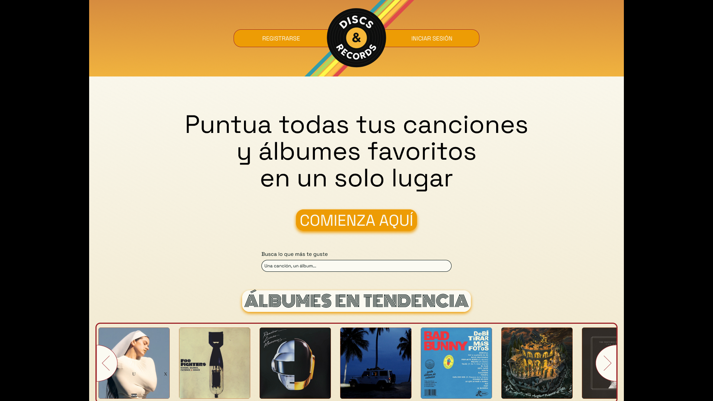
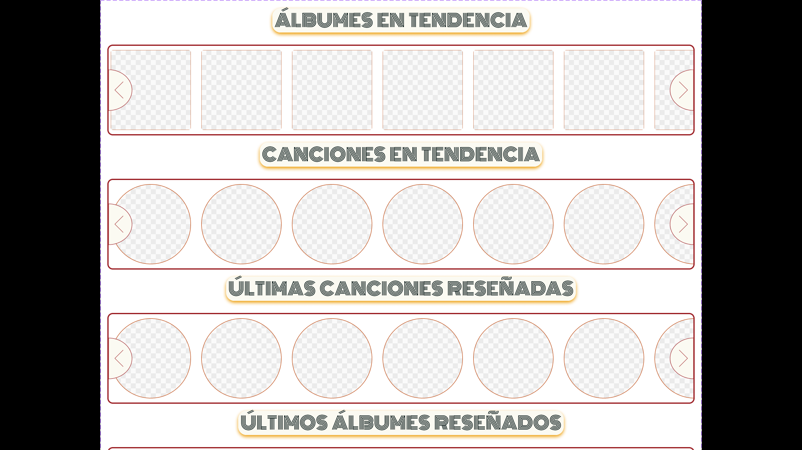

# Sección 1: Arquitectura CSS y comunicación visual.

## Principios de la comunicación visual: Mockup inicial y página tipo showcase.

### Jerarquía
La jerarquía visual se establece mediante una escala tipográfica bien definida y el uso estratégico del espacio, para ello, se establecen varios niveles de prioridad visual:

- **Nivel 1 - Título principal:** El texto **"Puntúa todas tus canciones y álbumes favoritos en un solo lugar"** utiliza un tamaño grande (~4.25rem/68px), peso regular y posición centrada para captar inmediatamente la atención. Este es el punto focal de la página invitando al usuario a realizar la acción pricipal de la aplicación web.
- **Nivel 2 - Call-to-Action primario:** El botón "COMIENZA AQUÍ" destaca con fondo naranja dorado (#ED9C05), texto en mayúsculas y sombra estilo neon de forma original. Este botón justo en medio y debajo del lema, crea urgencia visual al usuario, invitandolo a crear cuenta para tener su propio registro.
- **Nivel 3 - Títulos de sección:** "ÁLBUMES EN TENDENCIA" usa una tipografía decorativa (Monoton) con estilo retro 70s y tamaño intermedio (~2.625rem/42px), diferenciándose del contenido principal, creado contraste con el resto de la página. Esta tipografía es difícil de leer en textos largos, por lo que la decisión de diseño aquí ha sido usarlo en palabras cortas o frases de 3 o 4 palabras.
- **Nivel 4 - Navegación:** Los botones "REGISTRARSE" e "INICIAR SESIÓN" tienen menor jerarquía visual, integrados en la barra superior con fondo semi-transparente; los cuales no impiden a usuarios que ya hayan comenzado sus registros, perderse. Los botones son grandes con el fin de ser accesibles.
- **Nivel 5 - Elementos de apoyo:** *Labels* como "Busca lo que más te guste" y controles del carrusel (flechas) usan tamaños menores para no competir con el contenido principal.



---

### Contraste
El contraste se aplica de múltiples formas para diferenciar elementos y mejorar la legibilidad:

- **Contraste cromático:** La paleta cálida 70s (naranjas #ED9C05, #CA6703, #BB3F03, rojo vino #9D2227) sobre fondos claros (#FBFAF2, beige #E7D8AB) crea una separación visual clara. El header con degradado naranja contrasta fuertemente con el contenido beige inferior. Se alterna a una paleta fría para el modo oscuro, que sigue recordando a los colores de los años 70s (verde menta #93CFBB, teales #0A9295, #015F72) sobre fondo azul noche (#01131B) para mantener la identidad pero adaptar el contraste.
- **Contraste de tamaño:** La diferencia entre el título principal (4.25rem) y el texto de párrafo (1rem) es de 4:1, generando una jerarquía clara e inmediata. Esto busca hacer que el usuario entienda con el lema el propósito principal de la página.
- **Contraste de peso:** Los botones usan texto en mayúsculas con peso medio, mientras que el cuerpo de texto usa peso regular.
- **Contraste figura-fondo:** El logo circular negro "DISCS & RECORDS" sobre las franjas de colores arcoíris crea un punto focal fuerte en la navegación.
- **Contraste del modo oscuro:** El modo oscuro no cumple con los requisitos de diseño actualmente ya que no se trata de una escala de grises.


---

### Alineación
La estrategia de alineación combina múltiples técnicas según el contexto de cada vista:

**En la página de perfil de usuario (Primer ejemplo):**
- **Layout de dos columnas:** La vista de perfil utiliza un layout asimétrico donde la información del usuario (avatar, nombre, estadísticas de géneros) ocupa aproximadamente 1/3 del ancho a la izquierda, mientras que el contenido principal (tabs y grid de álbumes) ocupa 2/3 a la derecha.
- **Alineación izquierda en el sidebar:** El nombre de usuario "PerreteGordete", los géneros más escuchados y las barras de progreso se alinean a la izquierda, facilitando la lectura vertical de la información.
- **Grid para álbumes:** Los álbumes del usuario se organizan en un CSS Grid de 5 columnas con `grid-template-columns: repeat(auto-fit, minmax(250px, 1fr))`, permitiendo una distribución uniforme y responsiva.
- **Tabs centrados:** Los botones "Reseñas", "Álbumes" y "Canciones" se agrupan y centran sobre el grid de contenido, indicando claramente las opciones de navegación.


**En elementos globales (Segundo ejemplo):**
- **Alineación del header:** Los elementos de navegación (logo, botones) se distribuyen usando flexbox con `justify-content: space-between`, manteniendo equilibrio visual en todas las páginas.
- **Centrado de contenido hero:** En la página principal, el título y CTA se centran horizontalmente creando un eje visual.
- **Contenedor con borde:** El grid de álbumes está envuelto en un contenedor con borde naranja/rojo (#CA6703) que delimita visualmente el área de contenido.


---

### Proximidad
El espaciado agrupa elementos relacionados y separa secciones distintas:

- **Grupo Hero:** El título, subtítulo, botón CTA y buscador están agrupados con espaciado reducido entre ellos (~1-2rem), indicando que pertenecen a la misma unidad funcional.
- **Separación de secciones:** Entre el área hero y "Álbumes en tendencia" hay un espaciado mayor (~3-4rem), indicando cambio de contexto.
- **Cards de álbumes:** Los álbumes mantienen un `gap` consistente de 2rem ($espaciado-m) entre ellos, sugiriendo que son elementos del mismo tipo pero independientes.
- **Navegación agrupada:** Los botones "REGISTRARSE" e "INICIAR SESIÓN" comparten el mismo contenedor visual (barra naranja), indicando que son acciones relacionadas de autenticación.
- **Franjas decorativas:** Las líneas de colores en el header están muy próximas entre sí (sin gap), formando un único elemento decorativo cohesivo.



---

### Repetición
La coherencia visual se logra repitiendo patrones en toda la interfaz:

- **Paleta de colores:** Los mismos naranjas y tierras (#ED9C05, #CA6703, #BB3F03, #9D2227) aparecen en el header, botones, títulos decorativos y acentos, creando unidad visual.
- **Bordes neobrutalistas:** Los elementos interactivos (botones, cards, inputs) comparten el mismo estilo de borde negro sólido y sombras offset (4px 4px 0px), reforzando la estética retro-brutal.
- **Tipografía consistente:** Space Grotesk se usa en todo el UI, con Monoton reservado solo para títulos decorativos de sección.
- **Forma de las cards:** Todos los álbumes usan el mismo formato cuadrado con bordes redondeados y el contenedor rojo de borde grueso se repite como patrón de agrupación.
- **Iconografía:** Las flechas del carrusel usan el mismo estilo circular con borde, manteniendo coherencia con los demás elementos interactivos.
- **Espaciado modular:** Se repiten los mismos valores de espaciado ($espaciado-s: 1rem, $espaciado-m: 2rem, $espaciado-l: 3rem) en toda la aplicación.

---

### Conclusión de los principios de la comunicación visual: Transición a nuevos estilos.

Decidí evolucionar el diseño de la página hacia el neobrutalismo porque, tras descubrir este enfoque, sentí que encajaba perfectamente con la personalidad y el espíritu de mi proyecto. El neobrutalismo aporta una estética retro, audaz y muy reconocible, que conecta con la cultura de los discos y vinilos y refuerza la identidad visual que quiero transmitir.

Me gusta cómo los bordes gruesos, las sombras offset y los colores vibrantes hacen que cada elemento destaque y la interfaz resulte más memorable. Además, este estilo permite una comunicación visual directa y coherente con la temática musical, diferenciando mi página de otras propuestas más convencionales.

Recuperar la esencia de las primeras versiones del mockup en Figma me ha ayudado a crear una experiencia más auténtica y fiel a la idea original. En definitiva, el neobrutalismo me permite expresar mejor la personalidad del proyecto y ofrecer una experiencia visual única para los usuarios.

Las decisiones tomadas en cuanto a la jerarquía, el contraste, la alineación, la proximidad y la reptición se mantienen, sólo cambia el aspecto visual hacia una página más cuadrada y el estilo retro que buscaba en relación a la paleta de los 70s.

---

## Metodología CSS:
**ITCSS (Inverted Triangle CSS)** - Organización de estilos desde lo más genérico hasta lo más específico:

1. **Settings:** Variables y configuración (sin output CSS)
2. **Tools:** Mixins y funciones (sin output CSS)
3. **Generic:** Reset y normalize
4. **Elements:** Estilos base de elementos HTML
5. **Layout:** Estructuras y sistemas de grid
6. **Components:** Componentes de UI reutilizables
7. **Utilities:** Clases de utilidad con !important

Esta metodología evita problemas de especificidad y facilita el mantenimiento del código.

---

## Organización de archivos:
```
styles/
├── 00-settings/
│   └── _variables.scss      # Tokens de diseño (colores, tipografía, espaciado, breakpoints, sombras)
├── 01-tools/
│   └── _mixins.scss         # Mixins reutilizables (tipografía, temas, media queries)
├── 02-generic/
│   └── _reset.scss          # CSS Reset agresivo
├── 03-elements/
│   └── (estilos base HTML)  # Estilos para h1-h6, p, a, button, input, etc.
├── 04-layout/
│   └── _grid.scss           # Sistema de grid (CSS Grid + Flexbox)
├── 05-components/
│   └── (componentes UI)     # Cards, modales, alertas, navegación, etc.
├── 06-utilities/
│   └── (utilidades)         # Clases helper (.text-center, .mt-1, .hidden, etc.)
└── styles.scss              # Archivo principal que importa todo en orden ITCSS
```

---

## Sistema de Design Tokens:
Los design tokens centralizan todos los valores de diseño en variables SCSS:

### Colores
| Token | Valor Light | Valor Dark | Uso |
|-------|-------------|------------|-----|
| `$color-primario` | #ED9C05 (naranja dorado) | #93CFBB (verde menta) | Acciones principales, CTAs |
| `$color-secundario` | #CA6703 (naranja quemado) | #0A9295 (teal vibrante) | Acciones secundarias |
| `$color-contraste` | #BB3F03 (naranja rojizo) | #015F72 (teal profundo) | Acentos, hover states |
| `$color-acentuado` | #9D2227 (rojo vino) | #01131B (azul noche) | Alertas, énfasis |
| `$color-fondo` | #FBFAF2 (crema) | #01131B (azul noche) | Fondos principales |

### Tipografía
| Token | Valor | Uso |
|-------|-------|-----|
| `$fuente-principal` | 'Space Grotesk' | Todo el UI |
| `$fuente-secundaria` | 'Monoton' | Títulos decorativos |
| `$tamanio-fuente-h1` | 4.25rem (68px) | Títulos principales |
| `$tamanio-fuente-h2` | 2.625rem (42px) | Subtítulos de sección |
| `$tamanio-fuente-parrafo` | 1rem (16px) | Cuerpo de texto |

### Espaciado
| Token | Valor | Uso |
|-------|-------|-----|
| `$espaciado-xs` | 0.5rem (8px) | Padding interno mínimo |
| `$espaciado-s` | 1rem (16px) | Separación entre elementos cercanos |
| `$espaciado-m` | 2rem (32px) | Gap de grid, márgenes de sección |
| `$espaciado-l` | 3rem (48px) | Separación entre secciones |
| `$espaciado-xl` | 4rem (64px) | Espaciado hero, grandes bloques |

### Sombras Neobrutalistas
```scss
$sombra-brutal-s: 4px 4px 0px $color-letra-oscura;   // Elementos pequeños
$sombra-brutal-m: 6px 6px 0px $color-letra-oscura;   // Botones, cards
$sombra-vinilo-m: múltiples capas de colores;        // Efecto disco retro
$sombra-sunset-m: 4px 4px 0px $color-contraste-light; // CTAs cálidos
```

---

## Mixins y funciones:

### `@mixin font-size-line($tipo)`
Aplica tamaño de fuente y altura de línea según el tipo de elemento.
```scss
@include font-size-line('h1');  // Aplica 4.25rem y line-height 4.5rem
@include font-size-line('parrafo');  // Aplica 1rem y line-height 1.5rem
```

### `@mixin theme-colors($modo)`
Aplica colores de fondo y texto según el tema.
```scss
@include theme-colors('light');  // Fondo crema, texto oscuro
@include theme-colors('dark');   // Fondo azul noche, texto claro
```

### `@mixin respond-to($breakpoint)`
Media queries basadas en breakpoints predefinidos.
```scss
@include respond-to('tablet') {
  // Estilos para tablet y menor
}
```

### `@mixin alert-accesible-dark`
Mejora la accesibilidad de alertas en modo oscuro usando el color menta como fondo.
```scss
@include alert-accesible-dark;  // Fondo menta #93CFBB, texto oscuro
```

---

## ViewEncapsulation en Angular:
Angular ofrece tres modos de encapsulación de estilos:

### `ViewEncapsulation.Emulated` (por defecto)
- Simula Shadow DOM añadiendo atributos únicos a los elementos
- Los estilos del componente no afectan a otros componentes
- **Uso recomendado:** Componentes con estilos específicos

### `ViewEncapsulation.None`
- Los estilos se aplican globalmente
- Útil para estilos que deben afectar a toda la aplicación
- **Uso recomendado:** Componentes de layout o temas globales

### `ViewEncapsulation.ShadowDom`
- Usa Shadow DOM nativo del navegador
- Aislamiento completo de estilos
- **Uso recomendado:** Web components reutilizables

### Estrategia del proyecto:
- **Estilos globales** (`styles.scss`): Variables, reset, grid, utilities
- **Estilos de componentes**: `ViewEncapsulation.Emulated` para mantener estilos encapsulados
- **Acceso a variables globales**: Usar `@use` para importar variables en componentes que lo necesiten

---

## Showcase interactivo:

Enlace al showcase desplegado: https://styles-disc-n-records-showcase.netlify.app/showcase.html

---