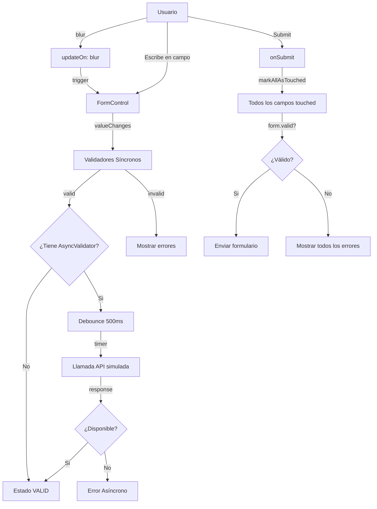

# Fase 3 - Formularios Reactivos Avanzados

> **Proyecto:** Discs & Records  
> **Tipo:** Aplicación web estilo Letterboxd para música  
> **Fecha:** 18 de diciembre de 2025

---

## Índice

1. [Introducción](#1-introducción)
2. [Formularios Reactivos Básicos](#2-formularios-reactivos-básicos)
3. [Validadores Personalizados](#3-validadores-personalizados)
4. [Validadores Asíncronos](#4-validadores-asíncronos)
5. [FormArray y Contenido Dinámico](#5-formarray-y-contenido-dinámico)
6. [Gestión de Estados de Formulario](#6-gestión-de-estados-de-formulario)
7. [Catálogo de Validadores](#7-catálogo-de-validadores)
8. [Implementación en Componentes](#8-implementación-en-componentes)
9. [Anexos](#9-anexos)

---

## 1. Introducción

Esta documentación cubre la implementación de formularios reactivos avanzados en el proyecto Discs & Records, siguiendo los requisitos de la Fase 3. Se implementan validaciones síncronas, asíncronas, gestión dinámica de campos mediante FormArray y gestión completa de estados de formulario.

### 1.1 Requisitos de la Rúbrica

- Implementar FormBuilder en todos los formularios
- FormGroup y FormControl para cada campo
- Validadores síncronos integrados (required, minLength, email, pattern)
- Validadores personalizados (contraseña fuerte, confirmación, formatos españoles)
- Validadores a nivel de formulario (cross-field validation)
- Validadores asíncronos con debounce
- FormArray para contenido dinámico
- Gestión completa de estados de formulario

### 1.2 Arquitectura de Validación

```
validators/
├── index.ts                          # Exportaciones centralizadas
├── password-strength.validator.ts    # Validador de contraseña fuerte
├── password-match.validator.ts       # Validador de coincidencia
├── spanish-formats.validator.ts      # NIF, teléfono, código postal
├── cross-field.validators.ts         # Validadores de grupo
├── async.validators.ts               # Validadores asíncronos
└── array-item.validators.ts          # Validadores de array

services/
├── async-validators.service.ts       # Servicio inyectable async
├── form-state.ts                     # Gestión de estados
└── validation.ts                     # Lógica de validación
```

---

## 2. Formularios Reactivos Básicos

### 2.1 FormBuilder, FormGroup y FormControl

#### Conceptos Fundamentales

**FormGroup**: Contenedor que agrupa múltiples FormControls relacionados.

```typescript
const loginForm = new FormGroup({
  email: new FormControl(''),
  password: new FormControl('')
});
```

**FormControl**: Representa un campo individual con su valor y estado de validación.

```typescript
const emailControl = new FormControl('', [Validators.required, Validators.email]);

// Estado del control
emailControl.value;        // valor actual
emailControl.valid;        // booleano
emailControl.invalid;      // booleano
emailControl.touched;      // si el usuario interactuó
emailControl.errors;       // { required: true, email: true, ... }
emailControl.status;       // 'VALID' | 'INVALID' | 'PENDING' | 'DISABLED'
```

**FormBuilder**: Factory para crear FormGroups con sintaxis simplificada.

```typescript
import { FormBuilder } from '@angular/forms';

export class LoginForm {
  loginForm: FormGroup;

  constructor(private formBuilder: FormBuilder) {
    this.loginForm = this.formBuilder.group({
      email: ['', [Validators.required, Validators.email]],
      password: ['', [Validators.required, Validators.minLength(8)]]
    });
  }
}
```

#### Paso a Paso: Implementación

**Paso 1**: Inyectar FormBuilder

```typescript
import { FormBuilder, FormGroup, Validators } from '@angular/forms';

export class MyComponent {
  myForm: FormGroup;

  constructor(private formBuilder: FormBuilder) {
    this.myForm = this.initializeForm();
  }
}
```

**Paso 2**: Construir el formulario

```typescript
private initializeForm(): FormGroup {
  return this.formBuilder.group({
    email: ['', [Validators.required, Validators.email]],
    password: ['', [Validators.required, Validators.minLength(8)]]
  });
}
```

**Paso 3**: Acceder a campos específicos

```typescript
get emailControl(): FormControl {
  return this.myForm.get('email') as FormControl;
}

// Verificar errores
const hasError = this.emailControl.invalid && this.emailControl.touched;
```

**Paso 4**: Vincular en el template

```html
<form [formGroup]="myForm" (ngSubmit)="onSubmit()">
  <input formControlName="email" type="email" />
  
  @if (emailControl.hasError('required') && emailControl.touched) {
    <span class="error">El email es requerido</span>
  }
  
  @if (emailControl.hasError('email') && emailControl.touched) {
    <span class="error">Formato de email inválido</span>
  }
  
  <button [disabled]="myForm.invalid">Enviar</button>
</form>
```

### 2.2 Validadores Síncronos Integrados

Angular proporciona validadores predefinidos en `@angular/forms`:

| Validador | Parámetro | Descripción | Uso |
|-----------|-----------|-------------|-----|
| `required` | - | Campo no puede estar vacío | `Validators.required` |
| `email` | - | Debe ser un email válido | `Validators.email` |
| `minLength(n)` | `n: number` | Longitud mínima | `Validators.minLength(8)` |
| `maxLength(n)` | `n: number` | Longitud máxima | `Validators.maxLength(20)` |
| `pattern(regex)` | `regex` | Debe cumplir patrón | `Validators.pattern(/^[a-zA-Z0-9]+$/)` |
| `min(n)` | `n: number` | Valor mínimo numérico | `Validators.min(0)` |
| `max(n)` | `n: number` | Valor máximo numérico | `Validators.max(100)` |
| `requiredTrue` | - | Checkbox debe estar marcado | `Validators.requiredTrue` |

#### Ejemplo: LoginForm

```typescript
export class LoginForm {
  loginForm: FormGroup;

  constructor(private formBuilder: FormBuilder) {
    this.loginForm = this.formBuilder.group({
      email: [
        '',
        [
          Validators.required,
          Validators.email
        ]
      ],
      password: [
        '',
        [
          Validators.required,
          Validators.minLength(8)
        ]
      ]
    });
  }

  onSubmit(): void {
    this.loginForm.markAllAsTouched();
    
    if (this.loginForm.valid) {
      const formData = this.loginForm.value;
      console.log('Login:', formData);
    }
  }
}
```

#### Ejemplo: RegisterForm

```typescript
export class RegisterForm {
  registerForm: FormGroup;

  constructor(private formBuilder: FormBuilder) {
    this.registerForm = this.formBuilder.group({
      username: [
        '',
        [
          Validators.required,
          Validators.minLength(3),
          Validators.maxLength(20),
          Validators.pattern(/^[a-zA-Z0-9_]+$/)
        ]
      ],
      email: [
        '',
        [
          Validators.required,
          Validators.email
        ]
      ],
      password: [
        '',
        [
          Validators.required,
          Validators.minLength(8),
          Validators.pattern(/^(?=.*[A-Z])(?=.*[!@#$%^&*])/)
        ]
      ],
      confirmPassword: [
        '',
        [Validators.required]
      ]
    });
  }
}
```

---

## 3. Validadores Personalizados

### 3.1 Validador de Contraseña Fuerte

**Requisitos:**
- Mínimo 12 caracteres
- Al menos una letra mayúscula
- Al menos una letra minúscula
- Al menos un número
- Al menos un carácter especial

**Ubicación:** `frontend/src/app/validators/password-strength.validator.ts`

```typescript
import { AbstractControl, ValidationErrors, ValidatorFn } from '@angular/forms';

export function passwordStrength(): ValidatorFn {
  return (control: AbstractControl): ValidationErrors | null => {
    const value = control.value;

    if (!value) return null;

    const hasUpperCase = /[A-Z]/.test(value);
    const hasLowerCase = /[a-z]/.test(value);
    const hasNumber = /\d/.test(value);
    const hasSpecialChar = /[!@#$%^&*(),.?":{}|<>]/.test(value);
    const minLength = value.length >= 12;

    const errors: ValidationErrors = {};

    if (!hasUpperCase) errors['noUppercase'] = true;
    if (!hasLowerCase) errors['noLowercase'] = true;
    if (!hasNumber) errors['noNumber'] = true;
    if (!hasSpecialChar) errors['noSpecial'] = true;
    if (!minLength) errors['minLength'] = { requiredLength: 12, actualLength: value.length };

    return Object.keys(errors).length ? errors : null;
  };
}

export function getPasswordErrorMessage(error: string): string {
  const messages: { [key: string]: string } = {
    'noUppercase': 'Debe contener al menos una mayúscula (A-Z)',
    'noLowercase': 'Debe contener al menos una minúscula (a-z)',
    'noNumber': 'Debe contener al menos un número (0-9)',
    'noSpecial': 'Debe contener al menos un carácter especial (!@#$%^&*)',
    'minLength': 'Debe tener al menos 12 caracteres'
  };
  return messages[error] || 'Error en contraseña';
}
```

**Uso:**

```typescript
import { passwordStrength } from '@app/validators';

this.form = this.formBuilder.group({
  password: ['', [Validators.required, passwordStrength()]]
});
```

**Template:**

```html
@if (form.get('password')?.hasError('noUppercase')) {
  <div class="error">Debe contener mayúsculas</div>
}
@if (form.get('password')?.hasError('noLowercase')) {
  <div class="error">Debe contener minúsculas</div>
}
@if (form.get('password')?.hasError('noNumber')) {
  <div class="error">Debe contener números</div>
}
@if (form.get('password')?.hasError('noSpecial')) {
  <div class="error">Debe contener caracteres especiales</div>
}
@if (form.get('password')?.hasError('minLength')) {
  <div class="error">Mínimo 12 caracteres</div>
}
```

### 3.2 Validador de Confirmación de Contraseña

**Tipo:** Cross-field validator (nivel FormGroup)

**Ubicación:** `frontend/src/app/validators/password-match.validator.ts`

```typescript
import { AbstractControl, ValidationErrors, ValidatorFn } from '@angular/forms';

export function passwordMatch(controlName: string, matchControlName: string): ValidatorFn {
  return (group: AbstractControl): ValidationErrors | null => {
    const control = group.get(controlName);
    const matchControl = group.get(matchControlName);

    if (!control || !matchControl) return null;
    if (matchControl.errors && !matchControl.touched) return null;

    return control.value === matchControl.value
      ? null
      : { mismatch: true };
  };
}

export function getPasswordMatchErrorMessage(): string {
  return 'Las contraseñas no coinciden';
}
```

**Uso:**

```typescript
import { passwordMatch } from '@app/validators';

this.registerForm = this.formBuilder.group({
  password: ['', [Validators.required, passwordStrength()]],
  confirmPassword: ['', Validators.required]
}, { 
  validators: passwordMatch('password', 'confirmPassword')
});
```

**Template:**

```html
@if (registerForm.hasError('mismatch')) {
  <div class="error">Las contraseñas no coinciden</div>
}
```

### 3.3 Validadores de Formato Personalizado

#### NIF/DNI Español

**Ubicación:** `frontend/src/app/validators/spanish-formats.validator.ts`

```typescript
export function nif(): ValidatorFn {
  return (control: AbstractControl): ValidationErrors | null => {
    const value = control.value;
    if (!value) return null;

    const nifUpper = value.toUpperCase().trim();
    const nifRegex = /^[0-9]{8}[TRWAGMYFPDXBNJZSQVHLCKE]$/;
    
    if (!nifRegex.test(nifUpper)) {
      return { invalidNif: true };
    }

    // Validar letra de control
    const letters = 'TRWAGMYFPDXBNJZSQVHLCKE';
    const position = parseInt(nifUpper.substring(0, 8), 10) % 23;
    const expectedLetter = letters[position];
    const actualLetter = nifUpper[8];

    return expectedLetter === actualLetter ? null : { invalidNif: true };
  };
}
```

#### Teléfono Móvil Español

```typescript
export function telefono(): ValidatorFn {
  return (control: AbstractControl): ValidationErrors | null => {
    const value = control.value;
    if (!value) return null;

    const telefonoRegex = /^[67][0-9]{8}$/;
    return telefonoRegex.test(value) ? null : { invalidTelefono: true };
  };
}
```

#### Código Postal Español

```typescript
export function codigoPostal(): ValidatorFn {
  return (control: AbstractControl): ValidationErrors | null => {
    const value = control.value;
    if (!value) return null;

    const cpRegex = /^\d{5}$/;
    if (!cpRegex.test(value)) {
      return { invalidCP: true };
    }

    const numCP = parseInt(value, 10);
    if (numCP > 52999) {
      return { invalidCP: true };
    }

    return null;
  };
}

export function getFormatErrorMessage(error: string): string {
  const messages: { [key: string]: string } = {
    'invalidNif': 'NIF inválido. Formato: 12345678Z',
    'invalidTelefono': 'Teléfono inválido. Formato: 6XX XXX XXX o 7XX XXX XXX',
    'invalidCP': 'Código postal inválido. Debe ser 5 dígitos (ej: 28001)'
  };
  return messages[error] || 'Formato inválido';
}
```

**Uso:**

```typescript
import { nif, telefono, codigoPostal } from '@app/validators';

this.addressForm = this.formBuilder.group({
  nif: ['', [Validators.required, nif()]],
  phone: ['', [Validators.required, telefono()]],
  zipCode: ['', [Validators.required, codigoPostal()]]
});
```

### 3.4 Validadores Cross-Field

#### Al Menos Uno Requerido

**Ubicación:** `frontend/src/app/validators/cross-field.validators.ts`

```typescript
export function atLeastOneRequired(...fields: string[]): ValidatorFn {
  return (group: AbstractControl): ValidationErrors | null => {
    const hasOne = fields.some(field => {
      const control = group.get(field);
      return control && control.value && control.value.toString().trim().length > 0;
    });

    return hasOne ? null : { atLeastOneRequired: { fields } };
  };
}
```

**Uso:**

```typescript
this.contactForm = this.fb.group({
  phone: [''],
  email: ['']
}, {
  validators: atLeastOneRequired('phone', 'email')
});
```

#### Rango de Fechas Válido

```typescript
export function validDateRange(startField: string, endField: string): ValidatorFn {
  return (group: AbstractControl): ValidationErrors | null => {
    const startControl = group.get(startField);
    const endControl = group.get(endField);

    if (!startControl?.value || !endControl?.value) return null;

    const startDate = new Date(startControl.value);
    const endDate = new Date(endControl.value);

    return startDate < endDate ? null : { invalidRange: true };
  };
}
```

---

## 4. Validadores Asíncronos

### 4.1 Concepto y Propósito

Los validadores asíncronos verifican datos contra un servidor, retornando `Observable<ValidationErrors | null>`. Se ejecutan después de los validadores síncronos.

**Características:**
- Incluyen debounce para evitar múltiples llamadas API
- Manejan errores de red de forma graceful
- Muestran estado 'pending' mientras validan

### 4.2 Validador de Email Único

**Ubicación:** `frontend/src/app/validators/async.validators.ts`

```typescript
import { AbstractControl, AsyncValidatorFn, ValidationErrors } from '@angular/forms';
import { Observable, of, timer } from 'rxjs';
import { map, switchMap, take, catchError } from 'rxjs/operators';

const REGISTERED_EMAILS = [
  'admin@discandrecords.com',
  'test@example.com',
  'usuario@discandrecords.com',
  'demo@demo.com'
];

export function emailUnique(excludeUserId?: string): AsyncValidatorFn {
  return (control: AbstractControl): Observable<ValidationErrors | null> => {
    const email = control.value?.trim().toLowerCase();

    if (!email) {
      return of(null);
    }

    // Debounce de 500ms + simulación de API
    return timer(500).pipe(
      switchMap(() => {
        const isTaken = REGISTERED_EMAILS.includes(email);
        
        // Simular latencia de red (300-800ms)
        return of(isTaken).pipe(
          switchMap(exists =>
            timer(300 + Math.random() * 500).pipe(
              map(() => exists ? { emailTaken: true } : null)
            )
          ),
          catchError(() => of(null))
        );
      }),
      take(1)
    );
  };
}
```

### 4.3 Validador de Username Disponible

```typescript
const TAKEN_USERNAMES = [
  'admin',
  'administrator',
  'root',
  'superuser',
  'discandrecords',
  'moderator',
  'support'
];

export function usernameAvailable(): AsyncValidatorFn {
  return (control: AbstractControl): Observable<ValidationErrors | null> => {
    const username = control.value?.trim().toLowerCase();

    if (!username || username.length < 3) {
      return of(null);
    }

    // Debounce de 300ms + simulación de API
    return timer(300).pipe(
      switchMap(() => {
        const isTaken = TAKEN_USERNAMES.includes(username);

        return timer(200 + Math.random() * 400).pipe(
          map(() => isTaken ? { usernameTaken: true } : null),
          catchError(() => of(null))
        );
      }),
      take(1)
    );
  };
}

export function getAsyncErrorMessage(error: string): string {
  const messages: { [key: string]: string } = {
    'emailTaken': 'Este email ya está registrado',
    'usernameTaken': 'Este nombre de usuario no está disponible'
  };
  return messages[error] || 'Error de validación';
}
```

### 4.4 Servicio Inyectable AsyncValidatorsService

**Ubicación:** `frontend/src/app/services/async-validators.service.ts`

```typescript
import { Injectable } from '@angular/forms';

@Injectable({
  providedIn: 'root'
})
export class AsyncValidatorsService {
  private readonly defaultDebounceTime = 500;

  emailUnique(excludeUserId?: string, debounceMs?: number): AsyncValidatorFn {
    const debounce = debounceMs ?? this.defaultDebounceTime;

    return (control: AbstractControl): Observable<ValidationErrors | null> => {
      const email = control.value?.trim().toLowerCase();

      if (!email) {
        return of(null);
      }

      return defer(() => timer(debounce)).pipe(
        switchMap(() => this.checkEmailAvailability(email, excludeUserId)),
        take(1)
      );
    };
  }

  usernameAvailable(debounceMs?: number): AsyncValidatorFn {
    const debounce = debounceMs ?? this.defaultDebounceTime;

    return (control: AbstractControl): Observable<ValidationErrors | null> => {
      const username = control.value?.trim().toLowerCase();

      if (!username || username.length < 3) {
        return of(null);
      }

      return defer(() => timer(debounce)).pipe(
        switchMap(() => this.checkUsernameAvailability(username)),
        take(1)
      );
    };
  }

  private checkEmailAvailability(email: string, excludeUserId?: string): Observable<ValidationErrors | null> {
    const apiDelay = 300 + Math.random() * 500;

    return of(REGISTERED_EMAILS.includes(email)).pipe(
      delay(apiDelay),
      map(exists => exists ? { emailTaken: true } : null),
      catchError(() => of(null))
    );
  }

  private checkUsernameAvailability(username: string): Observable<ValidationErrors | null> {
    const apiDelay = 200 + Math.random() * 400;

    return of(TAKEN_USERNAMES.includes(username)).pipe(
      delay(apiDelay),
      map(isTaken => isTaken ? { usernameTaken: true } : null),
      catchError(() => of(null))
    );
  }
}
```

### 4.5 Uso en FormBuilder con updateOn: 'blur'

```typescript
import { AsyncValidatorsService } from '../../services/async-validators.service';

export class RegisterForm {
  registerForm: FormGroup;

  constructor(
    private formBuilder: FormBuilder,
    private asyncValidators: AsyncValidatorsService
  ) {
    this.registerForm = this.formBuilder.group({
      email: ['', {
        validators: [Validators.required, Validators.email],
        asyncValidators: [this.asyncValidators.emailUnique()],
        updateOn: 'blur'
      }],
      username: ['', {
        validators: [Validators.required, Validators.minLength(3)],
        asyncValidators: [this.asyncValidators.usernameAvailable()],
        updateOn: 'blur'
      }]
    });
  }
}
```

### 4.6 Template con Estados de Loading

```html
<form [formGroup]="registerForm">
  <!-- Email con validación asíncrona -->
  <div class="form-field">
    <label for="email">Email</label>
    <div class="input-wrapper">
      <input 
        id="email" 
        type="email" 
        formControlName="email"
        [class.pending]="email.status === 'PENDING'" />

      <!-- Indicador de loading -->
      @if (email.status === 'PENDING') {
        <span class="loading-indicator">
          <span class="spinner"></span>
          Verificando...
        </span>
      }

      <!-- Indicador de éxito -->
      @if (email.valid && email.touched && email.status !== 'PENDING') {
        <span class="success-icon">✓</span>
      }
    </div>

    <!-- Mensajes de error -->
    @if (email.invalid && email.touched && email.status !== 'PENDING') {
      <div class="error">
        @if (email.hasError('required')) {
          El email es requerido
        } @else if (email.hasError('email')) {
          Formato de email inválido
        } @else if (email.hasError('emailTaken')) {
          Este email ya está registrado
        }
      </div>
    }
  </div>
</form>
```

### 4.7 Configuración y Mejores Prácticas

| Configuración | Efecto | Recomendación |
|---------------|--------|---------------|
| `updateOn: 'blur'` | Valida al salir del campo | Recomendado para async |
| `updateOn: 'submit'` | Solo al enviar form | Performance crítico |
| `debounceTime: 500` | Espera antes de validar | 300-800ms según caso |
| Estado `pending` | Indica validación en curso | Mostrar spinner |

---

## 5. FormArray y Contenido Dinámico

### 5.1 Concepto de FormArray

FormArray gestiona colecciones dinámicas de FormControls o FormGroups. Ideal para:
- Listas de ítems añadibles/eliminables
- Múltiples direcciones
- Líneas de carrito de compras
- Contactos de emergencia

### 5.2 Ejemplo Básico - Lista de Géneros Favoritos

```typescript
export class MusicForm {
  musicForm: FormGroup;

  constructor(private formBuilder: FormBuilder) {
    this.musicForm = this.formBuilder.group({
      username: ['', Validators.required],
      favoriteGenres: this.formBuilder.array([
        this.formBuilder.control('Rock'),
        this.formBuilder.control('Jazz')
      ])
    });
  }

  // Getter para acceder al FormArray
  get genresArray(): FormArray {
    return this.musicForm.get('favoriteGenres') as FormArray;
  }

  // Añadir nuevo género
  addGenre(): void {
    this.genresArray.push(this.formBuilder.control(''));
  }

  // Eliminar género por índice
  removeGenre(index: number): void {
    this.genresArray.removeAt(index);
  }

  // Obtener valor del género en índice específico
  getGenreControl(index: number): FormControl {
    return this.genresArray.at(index) as FormControl;
  }
}
```

**Template:**

```html
<form [formGroup]="musicForm">
  <input formControlName="username" placeholder="Nombre de usuario" />

  <div formArrayName="favoriteGenres">
    @for (genre of genresArray.controls; track $index; let i = $index) {
      <div class="genre-item">
        <input [formControlName]="i" placeholder="Género musical" />
        <button type="button" (click)="removeGenre(i)">Eliminar</button>
      </div>
    }
  </div>

  <button type="button" (click)="addGenre()">+ Agregar género</button>
</form>
```

### 5.3 FormArray con FormGroups - Direcciones

```typescript
export class AddressForm {
  profileForm: FormGroup;

  constructor(private formBuilder: FormBuilder) {
    this.profileForm = this.formBuilder.group({
      name: ['', Validators.required],
      addresses: this.formBuilder.array([
        this.createAddressGroup()
      ])
    });
  }

  get addressesArray(): FormArray {
    return this.profileForm.get('addresses') as FormArray;
  }

  private createAddressGroup(): FormGroup {
    return this.formBuilder.group({
      street: ['', Validators.required],
      city: ['', Validators.required],
      postalCode: ['', [Validators.required, Validators.pattern(/^\d{5}$/)]]
    });
  }

  addAddress(): void {
    this.addressesArray.push(this.createAddressGroup());
  }

  removeAddress(index: number): void {
    this.addressesArray.removeAt(index);
  }

  getAddressControl(index: number, field: string): FormControl {
    return this.addressesArray.at(index).get(field) as FormControl;
  }
}
```

**Template:**

```html
<form [formGroup]="profileForm">
  <div formArrayName="addresses">
    @for (address of addressesArray.controls; track $index; let i = $index) {
      <div class="address-item" [formGroupName]="i">
        <h4>Dirección {{ i + 1 }}</h4>
        
        <input formControlName="street" placeholder="Calle" />
        @if (getAddressControl(i, 'street').invalid && getAddressControl(i, 'street').touched) {
          <span class="error">La calle es requerida</span>
        }

        <input formControlName="city" placeholder="Ciudad" />
        @if (getAddressControl(i, 'city').invalid && getAddressControl(i, 'city').touched) {
          <span class="error">La ciudad es requerida</span>
        }

        <input formControlName="postalCode" placeholder="Código postal" maxlength="5" />
        @if (getAddressControl(i, 'postalCode').invalid && getAddressControl(i, 'postalCode').touched) {
          <span class="error">
            @if (getAddressControl(i, 'postalCode').hasError('required')) {
              El código postal es requerido
            } @else if (getAddressControl(i, 'postalCode').hasError('pattern')) {
              Formato: 5 dígitos
            }
          </span>
        }

        <button type="button" (click)="removeAddress(i)">Eliminar dirección</button>
      </div>
    }
  </div>

  <button type="button" (click)="addAddress()">+ Agregar dirección</button>
</form>
```

### 5.4 Validación de Elementos de Array

#### Validadores de Colección

**Ubicación:** `frontend/src/app/validators/array-item.validators.ts`

```typescript
// Mínimo de elementos
export function minArrayLength(min: number): ValidatorFn {
  return (control: AbstractControl): ValidationErrors | null => {
    const array = control as FormArray;
    
    if (array.length < min) {
      return {
        minArrayLength: {
          required: min,
          actual: array.length
        }
      };
    }
    
    return null;
  };
}

// Máximo de elementos
export function maxArrayLength(max: number): ValidatorFn {
  return (control: AbstractControl): ValidationErrors | null => {
    const array = control as FormArray;
    
    if (array.length > max) {
      return {
        maxArrayLength: {
          max: max,
          actual: array.length
        }
      };
    }
    
    return null;
  };
}

// Elementos únicos
export function uniqueItems(fieldName?: string): ValidatorFn {
  return (control: AbstractControl): ValidationErrors | null => {
    const array = control as FormArray;
    const values: any[] = [];
    const duplicates: number[] = [];

    array.controls.forEach((c, index) => {
      let value: any;

      if (fieldName && c instanceof FormGroup) {
        value = c.get(fieldName)?.value;
      } else {
        value = c.value;
      }

      if (value === '' || value === null || value === undefined) {
        return;
      }

      const normalizedValue = typeof value === 'string' ? value.toLowerCase().trim() : value;

      if (values.includes(normalizedValue)) {
        duplicates.push(index);
      } else {
        values.push(normalizedValue);
      }
    });

    if (duplicates.length > 0) {
      return {
        uniqueItems: {
          duplicateIndices: duplicates,
          message: 'Hay elementos duplicados'
        }
      };
    }

    return null;
  };
}
```

**Uso:**

```typescript
import { minArrayLength, maxArrayLength, uniqueItems } from '@app/validators';

this.form = this.formBuilder.group({
  addresses: this.formBuilder.array(
    [this.createAddressGroup()],
    [minArrayLength(1), maxArrayLength(3)]
  ),
  phones: this.formBuilder.array(
    [],
    [minArrayLength(1), uniqueItems()]
  )
});
```

#### Validadores de Elemento Individual

```typescript
// Dirección completa
export function completeAddress(): ValidatorFn {
  return (group: AbstractControl): ValidationErrors | null => {
    const formGroup = group as FormGroup;

    const street = formGroup.get('street')?.value?.trim();
    const city = formGroup.get('city')?.value?.trim();
    const postalCode = formGroup.get('postalCode')?.value?.trim();

    const errors: string[] = [];

    if (!street) errors.push('calle');
    if (!city) errors.push('ciudad');
    if (!postalCode) errors.push('codigo postal');

    if (errors.length > 0) {
      return {
        completeAddress: {
          missingFields: errors,
          message: `Faltan: ${errors.join(', ')}`
        }
      };
    }

    return null;
  };
}

// Contacto válido
export function validContact(): ValidatorFn {
  return (group: AbstractControl): ValidationErrors | null => {
    const formGroup = group as FormGroup;

    const name = formGroup.get('name')?.value?.trim();
    const phone = formGroup.get('phone')?.value?.trim();
    const email = formGroup.get('email')?.value?.trim();

    const errors: ValidationErrors = {};

    if (!name) {
      errors['missingName'] = true;
    }

    if (!phone && !email) {
      errors['missingContactMethod'] = {
        message: 'Se requiere teléfono o email'
      };
    }

    return Object.keys(errors).length ? errors : null;
  };
}
```

### 5.5 Ejemplo Completo: Lista de Contactos de Emergencia

```typescript
export class EmergencyContactsForm {
  contactForm: FormGroup;

  constructor(private formBuilder: FormBuilder) {
    this.contactForm = this.formBuilder.group({
      emergencyContacts: this.formBuilder.array(
        [],
        [maxArrayLength(2)]
      )
    });
  }

  get contactsArray(): FormArray {
    return this.contactForm.get('emergencyContacts') as FormArray;
  }

  private createContactGroup(): FormGroup {
    return this.formBuilder.group({
      name: ['', Validators.required],
      phone: ['', telefono()],
      email: ['', Validators.email]
    }, { validators: validContact() });
  }

  addContact(): void {
    if (this.contactsArray.length < 2) {
      this.contactsArray.push(this.createContactGroup());
    }
  }

  removeContact(index: number): void {
    this.contactsArray.removeAt(index);
  }

  getContactControl(index: number, field: string): FormControl {
    return this.contactsArray.at(index).get(field) as FormControl;
  }
}
```

---

## 6. Gestión de Estados de Formulario

### 6.1 FormStateService

Servicio centralizado para gestionar estados de validación, interacción y feedback visual.

**Ubicación:** `frontend/src/app/services/form-state.ts`

```typescript
import { Injectable, signal, computed } from '@angular/core';
import { FormGroup, FormArray, AbstractControl } from '@angular/forms';

@Injectable({
  providedIn: 'root'
})
export class FormStateService {

  private asyncValidatingControls = new Map<string, boolean>();
  private asyncValidatingCount = signal(0);

  readonly isAsyncValidating = computed(() => this.asyncValidatingCount() > 0);

  // Determina si mostrar errores
  shouldShowErrors(control: AbstractControl | null): boolean {
    if (!control) return false;
    return control.invalid && (control.touched || control.dirty);
  }

  // Combina touched/dirty con submitted
  shouldShowErrorsCombined(control: AbstractControl | null, submitted: boolean): boolean {
    if (!control) return false;
    return control.invalid && (control.touched || control.dirty || submitted);
  }

  // Estado del botón submit
  isSubmitDisabled(form: FormGroup, isSubmitting: boolean = false): boolean {
    return form.invalid || form.pending || isSubmitting;
  }

  // Verifica si está en estado pending
  isValidationPending(control: AbstractControl | null): boolean {
    if (!control) return false;
    return control.status === 'PENDING';
  }

  // Verifica si es válido y tocado
  isValidAndTouched(control: AbstractControl | null): boolean {
    if (!control) return false;
    return control.valid && control.touched;
  }

  // Marca todos los elementos de un FormArray como touched
  markArrayAsTouched(formArray: FormArray): void {
    formArray.controls.forEach(control => {
      control.markAsTouched();
      if (control instanceof FormGroup) {
        Object.values(control.controls).forEach(c => c.markAsTouched());
      }
    });
  }

  // Obtiene clases CSS para feedback visual
  getValidationClasses(control: AbstractControl | null, baseClass: string): Record<string, boolean> {
    if (!control) return {};

    const showError = this.shouldShowErrors(control);
    const showSuccess = this.isValidAndTouched(control);
    const isPending = this.isValidationPending(control);

    return {
      [`${baseClass}--error`]: showError,
      [`${baseClass}--success`]: showSuccess && !isPending,
      [`${baseClass}--pending`]: isPending,
      [`${baseClass}--touched`]: control.touched,
      [`${baseClass}--dirty`]: control.dirty
    };
  }

  // Estado de feedback
  getFeedbackState(control: AbstractControl | null): 'error' | 'success' | 'pending' | 'neutral' {
    if (!control) return 'neutral';

    if (this.isValidationPending(control)) return 'pending';
    if (this.shouldShowErrors(control)) return 'error';
    if (this.isValidAndTouched(control)) return 'success';
    return 'neutral';
  }
}
```

### 6.2 Mostrar Errores Solo Después de Touched/Dirty

```typescript
export class MyComponent {
  formState = inject(FormStateService);
  myForm: FormGroup;
  formSubmitted = signal(false);

  shouldShowError(controlName: string): boolean {
    const control = this.myForm.get(controlName);
    return this.formState.shouldShowErrorsCombined(control, this.formSubmitted());
  }
}
```

**Template:**

```html
@if (shouldShowError('email')) {
  <span class="error">
    @if (emailControl.hasError('required')) {
      El email es requerido
    } @else if (emailControl.hasError('email')) {
      Formato inválido
    }
  </span>
}
```

### 6.3 Deshabilitar Submit si Formulario Inválido

```html
<button 
  type="submit"
  [disabled]="formState.isSubmitDisabled(myForm, isSubmitting())"
  [attr.aria-busy]="isSubmitting()">
  @if (isSubmitting()) {
    <span class="spinner"></span>
    Guardando...
  } @else {
    Guardar
  }
</button>
```

### 6.4 Loading States Durante Validación Asíncrona

```html
<div class="form-field">
  <input 
    formControlName="email"
    [class.input--pending]="emailControl.status === 'PENDING'" />

  @if (emailControl.status === 'PENDING') {
    <span class="loading-indicator" aria-live="polite">
      <span class="spinner"></span>
      Verificando...
    </span>
  }

  @if (emailControl.valid && emailControl.touched && emailControl.status !== 'PENDING') {
    <span class="success-icon">✓</span>
  }
</div>
```

### 6.5 Feedback Visual de Validación

```html
<input
  formControlName="email"
  [ngClass]="formState.getValidationClasses(emailControl, 'form-input')" />

@switch (formState.getFeedbackState(emailControl)) {
  @case ('pending') {
    <span class="spinner"></span>
  }
  @case ('error') {
    <span class="icon-error">!</span>
  }
  @case ('success') {
    <span class="icon-success">✓</span>
  }
}
```

### 6.6 Estilos CSS para Feedback Visual

```scss
$color-success: #28a745;
$color-error: #dc3545;
$color-pending: #6c757d;
$transition: 0.15s ease-in-out;

.form-input {
  border: 2px solid #ced4da;
  transition: border-color $transition, box-shadow $transition;

  &:focus {
    border-color: #3d5a80;
    box-shadow: 0 0 0 3px rgba(#3d5a80, 0.1);
  }

  &--error {
    border-color: $color-error;
    background-color: rgba($color-error, 0.02);

    &:focus {
      box-shadow: 0 0 0 3px rgba($color-error, 0.1);
    }
  }

  &--success {
    border-color: $color-success;
    background-color: rgba($color-success, 0.02);

    &:focus {
      box-shadow: 0 0 0 3px rgba($color-success, 0.1);
    }
  }

  &--pending {
    border-color: $color-pending;
    background-color: rgba($color-pending, 0.02);
  }
}

.form-error {
  margin-top: 0.25rem;
  padding: 0.25rem 0.5rem;
  font-size: 0.8125rem;
  color: $color-error;
  background-color: rgba($color-error, 0.05);
  border-left: 3px solid $color-error;
}

.loading-indicator {
  display: flex;
  align-items: center;
  gap: 0.25rem;
  font-size: 0.75rem;
  color: $color-pending;
}

.success-icon {
  display: flex;
  align-items: center;
  justify-content: center;
  width: 20px;
  height: 20px;
  background-color: $color-success;
  color: white;
  border-radius: 50%;
  font-size: 0.75rem;
}
```

---

## 7. Catálogo de Validadores

### 7.1 Ubicación de Archivos

| Archivo | Tipo | Descripción |
|---------|------|-------------|
| `validators/password-strength.validator.ts` | Síncrono | Validador de contraseña fuerte |
| `validators/password-match.validator.ts` | Cross-field | Confirmación de contraseña |
| `validators/spanish-formats.validator.ts` | Síncrono | NIF, teléfono, código postal |
| `validators/cross-field.validators.ts` | Cross-field | atLeastOneRequired, validDateRange |
| `validators/async.validators.ts` | Asíncrono | emailUnique, usernameAvailable |
| `validators/array-item.validators.ts` | Array | Validadores de colección y elemento |
| `validators/index.ts` | Export | Exportación centralizada |

### 7.2 Validadores Síncronos

| Función | Propósito | Retorna |
|---------|-----------|---------|
| `passwordStrength()` | 12+ chars, mayúscula, minúscula, número, especial | `{ noUppercase, noLowercase, noNumber, noSpecial, minLength }` |
| `nif()` | NIF/DNI español con algoritmo mod-23 | `{ invalidNif: true }` |
| `telefono()` | Teléfono móvil español (6XX/7XX) | `{ invalidTelefono: true }` |
| `codigoPostal()` | Código postal español (00000-52999) | `{ invalidCP: true }` |

### 7.3 Validadores Cross-Field

| Función | Propósito | Retorna |
|---------|-----------|---------|
| `passwordMatch(control, match)` | Verifica coincidencia de contraseñas | `{ mismatch: true }` |
| `atLeastOneRequired(...fields)` | Al menos un campo con valor | `{ atLeastOneRequired: { fields } }` |
| `validDateRange(start, end)` | Fecha inicio < fecha fin | `{ invalidRange: true }` |

### 7.4 Validadores Asíncronos

| Función | Propósito | Retorna |
|---------|-----------|---------|
| `emailUnique(excludeId?)` | Verifica email no registrado | `{ emailTaken: true }` |
| `usernameAvailable()` | Verifica username disponible | `{ usernameTaken: true }` |
| `AsyncValidatorsService.emailUnique()` | Versión inyectable | `{ emailTaken: true }` |
| `AsyncValidatorsService.usernameAvailable()` | Versión inyectable | `{ usernameTaken: true }` |

### 7.5 Validadores de Array

| Función | Tipo | Propósito |
|---------|------|-----------|
| `minArrayLength(n)` | Colección | Mínimo n elementos |
| `maxArrayLength(n)` | Colección | Máximo n elementos |
| `uniqueItems(field?)` | Colección | Sin elementos duplicados |
| `completeAddress()` | Elemento | Dirección con todos los campos |
| `validContact()` | Elemento | Contacto con nombre y medio de contacto |

### 7.6 Helpers para Templates

| Función | Propósito |
|---------|-----------|
| `getPasswordErrorMessage(error)` | Mensaje para errores de password |
| `getPasswordMatchErrorMessage()` | Mensaje para mismatch |
| `getFormatErrorMessage(error)` | Mensaje para NIF/teléfono/CP |
| `getCrossFieldErrorMessage(error, obj?)` | Mensaje para cross-field |
| `getAsyncErrorMessage(error)` | Mensaje para async validators |
| `getArrayValidatorErrorMessage(error, val?)` | Mensaje para validadores de array |

---

## 8. Implementación en Componentes

### 8.1 LoginForm

**Ubicación:** `frontend/src/app/components/shared/login-form/`

```typescript
import { Component, signal } from '@angular/core';
import { ReactiveFormsModule, FormBuilder, FormGroup, Validators } from '@angular/forms';

@Component({
  selector: 'app-login-form',
  imports: [ReactiveFormsModule],
  templateUrl: './login-form.html'
})
export class LoginForm {
  loginForm: FormGroup;
  isSubmitting = signal(false);

  constructor(private formBuilder: FormBuilder) {
    this.loginForm = this.formBuilder.group({
      email: ['', [Validators.required, Validators.email]],
      password: ['', [Validators.required, Validators.minLength(8)]]
    });
  }

  get emailControl() {
    return this.loginForm.get('email');
  }

  get passwordControl() {
    return this.loginForm.get('password');
  }

  onSubmit(): void {
    this.loginForm.markAllAsTouched();

    if (this.loginForm.valid) {
      this.isSubmitting.set(true);
      const formData = this.loginForm.value;
      console.log('Login:', formData);
    }
  }
}
```

### 8.2 RegisterForm

**Ubicación:** `frontend/src/app/components/shared/register-form/`

```typescript
import { Component, signal } from '@angular/core';
import { ReactiveFormsModule, FormBuilder, FormGroup, Validators } from '@angular/forms';
import { passwordStrength, passwordMatch } from '@app/validators';

@Component({
  selector: 'app-register-form',
  imports: [ReactiveFormsModule],
  templateUrl: './register-form.html'
})
export class RegisterForm {
  registerForm: FormGroup;
  isSubmitting = signal(false);

  constructor(private formBuilder: FormBuilder) {
    this.registerForm = this.formBuilder.group({
      username: [
        '',
        [
          Validators.required,
          Validators.minLength(3),
          Validators.maxLength(20),
          Validators.pattern(/^[a-zA-Z0-9_]+$/)
        ]
      ],
      email: ['', [Validators.required, Validators.email]],
      password: ['', [Validators.required, passwordStrength()]],
      confirmPassword: ['', [Validators.required]]
    }, { 
      validators: passwordMatch('password', 'confirmPassword')
    });
  }

  onSubmit(): void {
    this.registerForm.markAllAsTouched();

    if (this.registerForm.valid) {
      this.isSubmitting.set(true);
      const formData = this.registerForm.value;
      console.log('Registro:', formData);
    }
  }
}
```

### 8.3 DynamicFormDemo (Componente Completo)

**Ubicación:** `frontend/src/app/components/shared/dynamic-form-demo/`

```typescript
import { Component, inject, signal } from '@angular/core';
import { ReactiveFormsModule, FormBuilder, FormGroup, FormArray, Validators } from '@angular/forms';
import { FormStateService } from '@app/services/form-state';
import { AsyncValidatorsService } from '@app/services/async-validators.service';
import { minArrayLength, maxArrayLength, uniqueItems, completeAddress, validContact, telefono } from '@app/validators';

@Component({
  selector: 'app-dynamic-form-demo',
  imports: [ReactiveFormsModule],
  templateUrl: './dynamic-form-demo.html'
})
export class DynamicFormDemo {
  private fb = inject(FormBuilder);
  private asyncValidators = inject(AsyncValidatorsService);
  formState = inject(FormStateService);

  profileForm: FormGroup;
  isSubmitting = signal(false);
  formSubmitted = signal(false);

  constructor() {
    this.profileForm = this.fb.group({
      email: ['', {
        validators: [Validators.required, Validators.email],
        asyncValidators: [this.asyncValidators.emailUnique()],
        updateOn: 'blur'
      }],
      username: ['', {
        validators: [Validators.required, Validators.minLength(3)],
        asyncValidators: [this.asyncValidators.usernameAvailable()],
        updateOn: 'blur'
      }],
      addresses: this.fb.array(
        [this.createAddressGroup()],
        [minArrayLength(1), maxArrayLength(3)]
      ),
      phones: this.fb.array(
        [this.createPhoneControl()],
        [minArrayLength(1), uniqueItems()]
      ),
      emergencyContacts: this.fb.array([], [maxArrayLength(2)])
    });
  }

  get addressesArray(): FormArray {
    return this.profileForm.get('addresses') as FormArray;
  }

  get phonesArray(): FormArray {
    return this.profileForm.get('phones') as FormArray;
  }

  get emergencyContactsArray(): FormArray {
    return this.profileForm.get('emergencyContacts') as FormArray;
  }

  private createAddressGroup(): FormGroup {
    return this.fb.group({
      street: ['', Validators.required],
      city: ['', Validators.required],
      postalCode: ['', [Validators.required, Validators.pattern(/^\d{5}$/)]]
    }, { validators: completeAddress() });
  }

  private createPhoneControl() {
    return this.fb.control('', [Validators.required, telefono()]);
  }

  private createEmergencyContactGroup(): FormGroup {
    return this.fb.group({
      name: ['', Validators.required],
      phone: ['', telefono()],
      email: ['', Validators.email]
    }, { validators: validContact() });
  }

  addAddress(): void {
    if (this.addressesArray.length < 3) {
      this.addressesArray.push(this.createAddressGroup());
    }
  }

  removeAddress(index: number): void {
    if (this.addressesArray.length > 1) {
      this.addressesArray.removeAt(index);
    }
  }

  addPhone(): void {
    this.phonesArray.push(this.createPhoneControl());
  }

  removePhone(index: number): void {
    if (this.phonesArray.length > 1) {
      this.phonesArray.removeAt(index);
    }
  }

  addEmergencyContact(): void {
    if (this.emergencyContactsArray.length < 2) {
      this.emergencyContactsArray.push(this.createEmergencyContactGroup());
    }
  }

  removeEmergencyContact(index: number): void {
    this.emergencyContactsArray.removeAt(index);
  }

  onSubmit(): void {
    this.formSubmitted.set(true);
    this.profileForm.markAllAsTouched();
    this.formState.markArrayAsTouched(this.addressesArray);
    this.formState.markArrayAsTouched(this.phonesArray);
    this.formState.markArrayAsTouched(this.emergencyContactsArray);

    if (this.profileForm.valid) {
      this.isSubmitting.set(true);
      console.log('Datos del formulario:', this.profileForm.value);
    }
  }
}
```

---

## 9. Anexos

### 9.1 Diagrama de Flujo de Validación



### 9.2 Compatibilidad de APIs y Navegadores

| API / Evento | Chrome | Firefox | Edge | Safari | Uso en el proyecto |
|--------------|:------:|:-------:|:----:|:------:|-------------------|
| Reactive Forms | Sí | Sí | Sí | Sí | FormBuilder, FormGroup, FormArray |
| FormControl.status | Sí | Sí | Sí | Sí | Estados VALID, INVALID, PENDING |
| AsyncValidator | Sí | Sí | Sí | Sí | emailUnique, usernameAvailable |
| Observable/RxJS | Sí | Sí | Sí | Sí | timer, switchMap, debounce |
| Angular Signals | Sí | Sí | Sí | Sí | Estados de componente |
| ngClass binding | Sí | Sí | Sí | Sí | Clases CSS dinámicas |
| aria-invalid | Sí | Sí | Sí | Sí | Accesibilidad |
| role="alert" | Sí | Sí | Sí | Sí | Lectores de pantalla |

### 9.3 Checklist de Validación Según Rúbrica

#### Formularios Reactivos Básicos
- [x] Implementar FormBuilder en todos los formularios
- [x] FormGroup y FormControl para cada campo
- [x] Validadores síncronos integrados (required, minLength, email, pattern)

#### Validadores Personalizados
- [x] Validador de contraseña fuerte (12+ caracteres, mayúscula, minúscula, número, especial)
- [x] Validador de confirmación de contraseña (coincidencia)
- [x] Validadores de formato (NIF con mod-23, teléfono 6XX/7XX, código postal 00000-52999)
- [x] Validadores a nivel de formulario (cross-field validation)

#### Validadores Asíncronos
- [x] Validador de email único (simular consulta a API)
- [x] Validador de username disponible
- [x] Debounce para evitar múltiples llamadas (300-500ms)

#### FormArray para Contenido Dinámico
- [x] Agregar/eliminar campos dinámicamente
- [x] Validación de cada elemento del array
- [x] Ejemplos: lista de direcciones, lista de teléfonos, contactos de emergencia

#### Gestión de Estados de Formulario
- [x] Mostrar errores solo después de touched/dirty
- [x] Deshabilitar submit si formulario inválido
- [x] Loading states durante validación asíncrona
- [x] Feedback visual de validación (error, success, pending)

#### Documentación
- [x] Catálogo de validadores implementados
- [x] Guía de uso de FormArray
- [x] Ejemplos de validación asíncrona

---

## Resumen

Este documento cubre la implementación completa de formularios reactivos avanzados en Discs & Records, cumpliendo todos los requisitos de la Fase 3. Se han implementado validadores síncronos, asíncronos, cross-field y de array, junto con una gestión completa de estados de formulario y feedback visual.

La arquitectura implementada es escalable, reutilizable y sigue las mejores prácticas de Angular 20 con Signals y formularios reactivos.
