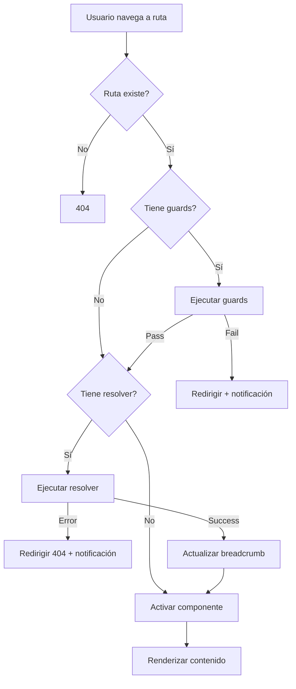

# Fase 4 - Enrutamiento y Navegación Avanzada (Frontend)

> **Proyecto:** Discs & Records  
> **Tipo:** Aplicación web estilo Letterboxd para música  
> **Fecha:** 9 de enero de 2026

---

## Índice

1. [Configuración de Rutas](#1-configuración-de-rutas)
2. [Navegación Programática](#2-navegación-programática)
3. [Lazy Loading](#3-lazy-loading)
4. [Route Guards](#4-route-guards)
5. [Resolvers](#5-resolvers)
6. [Breadcrumbs Dinámicos](#6-breadcrumbs-dinámicos)
7. [Mapa Completo de Rutas](#7-mapa-completo-de-rutas)
8. [Buenas Prácticas](#8-buenas-prácticas)

---

## 1. Configuración de Rutas

### 1.1 Rutas Principales

**Ubicación:** `frontend/src/app/app.routes.ts`

Las rutas se definen usando el array `Routes` de Angular Router. Cada ruta especifica un path, componente a cargar y metadata adicional.

```typescript
export const routes: Routes = [
  {
    path: '',
    loadComponent: () => import('./pages/home/home').then(m => m.Home),
    title: 'Inicio - Discs & Records',
    data: { preload: true, critical: true }
  },
  {
    path: 'search',
    loadComponent: () => import('./pages/search-results/search-results'),
    title: 'Resultados de Búsqueda - Discs & Records',
    data: { preload: true, critical: true, delay: 1000, breadcrumb: 'Búsqueda' }
  },
  {
    path: 'profile',
    loadComponent: () => import('./pages/profile/profile'),
    title: 'Perfil de Usuario - Discs & Records',
    canActivate: [authGuard],
    data: { preload: true, critical: true, delay: 2000 }
  }
];
```

**Metadata utilizada:**

| Propiedad | Tipo | Descripción |
|-----------|------|-------------|
| `path` | `string` | Segmento de URL para la ruta |
| `loadComponent` | `() => Promise<Component>` | Función de carga perezosa del componente |
| `title` | `string` | Título de la página (aparece en pestaña del navegador) |
| `canActivate` | `GuardFn[]` | Guards que deben pasar antes de activar la ruta |
| `canDeactivate` | `GuardFn[]` | Guards que se ejecutan al intentar abandonar la ruta |
| `resolve` | `{ [key: string]: ResolveFn }` | Resolvers para precargar datos |
| `data` | `object` | Metadata personalizada accesible en componentes |
| `children` | `Routes[]` | Rutas hijas anidadas |

### 1.2 Rutas con Parámetros

Las rutas pueden incluir parámetros dinámicos usando la sintaxis `:parametro`.

```typescript
{
  path: 'album/:id',
  loadComponent: () => import('./pages/detail/detail').then(m => m.DetailComponent),
  title: 'Detalle de Álbum - Discs & Records',
  resolve: { album: albumResolver },
  data: { preload: true, critical: true, delay: 1500 }
},
{
  path: 'artist/:id',
  loadComponent: () => import('./pages/detail/detail').then(m => m.DetailComponent),
  title: 'Detalle de Artista - Discs & Records',
  resolve: { artist: artistResolver },
  data: { preload: true, critical: true, delay: 1500 }
},
{
  path: 'song/:id',
  loadComponent: () => import('./pages/detail/detail').then(m => m.DetailComponent),
  title: 'Detalle de Canción - Discs & Records',
  resolve: { song: songResolver },
  data: { preload: true, critical: true, delay: 1500 }
}
```

**Acceso a parámetros en el componente:**

```typescript
export class DetailComponent implements OnInit {
  private route = inject(ActivatedRoute);
  
  ngOnInit(): void {
    // Método 1: Snapshot (valor actual, no reactivo)
    const id = this.route.snapshot.paramMap.get('id');
    
    // Método 2: Observable (reactivo, se actualiza si cambia el parámetro)
    this.route.paramMap.subscribe(params => {
      const id = params.get('id');
      this.loadData(id);
    });
  }
}
```

### 1.3 Rutas Hijas Anidadas

Las rutas hijas permiten crear layouts con subnavegación. El componente padre debe incluir un `<router-outlet>` donde se renderizarán los componentes hijos.

**Ejemplo: Settings con pestañas**

```typescript
{
  path: 'settings',
  loadComponent: () => import('./pages/settings/settings'),
  canActivate: [authGuard],
  data: { preload: true, delay: 3000, breadcrumb: 'Ajustes' },
  children: [
    {
      path: '',
      redirectTo: 'profile',
      pathMatch: 'full'
    },
    {
      path: 'profile',
      loadComponent: () => import('./pages/settings/profile/profile'),
      title: 'Perfil - Ajustes',
      data: { breadcrumb: 'Mi Perfil' },
      canDeactivate: [unsavedChangesGuard]
    },
    {
      path: 'account',
      loadComponent: () => import('./pages/settings/account/account'),
      title: 'Cuenta - Ajustes',
      data: { breadcrumb: 'Cuenta' },
      canDeactivate: [unsavedChangesGuard]
    },
    {
      path: 'preferences',
      loadComponent: () => import('./pages/settings/preferences/preferences'),
      title: 'Preferencias - Ajustes',
      data: { breadcrumb: 'Preferencias' },
      canDeactivate: [unsavedChangesGuard]
    },
    {
      path: 'security',
      loadComponent: () => import('./pages/settings/security/security'),
      title: 'Seguridad - Ajustes',
      data: { breadcrumb: 'Seguridad' },
      canDeactivate: [unsavedChangesGuard]
    }
  ]
}
```

**Componente padre (settings.html):**

```html
<div class="settings">
  <nav class="settings__tabs">
    <a routerLink="profile" routerLinkActive="active">Mi Perfil</a>
    <a routerLink="account" routerLinkActive="active">Cuenta</a>
    <a routerLink="preferences" routerLinkActive="active">Preferencias</a>
    <a routerLink="security" routerLinkActive="active">Seguridad</a>
  </nav>
  
  <div class="settings__content">
    <router-outlet></router-outlet>
  </div>
</div>
```

**Ejemplo: Panel de Administración**

```typescript
{
  path: 'admin',
  loadComponent: () => import('./pages/admin/admin'),
  title: 'Panel de Administración - Discs & Records',
  canActivate: [authGuard, adminGuard],
  data: { preload: false, breadcrumb: 'Administración' },
  children: [
    {
      path: '',
      redirectTo: 'albums',
      pathMatch: 'full'
    },
    {
      path: 'albums',
      loadComponent: () => import('./pages/admin/albums/albums'),
      title: 'Gestión de Álbumes - Admin',
      data: { breadcrumb: 'Álbumes' }
    },
    {
      path: 'users',
      loadComponent: () => import('./pages/admin/users/users'),
      title: 'Gestión de Usuarios - Admin',
      data: { breadcrumb: 'Usuarios' }
    },
    {
      path: 'genres',
      loadComponent: () => import('./pages/admin/genres/genres'),
      title: 'Gestión de Géneros - Admin',
      data: { breadcrumb: 'Géneros' }
    },
    {
      path: 'reviews',
      loadComponent: () => import('./pages/admin/reviews/reviews'),
      title: 'Moderación de Reseñas - Admin',
      data: { breadcrumb: 'Reseñas' }
    }
  ]
}
```

### 1.4 Ruta Wildcard para 404

La ruta wildcard captura todas las URLs no coincidentes y las redirige a una página de error.

```typescript
{
  path: '404',
  loadComponent: () => import('./pages/not-found/not-found'),
  title: '404 - Página No Encontrada'
},
{
  path: '**',
  loadComponent: () => import('./pages/not-found/not-found'),
  title: '404 - Página No Encontrada'
}
```

**Orden importante:** La ruta `**` debe ser siempre la última en el array, ya que captura todas las rutas.

---

## 2. Navegación Programática

### 2.1 Uso del Router Service

El servicio `Router` permite navegar desde código TypeScript sin requerir enlaces en el template.

```typescript
import { Router } from '@angular/router';

export class MyComponent {
  private router = inject(Router);
  
  navigateToAlbum(albumId: string): void {
    this.router.navigate(['/album', albumId]);
  }
  
  goBack(): void {
    this.router.navigate(['..'], { relativeTo: this.route });
  }
}
```

### 2.2 Pasar Parámetros de Ruta

**Parámetros en la URL:**

```typescript
// Navegar a /album/123
this.router.navigate(['/album', albumId]);

// Navegar a /search/resultados/rock
this.router.navigate(['/search', 'resultados', genre]);
```

### 2.3 Query Params y Fragments

**Query params** (`?param=value&otro=value2`):

```typescript
// Navegar a /search?q=metallica&genre=metal
this.router.navigate(['/search'], {
  queryParams: {
    q: 'metallica',
    genre: 'metal'
  }
});

// Preservar query params existentes
this.router.navigate(['/another-page'], {
  queryParamsHandling: 'preserve' // o 'merge'
});
```

**Fragments** (`#seccion`):

```typescript
// Navegar a /album/123#reviews
this.router.navigate(['/album', albumId], {
  fragment: 'reviews'
});

// Scroll a la sección después de navegar
navigateToSection(section: 'info' | 'tracks' | 'reviews'): void {
  const extras: NavigationExtras = {
    fragment: section,
    replaceUrl: true // No añadir al historial
  };
  this.router.navigate([], extras);
}
```

**Acceso a query params y fragments en el componente:**

```typescript
ngOnInit(): void {
  // Query params
  this.route.queryParamMap.subscribe(params => {
    const query = params.get('q');
    const genre = params.get('genre');
  });
  
  // Fragment
  this.route.fragment.subscribe(fragment => {
    if (fragment) {
      this.scrollToSection(fragment);
    }
  });
}
```

### 2.4 NavigationExtras para Estado

`NavigationExtras` permite pasar datos entre rutas sin exponerlos en la URL.

```typescript
goToArtist(artistId: string): void {
  const extras: NavigationExtras = {
    state: {
      fromAlbum: this.item()?.id,
      albumTitle: this.itemTitle()
    }
  };
  this.router.navigate(['/artist', artistId], extras);
}
```

**Acceso al estado en el componente destino:**

```typescript
ngOnInit(): void {
  const navigation = this.router.getCurrentNavigation();
  const state = navigation?.extras.state;
  
  if (state) {
    const fromAlbum = state['fromAlbum'];
    const albumTitle = state['albumTitle'];
    console.log(`Navegaste desde el álbum: ${albumTitle}`);
  }
}
```

**Ejemplo completo: Navegación con contexto**

```typescript
// En DetailComponent
goToUser(userId: string): void {
  const extras: NavigationExtras = {
    state: {
      fromReview: true,
      albumId: this.item()?.id
    }
  };
  this.router.navigate(['/profile', userId], extras);
}

shareReviewsLink(): void {
  const url = `${window.location.origin}/album/${this.item()?.id}#reviews`;
  navigator.clipboard.writeText(url);
  this.notificationStream.success('Enlace copiado', 'El enlace ha sido copiado al portapapeles');
}
```

---

## 3. Lazy Loading

### 3.1 Carga Perezosa con loadComponent

Angular 19 soporta lazy loading a nivel de componente sin necesidad de módulos.

```typescript
{
  path: 'style-guide',
  loadComponent: () => import('./pages/style-guide/style-guide').then(m => m.StyleGuide),
  title: 'Guía de Estilo - Discs & Records'
}
```

**Ventajas:**

- Reduce el bundle inicial
- Mejora tiempo de carga inicial
- Carga código solo cuando se necesita
- Angular genera chunks automáticamente

### 3.2 Estrategia de Precarga Personalizada

**Ubicación:** `frontend/src/app/services/custom-preloading-strategy.ts`

Implementa `PreloadingStrategy` para controlar qué rutas se precargan.

```typescript
import { PreloadingStrategy, Route } from '@angular/router';
import { Observable, of, timer } from 'rxjs';
import { mergeMap } from 'rxjs/operators';
import { Injectable } from '@angular/core';

@Injectable({ providedIn: 'root' })
export class CustomPreloadingStrategy implements PreloadingStrategy {
  preload(route: Route, load: () => Observable<any>): Observable<any> {
    // No precargar si no está marcada
    if (!route.data || !route.data['preload']) {
      return of(null);
    }

    // Delay opcional antes de precargar
    const delay = route.data['delay'] || 0;
    
    // Precargar con delay
    return timer(delay).pipe(
      mergeMap(() => {
        console.log(`Precargando ruta: ${route.path}`);
        return load();
      })
    );
  }
}
```

**Configuración en app.config.ts:**

```typescript
import { ApplicationConfig } from '@angular/core';
import { provideRouter, withPreloading } from '@angular/router';
import { routes } from './app.routes';
import { CustomPreloadingStrategy } from './services/custom-preloading-strategy';

export const appConfig: ApplicationConfig = {
  providers: [
    provideRouter(
      routes,
      withPreloading(CustomPreloadingStrategy)
    )
  ]
};
```

**Metadata de precarga en rutas:**

```typescript
{
  path: 'home',
  loadComponent: () => import('./pages/home/home'),
  data: { 
    preload: true,      // Activar precarga
    critical: true,     // Alta prioridad
    delay: 0            // Sin delay
  }
},
{
  path: 'search',
  loadComponent: () => import('./pages/search/search'),
  data: { 
    preload: true, 
    critical: true, 
    delay: 1000         // Precargar después de 1 segundo
  }
},
{
  path: 'admin',
  loadComponent: () => import('./pages/admin/admin'),
  data: { 
    preload: false      // No precargar (solo para admins)
  }
}
```

### 3.3 Verificar Chunking en Build Production

Ejecutar build de producción:

```bash
npm run build
```

**Salida esperada:**

```
Initial chunk files        | Names          |  Raw size
main.js                    | main           | 123.24 kB | 
chunk-DTYX5D27.js          | -              | 101.31 kB | 
polyfills.js               | polyfills      |  95 bytes | 

Lazy chunk files           | Names          |  Raw size
style-guide-D3UINLJI.js    | style-guide    | 334.85 kB | 
detail-KQMGTXCR.js         | detail         |  82.27 kB | 
search-results-CLNLN2IT.js | search-results |  50.12 kB | 
profile-3HJS2KHR.js        | profile        |  40.42 kB | 
settings-5HV67HU4.js       | settings       |  32.54 kB | 
admin-WMAC5N4S.js          | admin          |  15.80 kB | 
```

**Lazy chunks** son archivos que se descargan bajo demanda cuando el usuario navega a esa ruta.

---

## 4. Route Guards

### 4.1 Concepto y Tipos

Los guards son funciones que controlan el acceso a las rutas.

| Tipo | Cuándo se ejecuta | Uso típico |
|------|-------------------|------------|
| `CanActivate` | Antes de activar una ruta | Autenticación, permisos |
| `CanDeactivate` | Antes de abandonar una ruta | Cambios sin guardar |
| `CanActivateChild` | Antes de activar rutas hijas | Permisos en sección completa |
| `CanMatch` | Antes de matchear la ruta | Feature flags, A/B testing |
| `Resolve` | Antes de activar, después de guards | Precargar datos |

### 4.2 CanActivate: Protección de Rutas

**Ubicación:** `frontend/src/app/guards/auth.guard.ts`

```typescript
import { inject } from '@angular/core';
import { Router, CanActivateFn } from '@angular/router';
import { AppStateService } from '../services/app-state';
import { NotificationStreamService } from '../services/notification-stream';

export const authGuard: CanActivateFn = (route, state) => {
  const appState = inject(AppStateService);
  const router = inject(Router);
  const notificationStream = inject(NotificationStreamService);

  if (appState.isAuthenticated()) {
    return true;
  }

  notificationStream.error(
    'Acceso denegado',
    'Debes iniciar sesión para acceder a esta página'
  );

  router.navigate(['/'], {
    queryParams: { returnUrl: state.url }
  });

  return false;
};
```

**Guard de administrador:**

```typescript
export const adminGuard: CanActivateFn = (route, state) => {
  const appState = inject(AppStateService);
  const router = inject(Router);
  const notificationStream = inject(NotificationStreamService);

  const user = appState.currentUser();

  if (user?.role === 'admin') {
    return true;
  }

  notificationStream.error(
    'Acceso denegado',
    'No tienes permisos de administrador'
  );

  router.navigate(['/']);
  return false;
};
```

**Uso en rutas:**

```typescript
{
  path: 'profile',
  loadComponent: () => import('./pages/profile/profile'),
  canActivate: [authGuard]
},
{
  path: 'admin',
  loadComponent: () => import('./pages/admin/admin'),
  canActivate: [authGuard, adminGuard] // Se ejecutan en orden
}
```

### 4.3 CanDeactivate: Cambios Sin Guardar

**Ubicación:** `frontend/src/app/guards/unsaved-changes.guard.ts`

```typescript
import { CanDeactivateFn } from '@angular/router';

export interface CanComponentDeactivate {
  canDeactivate: () => boolean | Promise<boolean>;
}

export const unsavedChangesGuard: CanDeactivateFn<CanComponentDeactivate> = (component) => {
  if (component.canDeactivate) {
    return component.canDeactivate();
  }
  return true;
};
```

**Implementación en componente:**

```typescript
export class ProfileSettingsComponent implements CanComponentDeactivate {
  private fb = inject(FormBuilder);
  profileForm: FormGroup;
  private originalValues: any;

  ngOnInit(): void {
    this.profileForm = this.fb.group({
      username: [''],
      email: [''],
      bio: ['']
    });
    
    // Guardar valores originales
    this.originalValues = this.profileForm.value;
  }

  canDeactivate(): boolean {
    const hasChanges = JSON.stringify(this.profileForm.value) !== 
                       JSON.stringify(this.originalValues);
    
    if (hasChanges) {
      return confirm('Tienes cambios sin guardar. ¿Deseas salir sin guardar?');
    }
    
    return true;
  }

  onSubmit(): void {
    if (this.profileForm.valid) {
      // Guardar cambios
      this.originalValues = this.profileForm.value;
      this.notificationStream.success('Guardado', 'Los cambios se guardaron correctamente');
    }
  }
}
```

**Uso en rutas:**

```typescript
{
  path: 'settings/profile',
  loadComponent: () => import('./pages/settings/profile/profile'),
  canDeactivate: [unsavedChangesGuard]
}
```

---

## 5. Resolvers

### 5.1 Concepto y Propósito

Los resolvers precargan datos antes de activar una ruta, evitando mostrar componentes sin datos.

**Ventajas:**

- Loading state centralizado
- Evita flickering (componente sin datos → componente con datos)
- Manejo de errores antes de renderizar
- Mejor UX con spinner global

### 5.2 Implementación de Resolvers

**Ubicación:** `frontend/src/app/resolvers/album.resolver.ts`

```typescript
import { inject } from '@angular/core';
import { Router, ResolveFn } from '@angular/router';
import { Observable, of, catchError, finalize, tap } from 'rxjs';
import { Album } from '../models/data.models';
import { AlbumService } from '../services/album.service';
import { LoadingService } from '../services/loading';
import { NotificationStreamService } from '../services/notification-stream';
import { BreadcrumbService } from '../services/breadcrumb.service';

export const albumResolver: ResolveFn<Album | null> = (route, state): Observable<Album | null> => {
  const albumService = inject(AlbumService);
  const loadingService = inject(LoadingService);
  const notificationStream = inject(NotificationStreamService);
  const breadcrumbService = inject(BreadcrumbService);
  const router = inject(Router);

  const albumId = route.paramMap.get('id');

  if (!albumId) {
    notificationStream.error('ID inválido', 'El ID del álbum no es válido');
    router.navigate(['/404']);
    return of(null);
  }

  loadingService.start('Cargando álbum...');

  return albumService.getAlbumById(albumId).pipe(
    tap((album) => {
      if (album) {
        breadcrumbService.updateCurrentBreadcrumb(album.title);
      }
      loadingService.stop();
    }),
    catchError((error) => {
      console.error('Error loading album:', error);
      notificationStream.error(
        'Error',
        'No se pudo cargar el álbum. Redirigiendo...'
      );
      setTimeout(() => {
        router.navigate(['/404']);
      }, 500);
      loadingService.stop();
      return of(null);
    }),
    finalize(() => {
      loadingService.stop();
    })
  );
};
```

**Resolver para artista:**

```typescript
export const artistResolver: ResolveFn<Artist | null> = (route, state): Observable<Artist | null> => {
  const artistService = inject(ArtistService);
  const loadingService = inject(LoadingService);
  const notificationStream = inject(NotificationStreamService);
  const breadcrumbService = inject(BreadcrumbService);
  const router = inject(Router);

  const artistId = route.paramMap.get('id');

  if (!artistId) {
    notificationStream.error('ID inválido', 'El ID del artista no es válido');
    router.navigate(['/404']);
    return of(null);
  }

  loadingService.start('Cargando artista...');

  return artistService.getArtistById(artistId).pipe(
    tap((artist) => {
      if (artist) {
        breadcrumbService.updateCurrentBreadcrumb(artist.name);
      }
      loadingService.stop();
    }),
    catchError((error) => {
      console.error('Error loading artist:', error);
      notificationStream.error(
        'Error',
        'No se pudo cargar el artista. Redirigiendo...'
      );
      setTimeout(() => {
        router.navigate(['/404']);
      }, 500);
      loadingService.stop();
      return of(null);
    }),
    finalize(() => {
      loadingService.stop();
    })
  );
};
```

**Resolver para canción:**

```typescript
export const songResolver: ResolveFn<Song | null> = (route, state): Observable<Song | null> => {
  const songService = inject(SongService);
  const loadingService = inject(LoadingService);
  const notificationStream = inject(NotificationStreamService);
  const breadcrumbService = inject(BreadcrumbService);
  const router = inject(Router);

  const songId = route.paramMap.get('id');

  if (!songId) {
    notificationStream.error('ID inválido', 'El ID de la canción no es válido');
    router.navigate(['/404']);
    return of(null);
  }

  loadingService.start('Cargando canción...');

  return songService.getSongById(songId).pipe(
    tap((song) => {
      if (song) {
        breadcrumbService.updateCurrentBreadcrumb(song.title);
      }
      loadingService.stop();
    }),
    catchError((error) => {
      console.error('Error loading song:', error);
      notificationStream.error(
        'Error',
        'No se pudo cargar la canción. Redirigiendo...'
      );
      setTimeout(() => {
        router.navigate(['/404']);
      }, 500);
      loadingService.stop();
      return of(null);
    }),
    finalize(() => {
      loadingService.stop();
    })
  );
};
```

### 5.3 Uso en Rutas

```typescript
{
  path: 'album/:id',
  loadComponent: () => import('./pages/detail/detail').then(m => m.DetailComponent),
  resolve: { album: albumResolver }
},
{
  path: 'artist/:id',
  loadComponent: () => import('./pages/detail/detail').then(m => m.DetailComponent),
  resolve: { artist: artistResolver }
},
{
  path: 'song/:id',
  loadComponent: () => import('./pages/detail/detail').then(m => m.DetailComponent),
  resolve: { song: songResolver }
}
```

### 5.4 Acceso a Datos Resueltos

```typescript
export class DetailComponent implements OnInit {
  private route = inject(ActivatedRoute);
  item = signal<DetailItem | null>(null);

  ngOnInit(): void {
    const resolvedData = this.route.snapshot.data;

    if (resolvedData['album']) {
      const album = resolvedData['album'] as Album;
      this.item.set(album);
      this.loadAlbumDetails(album.id);
    } else if (resolvedData['artist']) {
      const artist = resolvedData['artist'] as Artist;
      this.item.set(artist);
      this.loadArtistDetails(artist.id);
    } else if (resolvedData['song']) {
      const song = resolvedData['song'] as Song;
      this.item.set(song);
      this.loadSongDetails(song.id);
    }
  }
}
```

### 5.5 Integración con LoadingService

**Ubicación:** `frontend/src/app/services/loading.ts`

```typescript
import { Injectable, signal } from '@angular/core';

@Injectable({
  providedIn: 'root'
})
export class LoadingService {
  private loadingSignal = signal<boolean>(false);
  private messageSignal = signal<string>('');

  isLoading = this.loadingSignal.asReadonly();
  message = this.messageSignal.asReadonly();

  start(message: string = 'Cargando...'): void {
    this.loadingSignal.set(true);
    this.messageSignal.set(message);
  }

  stop(): void {
    this.loadingSignal.set(false);
    this.messageSignal.set('');
  }
}
```

**Componente de Spinner (integrado en layout):**

```html
@if (loadingService.isLoading()) {
  <div class="global-spinner">
    <div class="spinner"></div>
    <p>{{ loadingService.message() }}</p>
  </div>
}
```

---

## 6. Breadcrumbs Dinámicos

### 6.1 Servicio de Breadcrumbs

**Ubicación:** `frontend/src/app/services/breadcrumb.service.ts`

```typescript
import { Injectable, signal } from '@angular/core';
import { Router, NavigationEnd, ActivatedRoute, ActivatedRouteSnapshot } from '@angular/router';
import { filter, map } from 'rxjs/operators';
import { BreadcrumbItem } from '../components/shared/breadcrumbs/breadcrumbs';

@Injectable({
  providedIn: 'root'
})
export class BreadcrumbService {
  breadcrumbs = signal<BreadcrumbItem[]>([]);

  constructor(
    private router: Router,
    private activatedRoute: ActivatedRoute
  ) {
    this.initBreadcrumbs();
  }

  private initBreadcrumbs(): void {
    this.router.events
      .pipe(
        filter(event => event instanceof NavigationEnd),
        map(() => this.buildBreadcrumbs(this.activatedRoute.root))
      )
      .subscribe(breadcrumbs => {
        this.breadcrumbs.set(breadcrumbs);
      });

    const initialBreadcrumbs = this.buildBreadcrumbs(this.activatedRoute.root);
    this.breadcrumbs.set(initialBreadcrumbs);
  }

  private buildBreadcrumbs(
    route: ActivatedRoute,
    url: string = '',
    breadcrumbs: BreadcrumbItem[] = []
  ): BreadcrumbItem[] {
    if (breadcrumbs.length === 0) {
      breadcrumbs.push({
        label: 'Inicio',
        url: '/'
      });
    }

    const children: ActivatedRoute[] = route.children;
    if (children.length === 0) {
      return breadcrumbs;
    }

    for (const child of children) {
      const routeURL: string = child.snapshot.url
        .map(segment => segment.path)
        .join('/');

      if (routeURL === '') {
        return this.buildBreadcrumbs(child, url, breadcrumbs);
      }

      url += `/${routeURL}`;
      const label = this.getBreadcrumbLabel(child.snapshot);

      if (label && !this.shouldSkipBreadcrumb(routeURL)) {
        breadcrumbs.push({
          label,
          url
        });
      }

      return this.buildBreadcrumbs(child, url, breadcrumbs);
    }

    return breadcrumbs;
  }

  private getBreadcrumbLabel(snapshot: ActivatedRouteSnapshot): string {
    // 1. Prioridad: data.breadcrumb definido en ruta
    if (snapshot.data['breadcrumb']) {
      return snapshot.data['breadcrumb'];
    }

    // 2. Extraer desde title
    if (snapshot.title) {
      return snapshot.title.replace(' - Discs & Records', '').split(' - ')[0];
    }

    // 3. Generar desde URL
    const path = snapshot.url[0]?.path;
    if (!path) return '';

    // Si es ID numérico, intentar obtener nombre desde resolver data
    if (/^\d+$/.test(path)) {
      const itemData = snapshot.data['album'] || snapshot.data['artist'] || snapshot.data['song'];
      if (itemData) {
        return itemData.title || itemData.name || path;
      }
      return `#${path}`;
    }

    return path
      .split('-')
      .map(word => word.charAt(0).toUpperCase() + word.slice(1))
      .join(' ');
  }

  private shouldSkipBreadcrumb(routeURL: string): boolean {
    const skipRoutes = ['404', 'style-guide'];
    return skipRoutes.some(skip => routeURL.includes(skip));
  }

  updateCurrentBreadcrumb(label: string): void {
    const current = this.breadcrumbs();
    if (current.length > 0) {
      current[current.length - 1].label = label;
      this.breadcrumbs.set([...current]);
    }
  }

  addBreadcrumb(breadcrumb: BreadcrumbItem): void {
    this.breadcrumbs.set([...this.breadcrumbs(), breadcrumb]);
  }

  reset(): void {
    this.breadcrumbs.set([{
      label: 'Inicio',
      url: '/'
    }]);
  }
}
```

### 6.2 Componente de Breadcrumbs

**Ubicación:** `frontend/src/app/components/shared/breadcrumbs/breadcrumbs.ts`

```typescript
import { Component, Input } from '@angular/core';
import { RouterModule } from '@angular/router';

export interface BreadcrumbItem {
  label: string;
  url?: string;
  icon?: string;
}

@Component({
  selector: 'app-breadcrumbs',
  standalone: true,
  imports: [RouterModule],
  templateUrl: './breadcrumbs.html',
  styleUrl: './breadcrumbs.scss'
})
export class Breadcrumbs {
  @Input() items: BreadcrumbItem[] = [];
  @Input() separator: string = '>';
}
```

**Template (breadcrumbs.html):**

```html
<nav class="breadcrumbs" aria-label="Navegación por migas de pan">
  <ol class="breadcrumbs__list">
    @for (item of items; track item.url || item.label; let i = $index; let isLast = $last) {
      <li
        class="breadcrumbs__item"
        [class.breadcrumbs__item--active]="isLast"
      >
        @if (!isLast && item.url) {
          <a
            [routerLink]="item.url"
            class="breadcrumbs__link"
          >
            @if (item.icon) {
              <span class="breadcrumbs__icon" [innerHTML]="item.icon"></span>
            }
            <span class="breadcrumbs__label">{{ item.label }}</span>
          </a>
        }

        @if (isLast || !item.url) {
          <span class="breadcrumbs__text">
            @if (item.icon) {
              <span class="breadcrumbs__icon" [innerHTML]="item.icon"></span>
            }
            <span class="breadcrumbs__label">{{ item.label }}</span>
          </span>
        }

        @if (!isLast) {
          <span class="breadcrumbs__separator">{{ separator }}</span>
        }
      </li>
    }
  </ol>
</nav>
```

### 6.3 Integración en Layout

```html
<main class="main">
  <div class="main__container">
    @if (breadcrumbService.breadcrumbs().length > 1) {
      <app-breadcrumbs [items]="breadcrumbService.breadcrumbs()" separator=">"></app-breadcrumbs>
    }
    
    <ng-content></ng-content>
  </div>
</main>
```

### 6.4 Actualización desde Resolvers

Los resolvers actualizan el breadcrumb con el nombre real del item:

```typescript
return albumService.getAlbumById(albumId).pipe(
  tap((album) => {
    if (album) {
      breadcrumbService.updateCurrentBreadcrumb(album.title);
    }
    loadingService.stop();
  }),
  // ...
);
```

**Resultado:**

- Antes del resolver: `Inicio > 123`
- Después del resolver: `Inicio > Abbey Road`

---

## 7. Mapa Completo de Rutas

### 7.1 Estructura de Rutas

```
/                           → Home
/search                     → Búsqueda (con query params)
/profile                    → Perfil de usuario (autenticado)
/settings                   → Ajustes (autenticado)
  /settings/profile         → Editar perfil
  /settings/account         → Configuración de cuenta
  /settings/preferences     → Preferencias
  /settings/security        → Seguridad
/album/:id                  → Detalle de álbum (con resolver)
/artist/:id                 → Detalle de artista (con resolver)
/song/:id                   → Detalle de canción (con resolver)
/admin                      → Panel admin (autenticado + admin)
  /admin/albums             → Gestión de álbumes
  /admin/users              → Gestión de usuarios
  /admin/genres             → Gestión de géneros
  /admin/reviews            → Moderación de reseñas
/style-guide                → Guía de estilos (desarrollo)
/404                        → Página no encontrada
/**                         → Captura todo (→ 404)
```

### 7.2 Metadata de Rutas

| Ruta | Lazy Loading | Precarga | Guards | Resolver | Breadcrumb |
|------|--------------|----------|--------|----------|------------|
| `/` | Si | Inmediata | - | - | - |
| `/search` | Si | 1s delay | - | - | Búsqueda |
| `/profile` | Si | 2s delay | authGuard | - | Perfil |
| `/settings/*` | Si | 3s delay | authGuard | - | Ajustes > [subsección] |
| `/album/:id` | Si | 1.5s delay | - | albumResolver | [Nombre del álbum] |
| `/artist/:id` | Si | 1.5s delay | - | artistResolver | [Nombre del artista] |
| `/song/:id` | Si | 1.5s delay | - | songResolver | [Título de la canción] |
| `/admin/*` | Si | No | authGuard + adminGuard | - | Administración > [sección] |
| `/style-guide` | Si | No | - | - | - |
| `/404` | Si | No | - | - | - |

### 7.3 Flujo de Navegación



---

## 8. Buenas Prácticas

### 8.1 Organización de Archivos

```
app/
├── guards/
│   ├── auth.guard.ts
│   └── unsaved-changes.guard.ts
├── resolvers/
│   ├── index.ts
│   ├── album.resolver.ts
│   ├── artist.resolver.ts
│   └── song.resolver.ts
├── services/
│   ├── custom-preloading-strategy.ts
│   ├── breadcrumb.service.ts
│   ├── loading.ts
│   └── ...
└── app.routes.ts
```

### 8.2 Nomenclatura

- **Guards:** `[nombre].guard.ts` (ej. `auth.guard.ts`)
- **Resolvers:** `[entidad].resolver.ts` (ej. `album.resolver.ts`)
- **Estrategias:** `[nombre]-preloading-strategy.ts`
- **Servicios:** `[nombre].service.ts` o `[nombre].ts`

### 8.3 Performance

**Lazy Loading:**
- Cargar solo componentes críticos en bundle inicial
- Usar precarga inteligente para rutas frecuentes
- Evitar precargar rutas administrativas

**Resolvers:**
- Limitar tiempo de resolución (timeout)
- Manejar errores y redirigir rápidamente
- Usar loading indicator global

**Guards:**
- Mantener lógica simple y rápida
- Cachear permisos si es posible
- Redirigir con notificación clara

### 8.4 Accesibilidad

**Breadcrumbs:**
- Usar `<nav>` con `aria-label="Navegación por migas de pan"`
- Marcar item actual con clase `.breadcrumbs__item--active`
- Separadores con `aria-hidden="true"`

**Links:**
- Usar `routerLink` en lugar de `href` para SPAs
- Agregar `routerLinkActive` para indicar ruta activa
- Mantener contraste adecuado en estados hover/focus

**Loading:**
- Anunciar cambios de estado con `aria-live="polite"`
- Proporcionar feedback visual claro
- Mantener foco accesible durante transiciones

### 8.5 Seguridad

**Guards:**
- Nunca confiar solo en guards del frontend
- Validar permisos en backend
- Usar HTTPS para todas las peticiones

**Estado:**
- No almacenar información sensible en localStorage
- Limpiar datos al cerrar sesión
- Validar tokens en cada petición importante

### 8.6 Testing

**Guards:**
```typescript
describe('authGuard', () => {
  it('debería permitir acceso si está autenticado', () => {
    const appState = { isAuthenticated: () => true };
    const result = authGuard(mockRoute, mockState);
    expect(result).toBe(true);
  });

  it('debería redirigir si no está autenticado', () => {
    const appState = { isAuthenticated: () => false };
    const result = authGuard(mockRoute, mockState);
    expect(result).toBe(false);
    expect(mockRouter.navigate).toHaveBeenCalledWith(['/']);
  });
});
```

**Resolvers:**
```typescript
describe('albumResolver', () => {
  it('debería resolver álbum por ID', (done) => {
    const mockAlbum = { id: '1', title: 'Test Album' };
    albumService.getAlbumById.and.returnValue(of(mockAlbum));

    albumResolver(mockRoute, mockState).subscribe(result => {
      expect(result).toEqual(mockAlbum);
      done();
    });
  });

  it('debería redirigir a 404 si falla', (done) => {
    albumService.getAlbumById.and.returnValue(throwError(() => new Error()));

    albumResolver(mockRoute, mockState).subscribe(result => {
      expect(result).toBe(null);
      expect(mockRouter.navigate).toHaveBeenCalledWith(['/404']);
      done();
    });
  });
});
```

---

## Conclusión

La Fase 4 implementa un sistema de enrutamiento completo y robusto que incluye:

- Configuración declarativa de rutas con metadata rica
- Lazy loading con estrategia de precarga personalizada
- Protección de rutas con guards (autenticación y permisos)
- Precarga de datos con resolvers integrados con UI
- Navegación programática avanzada con estado
- Breadcrumbs dinámicos generados automáticamente

Esta arquitectura proporciona una base sólida y escalable para la navegación de la aplicación, manteniendo buena performance, UX fluida y código mantenible.
